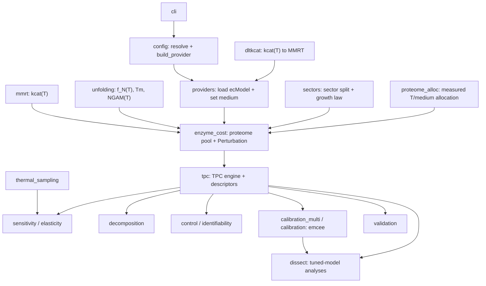

# etcgem

**etcgem** is an enzyme- and temperature-constrained genome-scale metabolic model
(etc-GEM) of *Escherichia coli* K-12 MG1655 (GECKO **eciML1515**) that predicts growth
**thermal performance curves** (TPCs) — growth rate as a function of temperature. The
organismal TPC is not assumed; it *emerges* from enzyme-constrained flux-balance analysis
in which every enzyme's turnover carries a temperature response, protein unfolding sets a
high-temperature collapse, and total enzyme demand is bounded by a measured proteome
budget. The aim is to understand what sets the shape and height of a microbial TPC and
which molecular measurements are needed to predict it.

## Scientific overview (high level)

An **etc-GEM** couples a genome-scale metabolic network to an enzyme budget: running a
reaction costs enzyme mass (`flux / kcat × MW`) drawn from a limited proteome pool, and
here each enzyme's `kcat(T)` and folded fraction `f_N(T)` are temperature-dependent, so the
growth-maximising solution traces out a TPC.

The project follows a deliberate **two-stage logic**. First an **emergent** model is built
entirely from independent data — per-enzyme thermal optima, melting temperatures, MMRT
curvature and a literature proteome budget — with **nothing fit to the growth curve**, and
its a-priori TPC is validated against a measured curve. Then a **Bayesian calibration**
(gradient-free MCMC) asks what corrections a measured TPC *demands* of a few global,
uncertain knobs, and the resulting **tuned** model is dissected for sensitivity, variance
decomposition and per-enzyme identifiability. In brief, the grounded envelope reproduces the
*shape and position* of the curve a priori, while the data mainly correct the catalytic
*capacity* (magnitude).

> **The full science — equations, parameter provenance, validation, calibration and all
> results — is in the Quarto report:** `reports/ecoli_tpc/report.qmd` (and
> `reports/ecoli_tpc/supplementary.qmd`). This README covers **how the repository works**; it
> deliberately does not reproduce the equations or detailed findings.

## Repository layout

```
etcGEMs/
├── configs/                     ALL configuration
│   ├── defaults.yaml            universal method defaults (solver, crit_frac, temp grid)
│   ├── examples/                self-contained example configs (toy, gecko)
│   └── experiments/             method overlays (sweep/decompose/control/... variants)
├── src/etcgem/                  the Python package (see the module map below)
├── strains/
│   └── eciML1515/
│       ├── strain.yaml          the organism descriptor (provider block + biophysics)
│       ├── model/               GECKO ecModel (eciML1515_batch.xml)
│       ├── media/               medium definitions (LB / BHI component lists)
│       ├── thermal/             per-enzyme Topt/Tm (BestParamsTopt.csv) + measured TPCs
│       ├── proteomics/          measured per-medium/temperature proteome (Wang 2026)
│       ├── dltkcat/             DLTKcat kcat(T) inputs/outputs/fits
│       └── outputs/             one folder per run (resolved_config.yaml + results)
│           └── _archive/        superseded / quick / diagnostic runs (on disk, gitignored)
├── reports/ecoli_tpc/              report.qmd, supplementary.qmd, assemble.py, assets/
├── prompts/                     README index + the current prompt; archive/ = executed
├── docs/                        RUNBOOK.md (step-by-step), correspondence/, proposals
├── pyproject.toml               package metadata; console entry point `etcgem`
└── requirements.txt
```

External, **kept outside the tracked tree and gitignored** (documented, not committed):
`DLTKcat/` (a vendored clone of the DLTKcat kcat(T) predictor) and `refs/` (reference
PDFs). The legacy `tpc_pipeline/` scaffold has been removed (superseded by `src/etcgem/`).

**Report convention.** Reports are **per deliverable**, named by organism + topic — the
current one is `reports/ecoli_tpc/` (this *E. coli* TPC study). Future deliverables live in
sibling directories, e.g. `reports/activation_energy/` (a cross-organism activation-energy
analysis) and `reports/respiration/`, each with its own `report.qmd` + `assemble.py`.
`strains/` is deliberately shared and not renamed per report.

## How it works

### The config model — `defaults ← strain ← experiment`

A run's configuration is composed from three layers, deep-merged in this precedence
(later overrides earlier):

| layer | file | holds |
|-------|------|-------|
| method defaults | `configs/defaults.yaml` | universal knobs: `solver_timeout`, `crit_frac`, a fallback `temperature_grid` |
| **organism** | `strains/NAME/strain.yaml` | the `provider` block (model, thermal mode, budget, DLTKcat/Tm sources), `T0_C`, `temperature_grid`, `proteome_sectors`, `allocation_from_data` |
| method overlay | `configs/experiments/EXP.yaml` | optional `kind` + a `sensitivity` / `decomposition` / `control` block for one analysis |

`config.resolve(strain, experiment)` returns the merged dict (with `provider.model_path`
injected), and **every run writes the exact merged config as `resolved_config.yaml`** in
its output folder for provenance. To **add a strain**, copy `strains/_template/` and edit
`strain.yaml`; to **add an experiment**, drop a YAML in `configs/experiments/`. (The legacy
root `defaults.yaml` / `experiments/` locations are still honoured as a fallback.)

### The CLI

Installing the package exposes the `etcgem` console command (`etcgem.cli:main`). Every run
writes into `strains/NAME/outputs/<tag>/`. Strain-only commands need just `--strain`;
analysis commands also take an `--experiment` overlay.

| command | what it does | key args | writes to `outputs/…` |
|---------|--------------|----------|-----------------------|
| `build` | build the strain's provider; print + save a model summary | `--strain` | `build/` |
| `tpc` | nominal TPC + descriptors + plot | `--strain [--fits]` | `tpc/` |
| `fba` | single enzyme-constrained solve at one temperature | `--strain --temp C` | `fba/` |
| `calibrate-dcp` | *(legacy)* pick `provider.default_dCp` for a target rising-limb Eₐ; not used by the emergent model | `--strain --target-ea` | *(updates strain.yaml)* |
| `sweep` | LHS TPC sensitivity sweep | `--strain --experiment [--fits --resume --seconds N --no-plots]` | `sweep_<exp>/` |
| `decompose` | allocation-vs-envelope variance decomposition | `--strain --experiment` | `decompose_<exp>/` |
| `control` | per-enzyme thermal control coefficients + identifiability | `--strain [--experiment]` | `control[_<exp>]/` |
| `elasticity` | equal-perturbation (standardised) elasticities | `--strain --experiment [--h]` | `elasticity_<exp>/` |
| `dissect` | dissect the **tuned** model (rich BHI): posterior-propagated elasticity + decomposition + identifiability | `--strain [--procs --draws]` | `elasticity_tuned/`, `decompose_tuned/`, `control_tuned/` |
| `anatomy` | model-anatomy figures at a reference operating point | `--strain [--medium]` | `anatomy/` |
| `validate` | emergent (nothing-fit) TPC vs the exact-strain measured curve | `--strain [--no-secondary]` | `validation_trusted/` |
| `calibrate` | Bayesian calibration (emcee); `--vdl` = Van Derlinden rich-BHI tuning, `--noll` = trusted Noll curve | `--strain [--vdl \| --noll \| --curve] [--walkers --steps --procs …]` | `calibration_vanderlinden_v3/` \| `calibration_noll_minimal/` |
| `proteome-sectors` | measured temperature/medium proteome allocation + proteome validation | `--strain` | `proteome_sectors/` |
| `dltkcat` | DLTKcat → MMRT tooling: `prep` / `parse` / `fit` / `csv` / `targets` | `--strain …` | *(strain `dltkcat/` files)* |

Example invocations:

```bash
etcgem build     --strain eciML1515                 # sanity-build the ecModel
etcgem tpc       --strain eciML1515 --fits           # nominal TPC with DLTKcat fits
etcgem sweep     --strain eciML1515 --experiment sectors
etcgem validate  --strain eciML1515                  # a-priori emergent validation
etcgem calibrate --strain eciML1515 --vdl            # Bayesian tuning (Van Derlinden, rich BHI)
etcgem dissect   --strain eciML1515                  # sensitivity + decomposition + identifiability on the tuned model
```

The current canonical outputs the report renders from are already committed; during the
repository restructure the calibration and validation dirs were renamed to drop their
`_v3`/`_trusted` suffixes (`calibration_vanderlinden/`, `validation/`), which is what
`assemble.py` reads.

### Module map + data flow

Every module under `src/etcgem/`:

| module | role |
|--------|------|
| `mmrt` | Macromolecular Rate Theory: temperature response of enzyme `kcat(T)` |
| `unfolding` | two-state native↔unfolded thermal model — folded fraction `f_N(T)` keyed on `Tm`, and NGAM(T) maintenance (after Li 2021 / the MRes) |
| `dltkcat` | turn DLTKcat temperature-dependent `kcat` predictions into per-enzyme MMRT (`Topt`, `dCp`) parameters |
| `providers` | load a genome-scale model → `(cobra model, enzyme cost table)`; set the medium (availability, incl. BHI); reconcile the proteome pool |
| `enzyme_cost` | the enzyme-constraint layer: the temperature-dependent proteome-pool budget and the `Perturbation` knob-set |
| `sectors` | coarse-grained proteome-sector partition (metabolic / biosynthesis / maintenance) + the Scott/Basan growth law |
| `proteome_alloc` | temperature- and medium-matched proteome allocation from the measured proteome; predicted-vs-measured usage validation |
| `tpc` | the TPC engine (`compute_tpc`) + curve descriptors (Topt, rmax, CTmin/CTmax, Eₐ, niche width) |
| `thermal_sampling` | correlated / calibrated per-enzyme thermal-parameter draws (M1.2) |
| `sensitivity` | LHS sensitivity sweep and the equal-perturbation **elasticity** analysis |
| `decomposition` | allocation-vs-envelope (and finer) **variance decomposition** (Shapley) of the TPC |
| `control` | per-enzyme thermal **control coefficients** + growth-curve **identifiability** |
| `calibration` | single-curve Bayesian calibration (emcee), Phase 0/1 (Noll) |
| `calibration_multi` | unified multi-parameter Bayesian **tuning** at the rich operating point (Van Derlinden) |
| `validation` | the emergent (a-priori) TPC checked against the trusted strain-matched curve |
| `dissect` | dissect the model around an arbitrary baseline (here the **tuned** posterior): elasticity + decomposition + identifiability |
| `plotting` | matplotlib figures for ensembles and analysis results |
| `config` | config resolution (`resolve`) + provider dispatch (`build_provider`) |
| `cli` | the `etcgem` command-line entry point |

Data flow (arrows follow the actual imports):



In words: `config` builds a `providers` model (GECKO ecModel + medium + DLTKcat overlay);
`enzyme_cost` attaches the temperature-dependent proteome pool, with `kcat(T)` from `mmrt`,
folding from `unfolding`, the sector split from `sectors`, and measured allocation from
`proteome_alloc`; `tpc` solves the enzyme-constrained FBA across temperature; and the
analysis modules (`sensitivity`, `decomposition`, `control`, `calibration`/
`calibration_multi`, `validation`, `dissect`) consume `tpc`. `plotting`, `config` and `cli`
are support.

## Install & quickstart

```bash
python3 -m venv .venv && source .venv/bin/activate
pip install -e .                     # src layout; installs the `etcgem` command + deps
etcgem build --strain eciML1515      # smoke test: builds the ecModel, writes outputs/build/
```

Dependencies (from `pyproject.toml`): `cobra`, `numpy`, `scipy`, `pandas`, `matplotlib`,
`pyyaml`. A minimal first run:

```bash
etcgem tpc --strain eciML1515        # -> strains/eciML1515/outputs/tpc/ (nominal TPC + plot)
```

**Solver (optional, recommended for calibration).** The default GLPK solver works
everywhere but is slow on the ~7,700-reaction ecModel. Installing **Gurobi** (`gurobipy` +
a free academic licence) makes the Bayesian calibration and the `dissect` analyses much
faster and the solves exact; the code auto-detects Gurobi and falls back to GLPK.

## Reproducing the report

The report renders from the committed canonical output dirs — it does not re-run the
analyses. The flow is **outputs → `assemble.py` → `quarto render`**:

```bash
python reports/ecoli_tpc/assemble.py            # copy the canonical outputs into reports/ecoli_tpc/assets/
quarto render reports/ecoli_tpc/report.qmd --to pdf
quarto render reports/ecoli_tpc/supplementary.qmd --to pdf
```

`assemble.py` copies a curated set of figures/tables from the canonical outputs
(`sweep_default`, `sweep_dltkcat_ext`, `proteome_sectors`, `anatomy`, `ablation_*`,
`validation`, `calibration_vanderlinden`, and the tuned `elasticity_tuned` /
`decompose_tuned` / `control_tuned`) into `assets/`, and joins local enzyme identities into
the control tables. It reads only these live dirs; superseded runs are in
`outputs/_archive/`. To regenerate an analysis from scratch, run the corresponding CLI
command (e.g. `etcgem calibrate --strain eciML1515 --vdl` then `etcgem dissect --strain
eciML1515`) before assembling.

See `docs/RUNBOOK.md` for a step-by-step macOS walkthrough.

## Development workflow

The project is built by writing task **prompts** in `prompts/` that are executed
autonomously (in an auto-approving Claude Code session), each committing its own work.
Executed prompts are moved to `prompts/archive/` for provenance; `prompts/README.md` indexes
them in build order.

## Data & external dependencies

Raw inputs live under `strains/eciML1515/`: the GECKO ecModel (`model/`), medium component
lists (`media/`), per-enzyme thermal parameters and measured TPCs (`thermal/`), the measured
proteome (`proteomics/`), and DLTKcat files (`dltkcat/`). `DLTKcat/` (the predictor clone)
and `refs/` (PDFs) are external and gitignored. Full data provenance — `kcat(T)` via
DLTKcat, `Topt` via the Li–Engqvist predictor, `Tm` via the Leuenberger meltome, the
proteome via Wang 2026 — is documented in the report.
