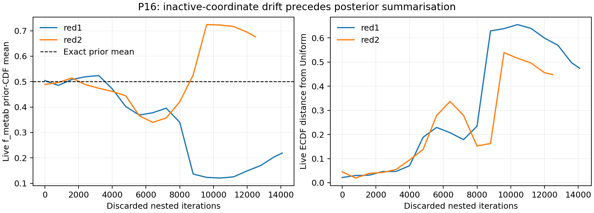

# P17 — investigation in progress

**The inactive-prior failure is independently reproduced and arises during sampling.
The decisive-conclusion gate has not passed. No computational remedy has yet been
validated for P16. No further biological fit is authorised by these results.**

The original P16 evidence is unchanged. This report records intermediate findings and
failed interventions, not a final diagnosis. Branch `codex/p17-inactive-prior` is isolated
in `/private/tmp/etcGEMs-p17`. Automatic continuation remains active.

## Established so far

The saved checkpoint rows, likelihoods and weights reproduce the reported posterior
arrays after adding exactly800 final live points. Independent truncated-prior CDF
calculations agree with stored cube coordinates within1.7e-15. The two f_metab
posterior cube means are0.319120 and0.393715, with ECDF distances0.290878 and0.216146
from Uniform(0,1). The historical14/15 median-disagreement result also reproduces;
its conditional-bootstrap errors must not be treated as calibrated full inference
uncertainties. Neither importance-weight ESS nor strand-slot ESS counts independent
posterior draws.

The actual stopping dlogz values are0.09999335 and0.09995762. The runner incorrectly
saved logzerr as dlogz_final; an isolated reporting patch corrects future outputs.
Historical outputs remain intact. This reporting bug does not explain the distributions.

Reconstruction from each slot's successive discarded points shows approximately
uniform initial live coordinates, followed by substantial drift and late concentration
in different nuisance regions. That establishes that the failure precedes weighting
and summarisation. Replacement-slot IDs do not identify proposal parents, so this
reconstruction does not prove a particular genealogy or a complete mixing mechanism.

## Why the mathematical prior is the null

The independent prior for sampled f_metab is N(0.280,0.03²), truncated to[0.15,0.45].
P16 removes only dTm and inserts its fixed value0 by name-consistent indexing before
the original16-parameter worker likelihood. Its growth-law allocation branch ignores
sampled f_metab when computing the metabolic and biosynthesis bounds. The simplex
check does not couple its prior to another parameter: the largest supported f_metab
plus f_maint is0.45+0.50=0.95. The configuration's nominal allocation used in model
construction is distinct from this sampled coordinate.

Writing the other free parameters as a, if the intended deterministic likelihood is
L(y|a) and the actual independent prior is p(a)p(f), then
p(f|y)=p(f)∫L(y|a)p(a)da/Z=p(f). Its exact truncated-prior CDF is Uniform(0,1).
The computational evaluation must also be checked for numerical state, because a
history-dependent numerical result is not a deterministic likelihood function.

Four representative active vectors from both seeds were scanned at both endpoints
and the prior centre, with reversed order and fresh models. Same-input repeats and
two-worker tests at the seed1 low-growth median showed zero canonical LP changes but
~0.088 likelihood variation from numerical history. A growth-basis reset did not cure
that variation. This is a separate demonstrated issue, not yet an explanation of P16.

At the two maximum-weight archived points and both index8000 transition points,
28 re-evaluations (identical repeats, endpoints and fresh contexts) reproduce their
archived likelihoods exactly. Thus the previously observed numerical variation is
absent at these prespecified influential points. This is a bounded result, not a
claim of globally deterministic solver behaviour.

## Controlled analytical experiments

Controls use15 dimensions, nlive800, dlogz0.1, rslice and the original min_eff30
first-bound rule. Seeds17001–17005 are calibration seeds. Confirmation seeds
17901–17905 have not been used. `controls.py` specifies the exact target densities:

- Smooth:14 independent unnormalised Gaussian factors centred0.5, sd0.15, restricted
  to the cube, plus the inactive coordinate. Exact logZ=-13.70655917.
- Mixture:13 such factors times a normalised first-coordinate truncated-Gaussian
  mixture, component masses0.3/0.7, centres0.2/0.75 and widths0.035/0.10.
- Narrow mixture: the same known target family with first width0.0005. Exact region
  probability P(x0<0.5)=0.3043739263. This stress test is motivated by a broad-to-small
  high-likelihood region transition; it is not fitted to P16 or a validated surrogate.

Five smooth controls each with plain/chunked invocation have identical coordinates
and log likelihoods; integrated weights differ only about1.5e-12. Applying the P16
prior transform and its inverse in the analytical likelihood also reproduces the
cube control. These mechanisms do not explain a failure on those matched targets.
Five serial-versus-pool16 controls are retained separately: changing queueing changes
the random sequence, so bitwise equality is not an expectation for that comparison.

Increasing slices from3 to15 reduces mean smooth logZ error from+0.233 to+0.069 and
mean ordinary-mixture logZ error from+0.227 to+0.073. Five calibration replicates do
not establish a reliable error envelope or prove a universally adequate setting.

The narrow-mixture slices3 controls allocate only0.006–0.117 probability to the region
whose exact probability is0.30437, while nuisance ECDF distances are only0.014–0.065.
Longer slices do not reliably fix its active-region probability either (all outcomes
in the per-run JSON files). **A reasonable nuisance marginal can conceal a major
active-distribution failure;15 slices has not passed as a remedy.** A single-bound
comparison also fails: all five region probabilities lie between0.007 and0.064.
Multiple-ellipsoid partitioning is therefore not necessary for this toy failure.

Bounding warnings occur even for100 well-conditioned random covariance matrices,
whose inverse residuals remain below2.5e-14. The warnings alone do not prove inaccurate
bounds. No installed library has been modified; source hashes are recorded.

## Remaining gate and scope

| Requirement | State |
|---|---|
| Exact null / executed mapping | Mathematical null established; numerical-history scope remains bounded |
| Independently reproduce failure | Passed for both saved P16 outputs |
| Isolate causal mechanism with intervention and falsification | Incomplete; simple reporting and matched wrapper explanations rejected, longer slices insufficient |
| Fresh-seed known-target and relevant real-model confirmation | Not begun; no remedy selected |
| Preserve scientific target | Passed so far; reporting/diagnostic code only |

The next work must distinguish constrained exploration, bound behaviour and residual
numerical state, and demonstrate the mechanism on the relevant real path before
claiming that a correction permits another fit. Read DECISIONS.md before launching
new batches; do not consume confirmation seeds during tuning.

Original P16 arrays, summaries, checkpoints and traces pass their launch hashes.
Tracked model/config/prior/runner source is unchanged between pre-run ab77189 and
reconstruction191b4b0. A transient uncommitted run-time edit or historical installed
library change cannot be ruled out retrospectively; no full run-time file snapshot
exists. Current library hashes are evidence of the diagnostic environment only.

Every P16/P17 posterior statement conditions on dTm=0: the meltome mean is assumed
exact. Uniform melting-temperature error is excluded and absorbed by tm_scale and
catalytic parameters. None of these results is a full-model posterior claim.

## Proposal tracing update (D8–D11)

A local subclass records the original rslice starts and ends without altering its
return values. All five instrumented runs are bit-identical to their existing
narrow-mixture baselines. Every run begins with 2–8 live points within six narrow
standard deviations of the small component, yet subsequent rslice proposals make
zero entries or exits from that core. Thus initial discovery alone does not prevent
the failure. Within-core movement of the nuisance is much smaller than outside;
seed17001 has RMS0.0114 versus0.1527 and parent-child correlation0.9993 inside.
Other active coordinates also move little. Proposal ancestry is reconstructed from
exact coordinates, with independent-phase roots explicitly distinguished; ancestry
concentration is not a calibrated posterior ESS.

A diagnostic alternative samples each coordinate from the full prior interval until
it meets the same likelihood constraint, in one random-order sweep. This is an exact
coordinate-conditional update, including disconnected permitted intervals. A sweep
is invariant but not necessarily adequately mixed. Direct independent-draw regression
tests on disjoint intervals and an informative Gaussian cut pass prespecified DKW
bounds; these IID tests are not applied to nested posterior samples.

The first narrow-target run with that update recovers region probability0.2371,
compared with baseline0.0072 and truth0.3044. This is an improvement, not confirmation:
it costs5.53million likelihood calls, and calibration-seed replication is ongoing.
The inactive coordinate is refreshed exactly by construction, so only active accuracy,
evidence and independent replication can validate the intervention. No use of this
costly kernel on a full biological fit is implied.

Six preregistered bounded proposal probes using P16's recorded live-set geometry are
queued after analytical replication. They start from archived, biased populations
and cannot be interpreted as posterior confirmation. The decisive gate remains open.

## Corrections and stratum findings (D12–D18)

**Withdraw the historical-bound interpretation of the earlier real proposal probes.**
Installed dynesty3.1.0 appends the same mutable bound object to its recorded history.
Both P16 checkpoints have only one distinct non-cube bound object, despite92 and90
recorded entries. Thus indexing that history retrieves final geometry, not geometry
at the stated iteration. Earlier probes combined final bounds with historical scale;
their likelihood evaluations remain valid, but their historical-geometry claims do
not. The initial live-set reconstruction and posterior audit do not use these bounds
and are unaffected.

A minimal regression reproduces the defect. A local recording-only wrapper preserves
24 distinct snapshots instead of one, with bit-identical samples and weights. This
locates a library defect and proves it does not directly cause the posterior bias.
It does not recover the lost historical bounds. No installed package has been edited.
`bound_coverage.json` likewise describes final-bound containment of earlier points,
not the historical coverage its original experiment intended to measure.

The unchanged zero-growth/no-scored-respiration likelihood has maximum-18.6825022942
at disc_growth1.14072162. Archived samples compatible with this exact curve carry
53.17% and81.48% posterior weight in the two seeds, unchanged across compatibility
tolerances1e-12,1e-8 and1e-4. Compatibility is an algebraic classification, not a
status check of every sample. Selected compatible points in both seeds were directly
validated as infeasible at all measured temperatures, with zero growth and no finite
O2. This explains the likelihood ceiling without modifying the infeasibility rule.
Complementary live groups already have strongly different nuisance distributions
before this large group disappears. Neither fact alone proves a sampling mechanism.

The six maximum-logL local probes showed some substantial nuisance movement. A
simplified two-region analytical model of the one-dimensional likelihood ceiling also
did not reproduce P16's large nuisance bias. These negative results are retained:
not every region is frozen, and the ceiling alone is insufficient as an explanation.
New local probes fit fresh bounds to reconstructed live sets, verify containment of
all800 live points, and are explicitly new experiments rather than historical replay.

All five full-coordinate narrow-mixture controls have now completed: region masses
0.2371,0.3949,0.3727,0.2177,0.3357 versus0.3044. This substantially improves average
recovery but leaves meaningful independent-run scatter; no remedy has passed the
confirmation gate. The alternative uniform-bound benchmark was interrupted after
exceeding its budget (~3.6h), with100.8million calls and12,255 iterations in its last
checkpoint. It is incomplete and not a posterior result or a practical real-model
candidate in this configuration. The overrun was a workflow failure; controls now
have enforced per-run deadlines, with a direct interruption test passing at1.01s.

No further biological fit or parameter fixing is justified by this interim work.
The decisive diagnosis and independent confirmation remain incomplete. All posterior
statements condition on dTm=0: an exact meltome mean, with uniform error excluded and
absorbed by tm_scale/catalytic parameters.

## Verified rebuilt bounds and live-set validation (D19–D20)

All six rebuilt-bound probes complete with800/800 live-point containment, but nuisance
moves range0.0068–0.2823. They do not support a universal frozen-coordinate explanation.
The earlier geometry-based inference must therefore remain withdrawn rather than
being rescued by choosing only the small moves.

A stronger likelihood check re-evaluates all800 reconstructed active live points at
red2/6800 in eight fresh worker models, after independently redrawing f_metab. Maximum
absolute difference from archived likelihood is1.341e-8, below the preregistered1e-6
threshold. This establishes reproducibility for this population, not global numerical
determinism. Full per-point growth/O2/status results are preserved.

An instrumented conditional continuation now starts from this active population with
independent prior nuisance values. It records actual parent/child proposals and the
live mean's decomposition into ancestor-value contribution and subsequent movement.
The initial mean is0.50419, with800 distinct ancestors. The run is capped at2500
replacements or two hours and does not integrate final-live evidence. Its active
starting population is biased; it is a mechanism diagnostic, never a fresh posterior
or evidence estimate. Independent diagnostic seeds17511–17513 are preregistered;
only17511 is launched initially for trace/cost verification.

## Interim group-level trace evidence (D21)

At1927 replacements in seed17511, all accepted parent/child links and live ancestry
are independently verified. The overall inactive distribution remains near its
prior (mean0.47953, KS0.05077), so this partial segment does not reproduce the original
P16 failure. Its smaller complementary likelihood group is much less mobile:271
within-group proposals have nuisance RMS step0.03244 and parent/child correlation
0.99488, compared with0.15350 and0.86147 in the zero-growth-curve-compatible group.
Its297 live points descend from30 initial ancestors. The complementary group's
mean is0.51156 but KS0.13734, illustrating why the mean alone is insufficient.
At compatibility tolerance1e-6 there are no observed group crossings; at1e-8
there is one apparent crossing. Group definitions are algebraic and this sensitivity
is retained. These are partial conditional diagnostics, not posterior results,
calibrated significance or proof of the historical cause. Registered independent
seeds and a controlled intervention remain necessary; the decisive gate is open.

D23 runtime correction: seed17511 stopped at its enforced7200s limit, preserving
a fully audited2250-replacement checkpoint. The coordinator correctly withheld
both repeats. A separate1800s segment now resumes the saved state to the unchanged
2500-replacement endpoint; the original runtime estimate failed and is not erased.
At2250, overall nuisance mean0.48679/KS0.07273 remains unlike the historical
P16 bias. Complementary-group movement remains restricted (RMS0.02994,
parent/child correlation0.99556). This is still conditional diagnostic evidence.

## Completed first conditional diagnostic and positive control (D24–D25)

Seed17511 reached2500 replacements and its independent trace audit passed.
Overall nuisance mean0.51115/KS0.08273 does not reproduce P16's original distortion.
Restricted movement persists in the complementary group (nuisance RMS0.02769,
parent/child correlation0.99602); this is insufficient for a causal conclusion.
The second registered seed is running; the third remains pending.

A deliberately informative toy coordinate with exact Beta(3,1) posterior was
distinguished from an inactive uniform coordinate in all10 controls: correct-CDF
KS0.0090–0.0330 versus incorrect-uniform KS0.3826–0.4153. Five of those runs
add a separate independent16th coordinate, whose KS is0.0232–0.0703. These
controls meet the positive-dependency diagnostic requirement. Their evidence
errors remain consistently positive (+0.0689 to+0.4065), so they do not certify
the baseline sampler or establish a repair. Confirmation seeds remain unused.

## Nuisance-only refresh falsification (D26)

D26 outcome: all35 diagnostic refreshes completed; original rows/weights were
not modified. P16 red1 KS drops from0.29088 to0.00910–0.01245, red2 from0.21615
to0.01427–0.02139. The narrow-mixture control refreshes have KS0.00762–0.01353,
yet their active-region probabilities remain0.00628–0.11692 against exact
truth0.30437. This directly falsifies nuisance recovery as sufficient validation
of active inference. It does not by itself isolate P16's original cause. No
refreshed P16 posterior file was saved; source hashes and deterministic refresh
seeds are recorded. Independent controls and real-path causal confirmation remain
required. Real seed17512 is still progressing under its existing bounded run.

## D30 — asymmetric toy outcomes and limits of the occupancy test

All20 registered cases completed, exit0, total72.87s. Independent quadrature
agrees with all four analytic normalisations within1e-12. Paired seeds have
identical initial high-group counts. No case was dropped or replaced.
Flat baseline versus lowered-low score: mean nuisance KS0.05347 versus0.05791;
mean final high roots26.2 versus27.8. Smooth baseline versus lowered-low score:
mean KS0.02656 versus0.03558; mean roots42.4 versus38.6. No systematic diversity
or nuisance-recovery improvement follows lowering the low score. None reproduces
P16 KS0.216–0.291; maximum here0.1102. Evidence errors and active CDF errors
are retained in full, not treated as passing inference validation.

Crucial limit: high-group nuisance RMS moves are0.142–0.163 across all cases,
so these toys do NOT reproduce the restricted high-group mobility (~0.028–0.042)
of the real conditional traces. Thus the result challenges occupancy asymmetry
ALONE, including the automatic800-independent-ancestors counterfactual. It does
not falsify the proposed interaction of occupancy with genuinely poor mixing.
Flat and smooth variants both retain few roots even after lowering the low score,
but root counts alone are not independent sample counts when within-lineage
moves are substantial. No flat-only P16-size failure supports a plateau-specific
explanation here. No further toy parameter sweep is authorised by these outcomes;
next causal work must address the missing real-surface mixing mechanism.

Source/weighted trace hashes, full case results, stage ancestry histories and
checkpoints preserved. Large arrays/checkpoints remain local; compact JSON
and diagnostic script are committed. Third real conditional seed17513 remains
in its original bounded run. No scientific target or biological penalty changed.

## Real live-group geometry (D31)

The preserved2000-step snapshots show a much narrower complementary-group
covariance in both conditional runs: minimum group/mixed width ratios0.01273
and0.01707. The tightest combinations involve chiefly dTopt, dCp_scale, sigma
and topt_scale, with tiny f_metab loadings. The inactive marginal width itself
is comparable across populations. These are live-geometry measurements, not
posterior/prior constraints. They motivate D32's paired proposal-axis test on
the unchanged real likelihood; that test has not yet run.

## First controlled geometry intervention (D34)

All three conditional traces have completed their registered2500 replacements
and passed ancestry audits. The first six-proposal axis intervention completed
in146.91s. With the parent, likelihood, cutoff, scale and paired random state
held fixed, locally fitted axes increased absolute nuisance displacement in
all three pairs (~31.5x,339.4x,19.5x); active RMS movement increased too.
Evaluation counts rose from9/10/10 to15/12/14, including verification. This
is controlled evidence of a local geometric restriction, not proof of globally
correct inference or a full explanation of P16. The same test at the median
complementary point in independent run17512 is now running with fresh seeds.

## Independent-point replication and real-path Beta chains (D36–D37)

The geometry replication at the second independent parent is mixed: local
axes increase nuisance movement in two of three pairs, decrease it in one.
Active movement also improves in two and decreases in one. This limits the
claim to demonstrated local restrictions, not a uniformly superior proposal.

Six paired fixed-cut chains completed with an appended inactive
Beta(3,1) coordinate on the unchanged real P16 likelihood. Each has32
transitions, fixed original or local axes, no nuisance refresh, and bounded
call/time budgets. The known Beta CDF tests actual-surface mixing, but these
short chains from biased active parents are not posterior certification.
All original15 priors and likelihood inputs are unchanged.

All six traces passed independent accounting and all24 endpoint rechecks
(maximum absolute log-likelihood difference7.77e-9, threshold1e-6). Beta-CDF
KS original/local was0.6315/0.5660,0.4204/0.3969,0.5754/0.5416. Existing
f_metab coverage worsened in one local-axis arm. The registered short chains
therefore do not certify either geometry as a repair. No retrospective extra
steps or burn-in removal were used. These are descriptive correlated-chain
results, not IID significance tests or full nested posterior confirmation.

D39 is now testing frozen global mixture proposals with exact Metropolis
correction on known targets. Its independent-start correctness test passed
(CDF discrepancy0.0242 below registered0.0436); removing the correction gave
0.7319. The first nested smooth benchmark completed10.78s with active/inactive
CDF discrepancies0.0108/0.0099. Remaining development repeats are running;
no real-model repair or full P17 completion is claimed.

## Global-proposal comparison completed (D39–D40)

All ten development runs completed. The pilot-based global proposal recovered
the smooth target, but failed the narrow mixture: region masses0.0076–0.3974
against0.3044, with one inactive-CDF discrepancy0.3347. A density-corrected
kernel can still mix badly when its proposal inherits a trapped pilot's geometry.

Replacing only the proposal geometry with the toy's known Gaussian geometry
improved all five paired repeats: region masses0.3049–0.3279, inactive-CDF
discrepancies0.0063–0.0107, maximum over all14 active-CDF discrepancies
0.0129–0.0257. Independent saved-array auditing verifies these results and
retains all outcomes. However, log-evidence errors reach about0.31 against
nominal errors around0.13; uncertainty calibration remains open. This oracle
comparison isolates a toy proposal limitation, not a practical biological-model
repair. The full P17 gate, including relevant real-model confirmation, is open.

## Geometry construction and transfer check (D41–D44)

Removing only the pilot's correlations failed across five repeats, sometimes
worsening both active and inactive errors. A numerical fit of local likelihood
geometry from the same pilot centres subsequently recovered the toy's region
mass0.3026–0.3279 and inactive-CDF discrepancies0.0063–0.0124 across five repeats.
This fit received no true active means or widths. Its initial forward-gradient
optimiser failure is retained; a central-gradient implementation passed unchanged
curvature and stopping checks. This is development evidence, not fresh-seed
certification. The real-surface curvature readiness check is now running before
any attempt to apply this geometry construction to the biological model.

D44 finished58 evaluations in121s. Seven coordinates have substantial
step-dependent curvatures (relative changes0.102–0.938); the baseline itself
repeats within7.43e-13. Feasibility classifications and respiration masks are
identical across all inputs. This fails the registered local readiness check
for direct transfer of the toy fitter. The point is not an optimum, and this
does not rule out every curvature-based method. D45 is repeating all saved
inputs in reverse order with a fresh model to test numerical history at the
perturbed points rather than relying on baseline repeatability alone.

D45 completed58 fresh-model reverse-order evaluations in121.50s. Every
likelihood reproduced within4.08e-10 and the same seven axes failed the
curvature-readiness check. Solver-history noise at these particular points
does not explain the result. This establishes reproducible scale dependence
at the selected point, not universal nondifferentiability or impossibility of
all curvature-based methods. The full gate remains open; current_gate.md
collects the present requirements and limits in one place.

## Separate local exploration from region allocation (D46–D49)

Recording-only replays reproduced the global-proposal outputs bit for bit.
The biased pilot's narrow core had no movement in677 consecutive core-parent
kernels spanning two middle stages, while broad-region parents remained mobile.
The oracle-geometry replay retained core movement and region exchange.

Adding coordinate slice sweeps removed duplicate full vectors and recovered
the inactive prior across five repeats, but regional mass remained0.1563–0.3700
against0.3044. This is a further concrete failure of nuisance-only certification.
The approach also increases evaluation counts and is not transferred to biology.

An exact-prior partition of the toy allocated400live points to each of two
regions and recombined their evidence using known prior volumes0.006/0.994.
The overall target is unchanged. Region weights improved to0.2463–0.3305,
but all ten conditional runs overestimated evidence. A direct-rejection
comparison within these same partitions is now being benchmarked to distinguish
within-region slice dependence from scarce-region representation. The analogous
real-model partition and its prior measure remain unknown.
