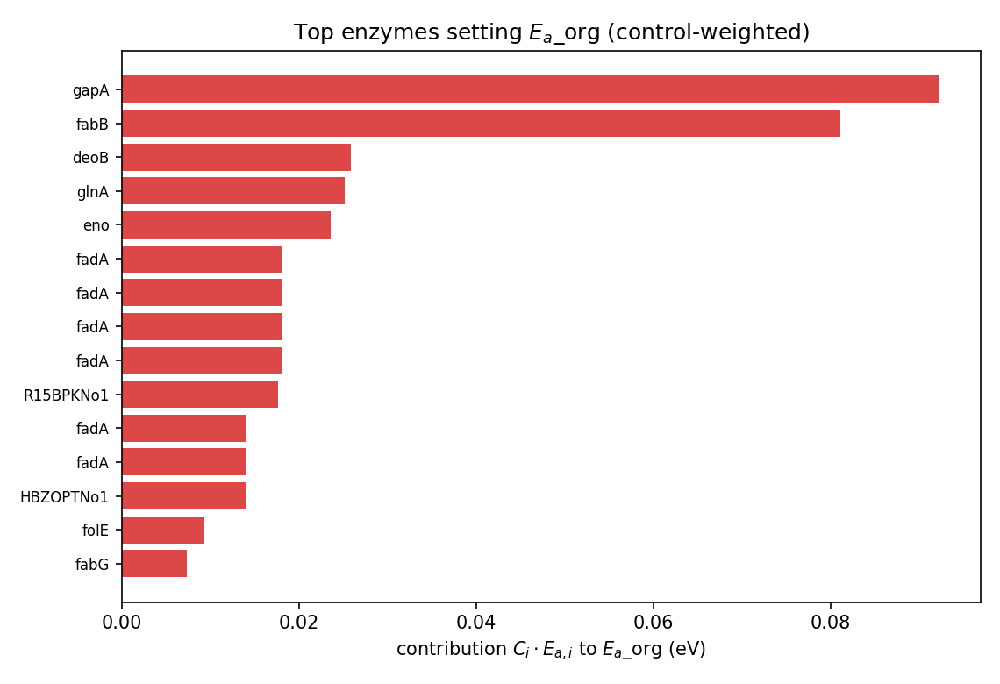

# Background: is the growth activation energy one enzyme or an aggregate?

A **thermal performance curve (TPC)** is growth rate versus temperature: it rises from a
cold limit, peaks at an optimum $T_\text{opt}$, and collapses at a hot limit. The
**activation energy** $E_a$ summarises the *rising limb* — the Boltzmann–Arrhenius slope
of $\ln(\text{rate})$ against $1/(k_B T)$ below the optimum, in eV. Across bacteria the
growth $E_a$ clusters near a "universal" value (~0.6–1.0 eV, often quoted around
0.85 eV), and this apparent constancy has been read as evidence for a shared biophysical
constraint. Yet it is not known whether an organism's $E_a$ is set by a **single
rate-limiting enzyme** whose own temperature response the organism inherits, or is an
**aggregate** over many enzymes weighted by how much each controls growth.

An enzyme- and temperature-constrained genome-scale model (etc-GEM) is the natural
testbed: it carries a temperature-dependent turnover for *every* enzyme and predicts the
whole TPC from enzyme-constrained flux-balance analysis. The construction, calibration and
validation of the *E. coli* model used here — GECKO **eciML1515**, with a two-state
unfolding thermal envelope, measured proteome-sector allocation, and a Bayesian
calibration to a measured curve — are the subject of the **companion report**
(`reports/ecoli_tpc/`); we do not re-derive them. Here we use that model, at its
calibrated ("tuned") operating point, to ask **what mechanistically sets $E_a^\text{org}$**.

The essential discipline is **non-circularity**. The model's per-enzyme activation
energies $E_{a,i}$ are *inputs*, grounded in independent data. Asking "what is $E_a$" would
be $E_a$-in-$E_a$-out. Instead we ask two questions the inputs do **not** predetermine: how
does the organism-level $E_a^\text{org}$ **aggregate** the $E_{a,i}$, and how does it
**depart** from their naive average? The departure is created by things absent from the
input distribution — the concentration of growth control in a few enzymes, the
temperature-dependent maintenance cost, and the growth-law proteome reallocation.

# Method: a control-weighted decomposition of $E_a^\text{org}$

By the chain rule (metabolic control analysis), the Arrhenius slope of growth is, to first
order, a sum of enzyme-kinetic and non-kinetic terms:

$$
E_a^\text{org} \;\approx\; \underbrace{\sum_i C_i\,E_{a,i}}_{\text{enzyme-kinetic}}
\;+\; \underbrace{\Delta_\text{alloc} + \Delta_\text{maint} + \text{residual}}_{\text{non-kinetic}},
$$ {#eq-mca}

with the ingredients defined **identically to the companion model** (`ea_dissection.py`):

- **$E_a^\text{org}$** reuses the exact rising-limb $E_a$ descriptor and window of the
  companion TPC engine (the temperatures where growth is 10–95 % of its peak, below the
  optimum).
- **$E_{a,i}$** (the *inputs*): each enzyme's effective rate capacity is
  $r_i(T)=\widehat{k}_{\text{cat},i}(T)\cdot f_{N,i}(T)$ — its temperature-dependent
  turnover (MMRT curvature refined by DLTKcat) times its folded fraction (a two-state
  native$\leftrightarrow$unfolded term keyed on $T_m$). $E_{a,i}$ is the Arrhenius slope of
  $r_i$ over the *same* window.
- **$C_i=\partial\ln\mu/\partial\ln k_{\text{cat},i}$** is enzyme $i$'s **growth flux
  control coefficient**, computed by a small symmetric $k_{\text{cat},i}$ perturbation and
  re-solve (reusing the companion per-enzyme control harness). The **summation theorem**
  requires $\sum_i C_i\approx 1$ over the controlling set.
- The **non-kinetic terms** are each isolated by a temporary, in-analysis switch-off
  (never written back to the model): $\Delta_\text{maint}$ by flattening the
  temperature-dependent maintenance, $\Delta_\text{alloc}$ by disabling the growth-law
  proteome reallocation.

So $E_a^\text{org}$ is, to first order, a **control-weighted mean of the enzyme
$E_{a,i}$**, offset by the non-kinetic couplings. The analysis quantifies (a) whether the
identity closes, (b) how the control-weighted mean departs from the unweighted mean, and
(c) how much the non-kinetic terms shift it. The substrate is the **tuned** model (the
calibrated posterior) at the rich operating point, with the model's uncosted O2-sink
reactions closed (companion correction) so control is attributed to genuine respiration;
a glucose-minimal operating point is used for the medium comparison.

# Results

## The decomposition closes, and $E_a^\text{org}$ is a control-weighted enzyme mean

At the rich operating point the calibrated model gives $E_a^\text{org}=0.91$ eV over a
17–35 °C rising-limb window — near the ~0.85 eV bacterial-growth benchmark. (For
reference, the *emergent*, nothing-fit model gives 0.65 eV and the digitised observed
value is 0.64 eV; the calibration raises the rising-limb slope, as detailed in the
companion report. This report concerns the *mechanism* of the tuned value.)

The MCA decomposition of @eq-mca closes (@fig-waterfall, @tbl-decomp): the enzyme-kinetic
backbone — the **control-weighted mean** $E_{a,i}$ — is 0.970 eV; proteome allocation
lowers it by 0.107 eV and temperature-dependent maintenance by 0.010 eV, leaving a small
residual (0.057 eV) for higher-order/window nonlinearity. So the organism-level $E_a$ is
**an aggregate of the enzyme activation energies, not the signature of a single
rate-limiting step**, buffered downward by the cell's allocation and maintenance physiology.

{#fig-waterfall fig-pos="H" width=85%}

```{python}
#| label: tbl-decomp
#| tbl-cap: "Decomposition of the departure of E_a^org from the naive enzyme-E_a mean (tuned model, rich medium), matching the signed-contribution figure. Starting from the unweighted enzyme mean, control weighting raises it to the control-weighted mean, and allocation, maintenance and a small nonlinear residual close it to the organism E_a. Values in eV; signs as in the figure."
#| output: asis
import json, pandas as pd
h = json.load(open("assets/tables/ea_summary.json"))["headline_BHI"]
D = h["decomposition_eV"]; dep = h["departure_from_naive_mean_eV"]
base = float(dep["unweighted_mean_Ea_i"]); cw = float(dep["control_weighted_mean_Ea_i"])
ctrl = cw - base
alloc = float(D["allocation_growth_law"]); maint = float(D["maintenance_NGAM"])
resid = float(D["residual_nonlinear"]); Ea = float(D["actual_Ea_org"])
chk = base + ctrl + alloc + maint + resid
assert abs(chk - Ea) < 1e-3, f"decomposition does not close: {chk} vs {Ea}"
def sgn(v):
    return f"{v:+.3f}".replace("-", "−")
def num(v):
    return f"{v:.3f}".replace("-", "−")
rows = [("naive (unweighted) enzyme mean", num(base)),
        ("+ control weighting", sgn(ctrl)),
        ("= control-weighted mean", num(cw)),
        ("− allocation (growth law)", sgn(alloc)),
        ("− maintenance NGAM(T)", sgn(maint)),
        ("+ residual (nonlinear)", sgn(resid)),
        ("**= organism $E_a$ (actual)**", "**" + num(Ea) + "**")]
print(pd.DataFrame(rows, columns=["term", "eV"]).to_markdown(index=False))
```

## The departure from the naive mean — control on higher-$E_a$ enzymes

The non-circular result is the **departure** of $E_a^\text{org}$ from the naive average of
the input $E_{a,i}$ (@fig-departure). The unweighted mean over the flux-carrying enzymes is
0.867 eV and the proteome-mass-weighted mean 0.896 eV, but the **control-weighted mean is
0.970 eV** — the enzymes that actually control growth have a *higher* activation energy
than the average enzyme, lifting the effective enzyme-$E_a$ by **+0.10 eV**. That
concentration of control on higher-$E_a$ enzymes is what makes $E_a^\text{org}$ larger than
a mass-weighted or unweighted reading of the same input distribution. The organism $E_a$ is
therefore not a property of the enzyme *pool* but of the enzyme *bottlenecks*.

{#fig-departure fig-pos="H" width=65%}

## Summation-theorem validation, and the allocation link

The MCA identity is validated by the **summation theorem**. On the full tuned model
$\sum_i C_i = 0.56$ — *not* unity — because the growth law places a temperature-independent
biomass term inside the binding metabolic-enzyme budget, so ~0.44 of the marginal growth
control sits on the proteome **allocation** rather than on enzyme turnovers (the in-vivo
saturation $\sigma$ has a growth elasticity ≈ 1.0). With the growth law **disabled**,
$\sum_i C_i \to 1.02$ and the raw $\sum_i C_i E_{a,i}\to 0.96 \approx E_a^\text{org}(\text{no
GL})=1.02$: the identity closes directly on the enzyme-kinetic backbone, and it is the
growth-law allocation that bends it.

This is the analysis's **through-line to the companion report**: the *same* proteome-budget
lever ($\sigma$, the in-vivo enzyme saturation) that had to rail toward its physical ceiling
to reach the rich-medium growth *magnitude* is here the largest non-kinetic offset to $E_a$
($-0.107$ eV) and the holder of ~0.44 of growth control. **Proteome allocation links the
magnitude and the temperature sensitivity of growth** — the same physiological constraint
governs both.

## Which pathways set $E_a^\text{org}$ — and the medium dependence

Ranking enzymes by their contribution $C_i\cdot E_{a,i}$ (@fig-topenz, @tbl-cog), the rich-
medium $E_a$ is set by **fatty-acid synthesis** (fabB, fadA) and **glycolysis** (gapA,
enolase). The shared acyl-carrier protein acpP (P0A6A8) is a genuine contributor (14.5 % of
the enzyme-kinetic term) but a hub that participates in 30 reactions; excluding it, the
*genuine* catalytic enzymes still carry the lipid signal (fabB/fadA contribute 0.198 of the
0.276 lipid-category total), and **lipid metabolism still leads the by-category ranking**
(0.198 vs glycolysis 0.152). The figures and tables here use that acpP-excluded, robust
attribution.

The most striking result is **medium dependence**. On glucose-minimal the controlling set
shifts entirely to **amino-acid biosynthesis** — argininosuccinate synthase (argG) is the
single largest contributor, with threonine synthase and glutamine synthetase — and lipid
falls to second; only 6 of the top 15 controlling enzymes are shared with the rich medium.
The mechanistic basis of the growth $E_a$ is thus **set by whatever the cell is actively
synthesising**: fatty acids and central carbon on a rich medium where building blocks are
supplied, amino-acid biosynthesis on a minimal medium where they must be made. A single
"universal" $E_a$ can sit atop quite different controlling machinery.

{#fig-topenz fig-pos="H" width=78%}

```{python}
#| label: tbl-cog
#| tbl-cap: "E_a^org contribution by functional (COG) category, acyl-carrier hub excluded. Rich medium (BHI) vs glucose-minimal: the controlling machinery is medium-dependent — lipid/glycolysis on rich, amino-acid biosynthesis on minimal."
#| output: asis
import pandas as pd
b = pd.read_csv("assets/tables/ea_by_cog_BHI.csv"); g = pd.read_csv("assets/tables/ea_by_cog_glucose.csv")
b = b.rename(columns={"contrib": "BHI (eV)"}).set_index("cog_category")["BHI (eV)"]
g = g.rename(columns={"contrib": "glucose (eV)"}).set_index("cog_category")["glucose (eV)"]
t = pd.concat([b, g], axis=1).fillna(0.0).round(3)
t = t.reindex(t["BHI (eV)"].abs().add(t["glucose (eV)"].abs()).sort_values(ascending=False).index).head(6)
print(t.to_markdown())
```

## Robustness, and a discarded artefact

$E_a^\text{org}$ is **robust** to moderate changes in the enzyme-$E_a$ heterogeneity: scaling
the spread of the per-enzyme kinetics by ×0.5–1.0 leaves it at 0.90–0.93 eV (@fig-robust).
The control-weighting **mechanism** is also structural rather than a fit artefact: the top-15
controlling enzymes overlap 7/15 between the emergent (nothing-fit) and tuned models. We
explicitly **do not** claim, as an earlier draft did, that fully homogenising the enzyme
kinetics raises $E_a$ (hence "heterogeneity lowers $E_a$"): a diagnostic showed that value is
a numerical artefact — setting all optima equal sharpens the peak and shifts the rising-limb
window into a steeper, hotter region where maintenance amplifies it, and the homogenisation is
incomplete (see the diagnostic note). The moderate-spread result is the honest robustness
statement.

{#fig-robust fig-pos="H" width=62%}

# Interpretation

The organism-level activation energy of *E. coli* growth is, mechanistically, a
**control-weighted average of per-enzyme activation energies** — an aggregate, not the
fingerprint of one rate-limiting enzyme. Three features shape it. First, it sits *above* the
naive enzyme-$E_a$ mean because growth **control concentrates on a few, higher-$E_a$
enzymes**; the organism inherits the temperature sensitivity of its bottlenecks, not of its
average protein. Second, it is **buffered downward** by proteome physiology — the growth-law
reallocation of proteome toward ribosomes at higher growth, and temperature-dependent
maintenance — which together remove ~0.12 eV; the same in-vivo-saturation lever that limits
the growth *magnitude* is the dominant $E_a$ offset, so **allocation ties the height and the
temperature sensitivity of the curve together**. Third, the controlling machinery is
**medium-dependent**: the $E_a$ reflects the temperature sensitivity of whatever biosynthesis
the cell is actively running, so a common ~0.85 eV can rest on lipid/glycolytic control in
rich conditions and amino-acid biosynthesis in minimal ones.

This reframes the "universal" metabolic $E_a$. If the value is an aggregate set by the
*active* biosynthetic bottlenecks and buffered by allocation, its apparent constancy need
not imply a single conserved enzyme or a fixed biophysical constant — it can emerge from
different controlling enzymes in different conditions and organisms, provided those
bottlenecks share a temperature sensitivity near the benchmark. The caveats are those of the
model: the per-enzyme $E_{a,i}$ are grounded *inputs* (MMRT + DLTKcat + a melting proteome),
so the result is an attribution given those inputs, not an ab-initio prediction of the $E_a$
value; and the tuned rising-limb slope (0.91 eV) is a calibrated quantity that sits near, but
is not pinned to, the 0.85 eV benchmark (the companion report shows the calibration does not
chase the possibly-flattened digitised 0.64).

# Next steps: a cross-organism test

The sharpest test of "the $E_a$ is set by the active, rate-controlling biosynthesis" is
**across metabolisms**. The planned comparison (see `docs/METHANOGEN_ETCGEM_PLAN.md`) builds a
parallel etc-GEM for a **hydrogenotrophic methanogen** (*Methanococcus maripaludis*), where
methanogenesis is the *only* energy-generating pathway and growth is tightly coupled to CH$_4$
— so the growth-$E_a$ control should fall squarely on the methanogenesis enzymes, with
**methyl-coenzyme-M reductase (Mcr)**, the famously slow terminal step, the predicted
dominant, higher-$E_a$ controller. A within-metabolism, across-thermal-niche test (a
thermophilic *Methanococcales* relative such as *Methanocaldococcus jannaschii*) and an
across-metabolism control (a **cyanobacterium**, phototrophy) complete the design. If the
same control-weighted-aggregation mechanism holds — with a *different* controlling enzyme
set predicted for each metabolism — the framework will have turned a phenomenological
"universal" $E_a$ into a mechanistic, organism-specific attribution. This report is the first
(E. coli) act.
