This Supplement documents the full construction of **all three** etc-GEMs — the *M. maripaludis*
methanogenesis model, the *E. coli* respiration model and the *Synechocystis* 6803 photosynthesis
model, each the first published for its taxon — together with the window-independence audit that
motivates the Sharpe–Schoolfield $E$, the calibration diagnostics, and the robustness analyses.
Numbers are model outputs; honest caveats are stated throughout.

# Building the *E. coli* respiration etc-GEM

**Base network and enzyme constraint.** The base is iML1515, the manually curated *E. coli*
K-12 MG1655 genome-scale reconstruction (2,712 reactions, 1,877 metabolites, 1,516 genes)
[@Monk2017], converted to the enzyme-constrained ecModel **eciML1515** with the GECKO method
[@Sanchez2017; @Domenzain2022], which adds a protein-usage pseudo-metabolite per reaction drawn
from a shared pool. The metabolic pool is set from independent data
($P_\text{metab}=\sigma\,f_\text{metab}\,P^{\text{lit}}$; literature protein content
$P^{\text{lit}}=0.5$ g gDW⁻¹, measured metabolic fraction, in-vivo saturation $\sigma=0.45$
[@Davidi2016; @Heckmann2020]), so the growth-rate magnitude is emergent, not fit.

**Model curation — uncosted O₂ sinks.** Four reactions in eciML1515 consume O₂ at negligible
enzyme cost — two quinol/menaquinol monooxygenases (QMO2, QMO3), a malate:O₂ oxidoreductase
(MOX) and a cuprous oxidase (CU1Opp) — forming a futile O₂ cycle that at low temperature can
carry the majority of gross O₂ turnover and short-circuits the enzyme-costed cytochrome oxidase.
Closing these four (a documented, reversible default) routes O₂ through the genuine respiratory
chain at ~−0.3% growth, so control is attributed to real respiration. Catalase and superoxide
dismutase are real enzymes and are deliberately *not* closed.

**Thermal + allocation layers.** Per-enzyme $T_\text{opt}$ and $T_m$ were grounded from a
sequence-based optimum predictor [@LiEngqvist2019] and meltome/length relations for ~90% of
enzymes (the rest at dataset means), with DLTKcat [@Qiu2024] refining $T_\text{opt}$ where it
fits; $k_\text{cat}(T)$ follows MMRT [@Hobbs2013] with a literature $\Delta C_p$ prior, and the
high-$T$ collapse follows a two-state unfolding native fraction keyed on $T_m$. The proteome was
partitioned into metabolic/biosynthesis/maintenance sectors [@Basan2015; @Scott2010] from a
growth-condition-matched measured *E. coli* proteome, with the coupled bacterial growth law
(Scott slope) under which the ribosomal fraction rises with growth rate. Maintenance is a
temperature-dependent NGAM($T$).

**Validation and calibration.** The emergent model was validated against, then Bayesian-
calibrated (emcee, exact Gaussian discrepancy likelihood) to, the rich-medium (BHI) growth TPC
of @vanderlinden2012 (7–46 °C, $r_\text{max}=2.40$ h⁻¹ at 40 °C). The calibration frees only a
few global scalars (the grounded per-enzyme parameters are not re-fit) and closes ~89% of the
magnitude gap; the posterior in-vivo saturation railed toward its physical ceiling
($\sigma=0.867$ [0.671, 0.986], above the 0.4–0.5 literature range — a genuine residual, kept
distinct rather than papered over), with a melting-temperature shift ($dT_m=-5.6$ K) pulling the
hot collapse to the data (@fig-ecoli-cal). The calibrated $E_a$ holds near the metabolic
benchmark. This is the calibrated model dissected in the main text.

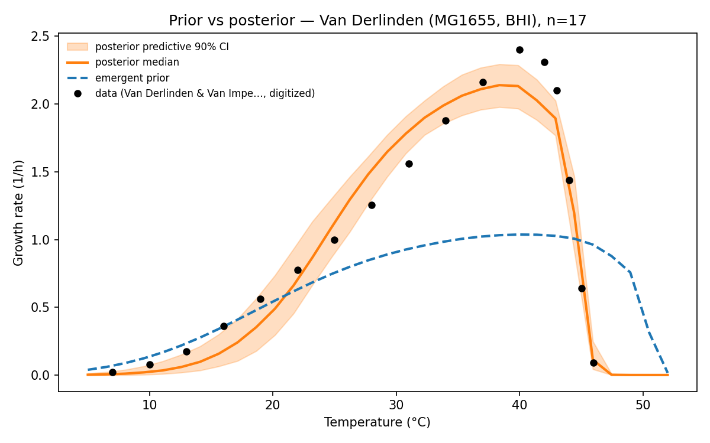{#fig-ecoli-cal width=80%}

# Building the *M. maripaludis* methanogenesis etc-GEM (M1–M6)

The model was built in six phases, each committed and validated (build records in
`strains/mmaripaludis/outputs/M*.md`).

## M1 — base GEM + medium (foundation)
The iMR539 reconstruction [@richards2016] (688 reactions / 710 metabolites / 539 genes;
BioModels BIOMD0000001099) was acquired and validated on a defined H2/CO2 medium. Plain FBA
reproduces hydrogenotrophic methanogenesis with the correct **H2:CO2:CH4 = 4:1:1**
stoichiometry and a gene-annotated Wolfe cycle. A preliminary audit found **no thermodynamic
energy loops**; 85% metabolic GPR coverage; MMP locus tags map to UniProt proteome
UP000000590 (sequences fetchable) — ecModel-ready.

## M1b — carbon-honest curation
The published reconstruction could not grow without free uptake of four biomass precursors.
Tracing the network, three (Membrane_lipid, NAC, Flagellin) feed *only* the archaellin
(flagellum) glycoprotein — a dispensable motility structure — so archaellin was folded out of
biomass; the fourth (tRNA(SeCys)) was a **recycling gap** (the incorporation step failed to
release the free tRNA), fixed by regenerating it. Organic-carbon leaks were closed and the
pinned CH4 exchange freed. The curated model grows autotrophically on H2/CO2 with **99.98% of
biomass carbon from CO2**. Two vitamin cofactors (thiamin, NMN) lack biosynthesis and are
supplied as documented medium traces (0.02% of carbon).

## M2 / M2b — the sMOMENT ecModel + kcat refinement
An sMOMENT total-protein pool was attached (reusing the E. coli `enzyme_cost` engine): each
reaction costs $\text{MW}/k_\text{cat}$ from a shared budget. Per-reaction $k_\text{cat}$ by
source priority: **measured core** (electron-bifurcation complexes from Milton et al. 2018,
25–165 U/mg [@milton2018]; classic biochemistry for Mtr/Fwd/Mcr/etc.), **DLTKcat** sequence
predictions for the bulk, and a mean fallback. Mcr — the famously slow terminal enzyme and the
$E_a$ target — was sourced carefully (mature-Mcr average specific activity ~20 U/mg,
*Methanothermobacter*; $k_\text{cat}$ ≈ 59 s⁻¹, uncertainty range 3–294 s⁻¹). **M2b** corrected
a systematic DLTKcat archaeal-underprediction (28% of predictions <1 s⁻¹) with cited
literature/BRENDA overrides for the flagged high-pool offenders (pyruvate- and
2-oxoglutarate:ferredoxin oxidoreductases) plus a documented 1 s⁻¹ floor. The grounded pool
($P_\text{total}\times\sigma\times f_\text{metab}$, not tuned to $\mu_\text{max}$) gives an
emergent $\mu$ that undershoots the observed rate ~4×, expected for a-priori kinetics.

## M3 — thermal envelope + measured maintenance
kcat($T$) (MMRT/Eyring) × native fraction $f_N(T)$ (two-state unfolding keyed on $T_m$), with
per-enzyme optima from a documented **mesophile Topt prior** and $T_m$ from a mesophile prior
(the sequence/meltome predictors are the future upgrade). Maintenance is a
temperature-dependent NGAM($T$) **anchored on the measured** M. maripaludis maintenance energy
(7.836 mmol ATP gDW⁻¹ h⁻¹, Goyal et al. 2015 [@goyal2015]). The emergent TPC matches Jones'
**CTmax (~47 °C)** a-priori (@fig-emergent); the rising limb was too warm/steep and the
magnitude maintenance-crushed — the residuals the calibration then addresses.

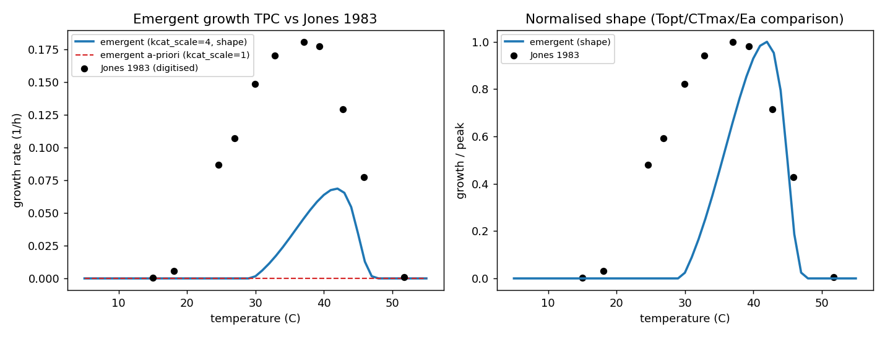{#fig-emergent width=95%}

## M4 — Bayesian calibration to Jones 1983
The thermal ecModel was calibrated to the digitised Jones 1983 growth TPC [@jones1983] by
ensemble MCMC (emcee; the same machinery as the E. coli fit), magnitude-first, with
provenance priors. The posterior **reproduces the whole curve** (@fig-calib; RMSE 0.005 h⁻¹),
reaching the peak (0.184 vs 0.181 h⁻¹) with Topt 37 °C and CTmax 51 °C. The demanded magnitude
correction (kcat_scale ≈ 7×) is a plausible in-vitro→in-vivo + archaeal-underprediction gap
(the single sMOMENT pool lumps the degenerate magnitude levers). The maintenance multiplier
stayed near 1, confirming the Goyal-measured NGAM.

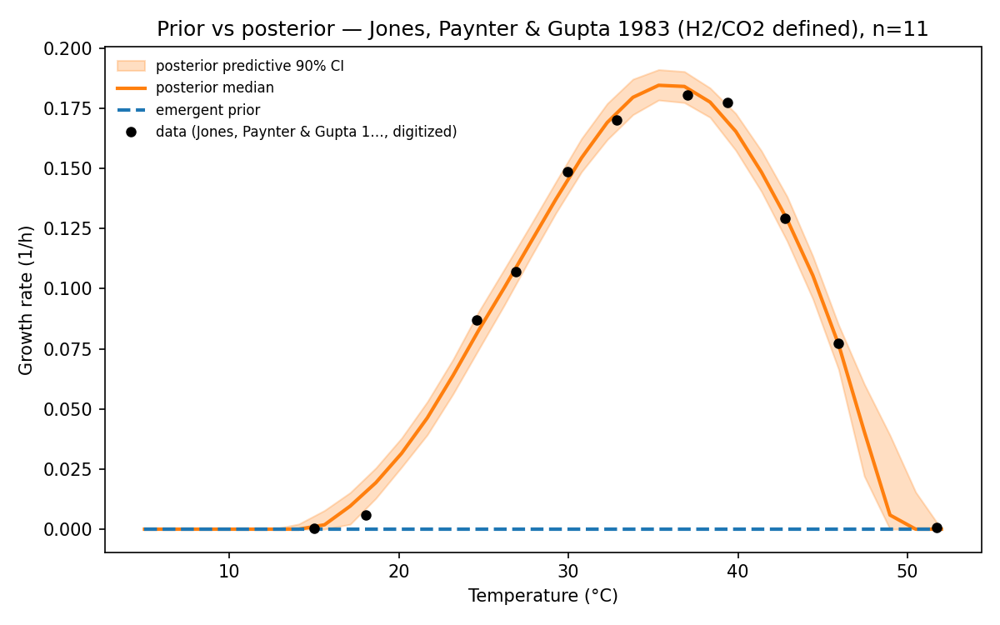{#fig-calib width=85%}

## M6 — the methanogen's own allocation layer
A proteome-sector/growth-law layer was added, grounded in the organism's **own** allocation
physiology: Müller et al. 2021 [@muller2021] show M. maripaludis holds a **constant ribosomal
proteome fraction** and invariant catabolic/anabolic allocation across growth rate (the
opposite of the E. coli/yeast scaling law), so the growth-law coupling slope is **~0 (flat)**.
Sector fractions ($f_\text{metab}$ 0.55 / $f_\text{maint}$ 0.30 / $f_\text{bio}$ 0.15) are
grounded in the Xia/Müller proteome. Forward-check: with the sector layer on and the M4
posterior, the TPC is **identical** to the single-pool model (max\|$\Delta\mu$\| = 0), so no
re-calibration was needed. The directly-measured allocation buffer is **+0.000 eV** (vs
E. coli −0.130), grounding the allocation asymmetry in each organism's measured strategy.

**Honest caveats carried into the analysis.** (i) The **Mcr $k_\text{cat}$** (3–294 s⁻¹) is
the dominant single-parameter uncertainty. (ii) **DLTKcat is bacteria-trained**, so archaeal
predictions are corrected but remain a prior for the biosynthetic bulk. (iii) The **$T_m$ and
Topt** are mesophile priors (no archaeal sequence predictor). (iv) The **sector fractions** are
grounded but approximate; the flat slope is the robust, cited quantity. The main-text
conclusions are shown robust to the parameter that matters most (Mcr; @sec-mcr).

# Building the *Synechocystis* 6803 photosynthesis etc-GEM (P1–P4)

The phototroph was built in four phases (build records in `strains/syn6803/outputs/P*.md`),
in the **light-saturated, carbon-fixation-limited** regime chosen so that the temperature-
insensitive light reactions are non-limiting and Calvin-cycle enzyme kinetics set the rate —
keeping the phototroph *within* the shared enzyme-kinetic mechanism rather than requiring a new
light-supply layer.

## P1 — scaffold + light-saturated autotrophic base
The base reconstruction iSynCJ816 [@joshi2020] (1,044 reactions / 928 metabolites / 816 genes;
BiGG) was acquired and a **pre-built enzyme-constrained ecModel**, iSynCJ816\_STAR [@andrews2024]
— an AUTOPACMEN sMOMENT total-protein-pool layer (`prot_pool`, budget 0.26 g gDW⁻¹, 1,066
flux-costed reactions, BRENDA/SABIO-RK kcats) — was adopted as the enzyme layer (the cyanobacterial
analog of the pre-built *E. coli* ecModel, so no enzyme layer is built by hand). The medium was set
photoautotrophic and **light-saturated**: photon uptake non-limiting, CO₂/bicarbonate available,
organic carbon closed, objective the autotrophic biomass reaction. A decisive check confirmed the
in-mechanism regime: in the enzyme-constrained model, growth **saturates** against photon supply
and the **photon shadow price is zero** (carbon-fixation capacity, not light, is limiting), with
RuBisCO carrying flux and zero net photorespiration — impossible in a plain (non-enzyme) model,
which is photon-linear.

## P2 — thermal envelope + measured maintenance
The temperature-dependent envelope — kcat($T$) (MMRT/Eyring) × native fraction $f_N(T)$ (two-state
unfolding keyed on $T_m$) — was attached to iSynCJ816\_STAR by the same machinery as the other two
models. Per-enzyme optima and melting temperatures use the documented **mesophile prior** (6803 is
a mesophile absent from the sequence/meltome training sets; the same route as the methanogen), the
curvature the literature MMRT prior. Maintenance NGAM($T$) is anchored on the **measured**
*Synechocystis* photon-maintenance coefficient (3.12 mmol gDW⁻¹ h⁻¹; Touloupakis et al. 2015
[@touloupakis2015]) — a photon-based coefficient, reflecting that maintenance ATP is met by
photophosphorylation. The emergent (nothing-fit) TPC already matches shape and magnitude a-priori
(Topt 36 °C vs observed ~35; CTmax 46 °C; $r_\text{max}$ 0.067 h⁻¹, realistic for 6803; @fig-photo-emergent),
with one clear residual — the rising-limb $E$ ran to 0.77 eV versus the observed ~0.5 — which the
calibration then addresses.

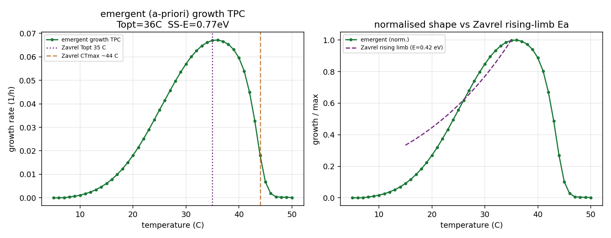{#fig-photo-emergent width=95%}

## P3 — Bayesian calibration to Zavrel 2015 (shape-first)
The thermal ecModel was calibrated to the digitised @zavrel2015 light-saturated growth TPC by
ensemble MCMC (emcee; the same machinery as the other two), **shape-first**: the a-priori magnitude
is already realistic, so `kcat_scale` was centred on 1 (not the methanogen's Davidi-4× prior) and
the envelope knobs did the work. The posterior reproduces the curve (@fig-photo-calib; $r_\text{max}$
0.094 vs 0.097 h⁻¹, Topt 35 °C) with **modest, plausible** corrections — `kcat_scale` ×1.22 and a
curvature `dCp_scale` ×0.85 (i.e. −3.4 vs the −4 kJ mol⁻¹ K⁻¹ prior; **not** railed to an implausible
floor). The **Ea-lever diagnostic** is the key P3 result: the low photosynthesis $E_a$ is achieved
with the curvature knob at essentially its prior and **no allocation buffer needed**, so it is
genuinely **shallow Calvin-cycle kinetics**, not an artefact. The observed Zavrel growth-$E$ (0.44)
is fragile — a ±5% rate perturbation spans a 90% range [0.34, 1.01], because six points over a
narrow window under-determine the metric — so the robust anchor is the window-independent model $E$
(0.57) and the independent Inoue photosynthesis-flux $E$ (0.52), which the model's carbon-fixation
flux $E$ (0.56) matches (@fig-photo-inoue). The Inoue *light-limited* growth curve (Topt ~25 °C) is
shown as the light-limitation-scope cross-check, not a fit target.

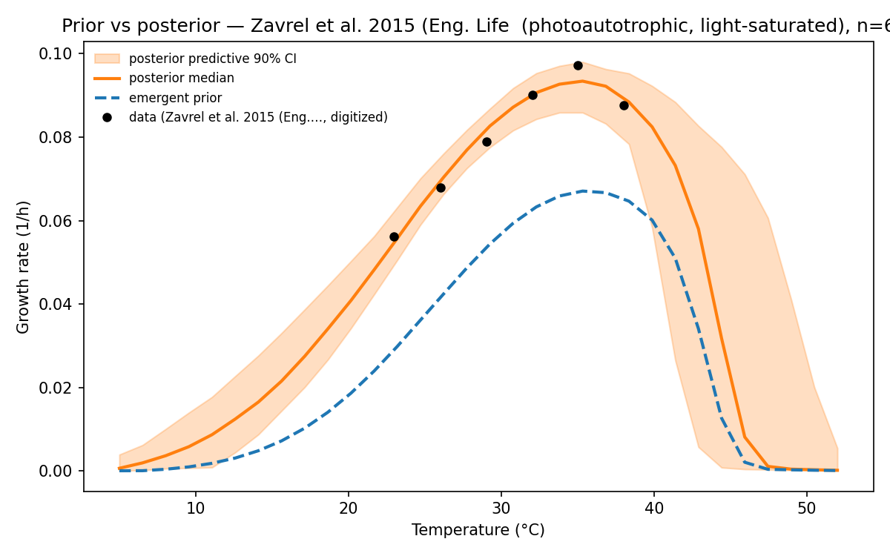{#fig-photo-calib width=85%}

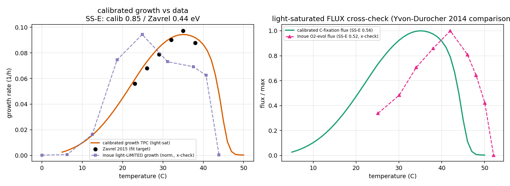{#fig-photo-inoue width=95%}

## P3b — the phototroph's own allocation layer
A proteome-sector/growth-law layer was added, grounded in the cyanobacterium's **own** allocation
physiology: Jahn et al. 2018 [@jahn2018] resolve seven proteome sectors versus growth rate (total
protein invariant), which map onto our three as $f_\text{metab}$ 0.50 (light-harvesting + photosystems
+ carbon fixation + metabolism), $f_\text{maint}$ 0.33 (MAI), $f_\text{bio}$ 0.17 (RIB, rising with
growth rate = the coupling slope), corroborated by Zavrel et al. 2019 [@zavrel2019] and the Faizi et
al. 2018 optimal-allocation framework [@faizi2018], with the heat-shock response [@suzuki2006]
informing the hot-side maintenance sector. Because *Synechocystis*'s ribosome fraction is nearly
constant and its growth-rate range is ~10–20× narrower than *E. coli*'s, the ribosome cap is pinned
non-binding and the small allocation buffer comes from the metabolic-sector shrinkage. Forward-check:
with the layer on and the P3 posterior, the TPC is near-identical (Topt/CTmax preserved,
$r_\text{max}$ −4%, max\|$\Delta\mu$\| 0.004; @fig-photo-sect), so no re-calibration was needed. The
directly-measured allocation buffer is **−0.019 eV** — small, between *E. coli*'s −0.13 (Scott) and
the methanogen's 0.00 (Müller-flat), confirming on a measured footing that the low photosynthesis
$E_a$ is kinetic, not allocation-set.

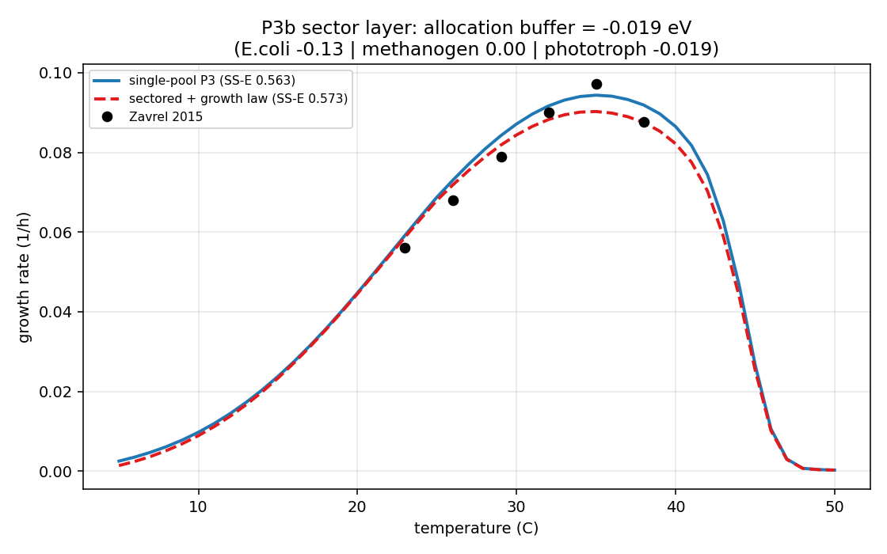{#fig-photo-sect width=80%}

## P4 — dissection + robustness
The calibrated, sectored SS-E (0.573 eV) was decomposed identically to the other two organisms
(main text @sec-decomp): naive 0.684 + control −0.016 + allocation −0.019 + maintenance −0.027 +
aggregation −0.050. The carbon-fixation/Calvin enzymes (transketolase, aldolase, RuBisCO,
phosphoribulokinase, fructose-bisphosphatase) carry 34% of the control term at mean $E$ 0.63, below
the 0.68 proteome mean — a **low-$E_a$ controlling backbone**, the mirror image of the methanogen.
Robustness (@fig-photo-robust): sweeping RuBisCO $k_\text{cat}$ (0.5–4×) and the whole Calvin
backbone (0.5–2×) leaves the SS-E within [0.565, 0.577] — the low $E_a$ is a curvature/shape
property, not a kcat-level artefact — while the shared MMRT curvature prior (−2 to −6 kJ mol⁻¹ K⁻¹)
scales all three organisms together.

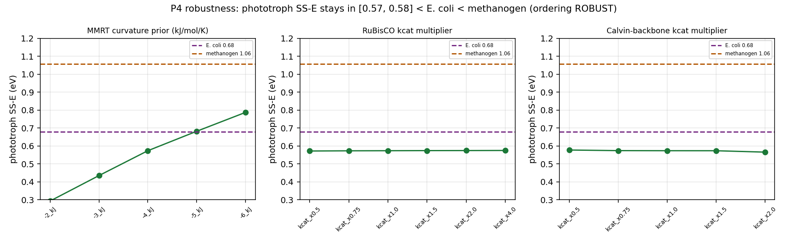{#fig-photo-robust width=95%}

**Honest caveats carried into the analysis.** (i) The observed **Zavrel growth-$E$ is fragile**
(6 points, narrow window); the robust anchor is the model $E$ (0.57) and the independent Inoue flux
$E$ (0.52). (ii) **Topt and $T_m$** are mesophile priors (no cyanobacterial sequence/meltome
predictor run). (iii) The result is for the **light-saturated** regime; light limitation lowers the
$E_a$ further through a non-enzymatic (photon-supply) route outside the present mechanism (Discussion).
(iv) **Photorespiration** temperature-dependence is not modelled (suppressed under the CO₂-replete
calibration conditions). (v) The **sector fractions** are grounded but approximate; the small buffer
is the robust, cited quantity.

# Parameter provenance and the global correction knobs

Every per-enzyme and whole-cell input is grounded in independent data or a stated literature
value; nothing is fit to the growth curve in the emergent model. @tbl-prov-ecoli,
@tbl-prov-methanogen and @tbl-prov-phototroph give the provenance for each organism, and @tbl-knobs the global scalars
freed in calibration (each transforms the whole grounded per-enzyme distribution while
preserving its shape; all are no-ops at their nominal).

| Symbol | Quantity | Source | Coverage / value |
|---|---|---|---|
| $\text{MW}_i,k_{\text{cat,ref},i}$ | enzyme mass, reference turnover | GECKO ecModel of iML1515 [@Sanchez2017; @Domenzain2022; @Monk2017] | 2,560 enzymes |
| $T_{\text{opt},i}$ | catalytic optimum | sequence predictor [@LiEngqvist2019] + DLTKcat [@Qiu2024] | ~90% grounded |
| $T_{m,i}$ | melting temperature | measured *E. coli* meltome [@Leuenberger2017] | ~90% grounded; rest 55.6 °C |
| $\Delta C^{\ddagger}_{p,i}$ | turnover curvature | literature MMRT prior [@Hobbs2013] | −4 kJ mol⁻¹ K⁻¹ |
| $f_\text{metab}/f_\text{bio}/f_\text{maint}$ | sector fractions | measured proteome per medium & $T$ [@Wang2026] | 0.48/0.19/0.33 (glucose 30 °C) |
| $s$ | growth-law slope | Scott 2010 [@Scott2010] | 0.33 (rising ribosome fraction) |
| $P^{\text{lit}},\sigma$ | total protein, saturation | literature [@Davidi2016; @Heckmann2020] | 0.5 g gDW⁻¹, 0.45 |
| NGAM($T$) | maintenance | *E. coli* maintenance port [@Madkaikar2023] | $a_\text{m}$ 8.5, $E_m$ 0.5 eV |
| validation | growth TPC | K-12 MG1655, BHI, 7–46 °C [@vanderlinden2012] | 1 curve |

: *E. coli* parameter provenance — grounded in independent data, never fit to growth. {#tbl-prov-ecoli}

| Symbol | Quantity | Source | Coverage / value |
|---|---|---|---|
| $\text{MW}_i$ | enzyme mass | UniProt proteome UP000000590 (from GPRs) | 527/527 enzymatic reactions |
| $k_{\text{cat},i}$ | turnover | measured core [@milton2018] + DLTKcat [@Qiu2024] + literature overrides + 1 s⁻¹ floor | 11 core / 293 DLTKcat / 223 fallback |
| $k_\text{cat}$(Mcr) | terminal enzyme | mature-Mcr specific activity | 58.9 s⁻¹ (range 3–294; swept) |
| $T_{\text{opt},i},T_{m,i}$ | optimum, stability | mesophile prior (sequence/meltome predictors not run) | $T_\text{opt}$ ~39 °C, $T_m$ ~55.6 °C |
| $\Delta C^{\ddagger}_{p,i}$ | turnover curvature | literature MMRT prior [@Hobbs2013] | −4 kJ mol⁻¹ K⁻¹ |
| $f_\text{metab}/f_\text{bio}/f_\text{maint}$ | sector fractions | Xia/Müller proteome [@muller2021] | 0.55/0.15/0.30 |
| $s$ | growth-law slope | Müller 2021 constant ribosome fraction [@muller2021] | 0 (flat law) |
| $P^{\text{lit}},\sigma$ | total protein, saturation | literature [@Davidi2016; @Heckmann2020] | 0.5 g gDW⁻¹, 0.45 |
| NGAM($T$) | maintenance | **measured** *M. maripaludis* [@goyal2015] | 7.836 mmol ATP gDW⁻¹ h⁻¹ @ 37 °C |
| validation | growth TPC | type strain JJ, H₂/CO₂ [@jones1983] | 1 curve |

: *M. maripaludis* parameter provenance. The measured energy-core kinetics, the measured maintenance, and the constant-ribosome allocation law are the organism-specific grounded inputs. {#tbl-prov-methanogen}

| Symbol | Quantity | Source | Coverage / value |
|---|---|---|---|
| $\text{MW}_i,k_{\text{cat,ref},i}$ | enzyme mass, reference turnover | pre-built ecModel iSynCJ816\_STAR (AUTOPACMEN sMOMENT) [@andrews2024; @joshi2020] | 1,066 flux-costed reactions; BRENDA/SABIO-RK |
| $k_\text{cat}$(RuBisCO/Calvin) | carbon-fixation core | ecModel (well-measured); swept for robustness | RuBisCO 0.5–4×, Calvin 0.5–2× |
| $T_{\text{opt},i},T_{m,i}$ | optimum, stability | mesophile prior (sequence/meltome predictors not run) | $T_\text{opt}$ ~39 °C, $T_m$ ~55.6 °C |
| $\Delta C^{\ddagger}_{p,i}$ | turnover curvature | literature MMRT prior [@Hobbs2013] | −4 kJ mol⁻¹ K⁻¹ |
| $f_\text{metab}/f_\text{bio}/f_\text{maint}$ | sector fractions | Jahn 2018 [@jahn2018] + Zavrel 2019 [@zavrel2019] + Faizi 2018 [@faizi2018] | 0.50/0.17/0.33 |
| $s$ | growth-law slope | Jahn 2018 RIB vs $\mu$ [@jahn2018] | weak rise, small over $\mu\le0.11$ h⁻¹ |
| $P^{\text{lit}},\sigma$ | total protein, saturation | Zavrel 2019 [@zavrel2019]; [@Davidi2016; @Heckmann2020] | ~0.4 g gDW⁻¹, 0.45 |
| NGAM($T$) | maintenance | **measured** photon-maintenance [@touloupakis2015]; heat-shock [@suzuki2006] | 3.12 mmol gDW⁻¹ h⁻¹ |
| validation | growth + flux TPC | light-sat. autotrophy [@zavrel2015]; O₂-evolution flux [@inoue2001] | 2 curves |

: *Synechocystis* 6803 parameter provenance. The pre-built ecModel kinetics (with well-measured RuBisCO/Calvin turnovers), the measured photon-maintenance, and the Jahn shallow-ribosome allocation law are the organism-specific grounded inputs. {#tbl-prov-phototroph}

| Knob | Transformation | Effect |
|---|---|---|
| $dT_\text{opt}$ | $T_{\text{opt},i}\to T_{\text{opt},i}+dT_\text{opt}$ | uniform shift of every optimum |
| `topt_scale` | $T_{\text{opt},i}\to T_0+\texttt{topt\_scale}(T_{\text{opt},i}-T_0)$ | spread of optima |
| `dCp_scale` | $\Delta C^{\ddagger}_{p,i}\to\texttt{dCp\_scale}\,\Delta C^{\ddagger}_{p,i}$ | turnover curvature / breadth |
| $dT_m$ | evaluate $f_{N,i}$ at $T-dT_m$ | uniform melting shift ($+$ raises $CT_\text{max}$) |
| `tm_scale` | $T_{m,i}\to\bar T_m+\texttt{tm\_scale}(T_{m,i}-\bar T_m)$ | spread of melting temperatures |
| `kcat_scale` ($\lambda_k$) | $c_i\to c_i/\lambda_k$ | global turnover level → $r_\text{max}$ |
| $f_\text{metab},f_\text{maint}$ | set the sector simplex | proteome allocation |
| `ngam_scale`, `ngam_steepness` | scale $a_\text{m}$, $E_m$ | maintenance amplitude / steepness |
| $\sigma$ | scale both sector caps | in-vivo saturation (magnitude) |
| $\sigma_\text{disc}$ | likelihood variance | model-discrepancy noise (nuisance) |

: Global correction knobs freed in calibration — each is one scalar acting on the whole per-enzyme distribution. {#tbl-knobs}

# Why Sharpe–Schoolfield $E$: the window-sensitivity audit

The naive Boltzmann–Arrhenius slope of the rising limb depends on the fitting window because
the limb is curved. @tbl-window-full recomputes it under five window conventions for every
model and observed curve: the spread is **0.42–1.41 eV per curve**, larger than the effects we
attribute, and enough to reverse the cross-organism ordering. The Sharpe–Schoolfield $E$
(the high-temperature-inactivation model, main text) is read from the whole shape, is
window-independent, and — the
decisive test — makes model and observed agree for both organisms (@fig-ssfits).

```{python}
#| label: tbl-window-full
#| tbl-cap: "Full window-sensitivity table: Boltzmann-Arrhenius slope Ea (eV) under five window conventions, and the window-independent Sharpe-Schoolfield E, for every model + observed curve."
#| output: asis
import pandas as pd
w = pd.read_csv("assets/tables/window_sensitivity.csv")
ss = pd.read_csv("assets/tables/sharpe_schoolfield_fits.csv")[["curve","SS_E_eV","SS_r2" if "SS_r2" in pd.read_csv("assets/tables/sharpe_schoolfield_fits.csv").columns else "r2"]]
m = w.merge(ss, on="curve", how="left")
print(m.round(3).to_markdown(index=False))
```

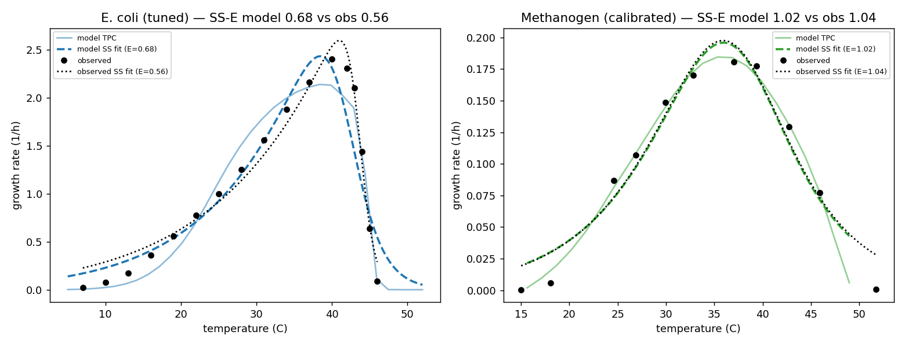{#fig-ssfits width=100%}

# Mcr-$k_\text{cat}$ sensitivity {#sec-mcr}

@tbl-mcr-full sweeps Mcr across its 3–294 s⁻¹ range. The organism $E_a$ stays **1.01–1.27 eV,
always well above E. coli's 0.68**, and the methanogenesis backbone carries **83–103%** of the
control term throughout — so the ordering and the backbone-control finding are robust. Only the
identity of the single leading enzyme shifts (Mcr when slow → Fwd when fast).

```{python}
#| label: tbl-mcr-full
#| tbl-cap: "Mcr-kcat sensitivity sweep: organism SS-E, backbone fraction of the control term, and the leading enzymes, across 3-294/s."
#| output: asis
import pandas as pd
m = pd.read_csv("assets/tables/mcr_sweep.csv")
print(m.round(3).to_markdown(index=False))
```

# Calibration diagnostics

All three models were calibrated by ensemble Markov-chain Monte Carlo (emcee) with an exact
Gaussian discrepancy likelihood and autocorrelation-based early stopping; the grounded per-enzyme
parameters are held fixed and only a small set of global scalars is freed. @fig-corners shows the
posterior corner plots. For *E. coli* the fit demands a large in-vivo saturation ($\sigma\to$ its
physical ceiling) and a modest melting-temperature shift; for *M. maripaludis* it demands a
several-fold turnover magnitude correction (kcat_scale ≈ 7, absorbing the in-vitro→in-vivo gap and
the residual archaeal-kcat underprediction on the single sMOMENT pool), while the maintenance
multiplier stays near one — confirming the Goyal-measured NGAM; for *Synechocystis* the
calibration is **shape-first** (magnitude already realistic), demanding only a small kcat_scale
(×1.2) and a modest curvature reduction (dCp_scale ×0.85, not railed), the diagnostic that the low
photosynthesis $E_a$ is genuinely shallow Calvin-cycle kinetics. In all three the
posterior-predictive curve passes through the observed data (the main-text Figure 1), and the
resulting Sharpe–Schoolfield $E_a$ matches the observed value.

::: {layout-ncol=3}
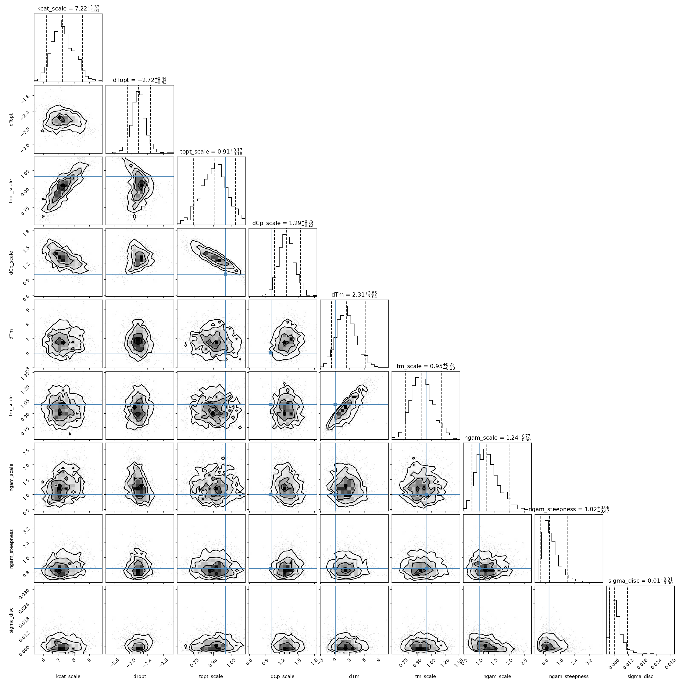{#fig-corner-mm width=100%}

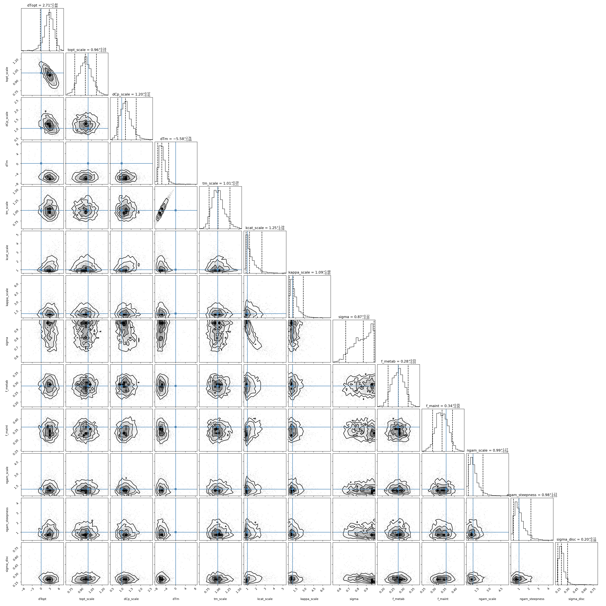{#fig-corner-ec width=100%}

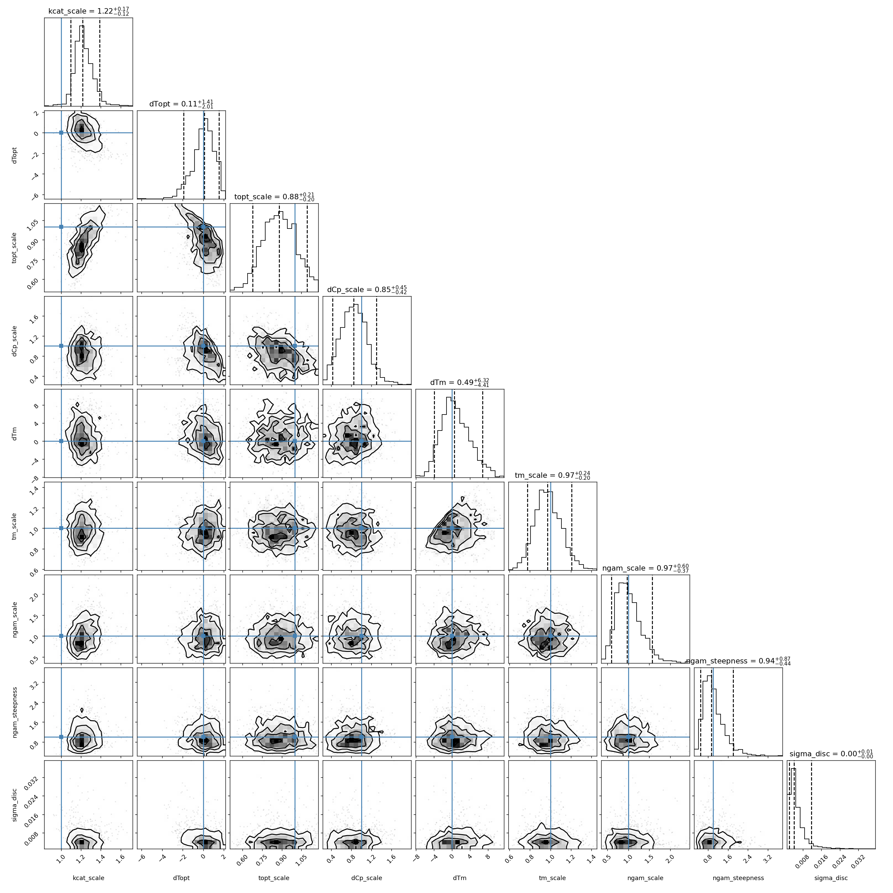{#fig-corner-ph width=100%}
:::
::: {#fig-corners}
Posterior corner plots for the three calibrations.
:::
