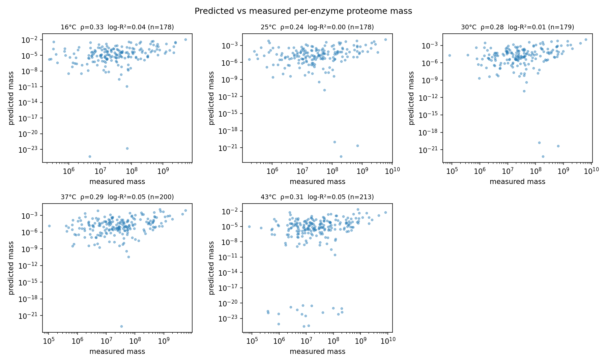
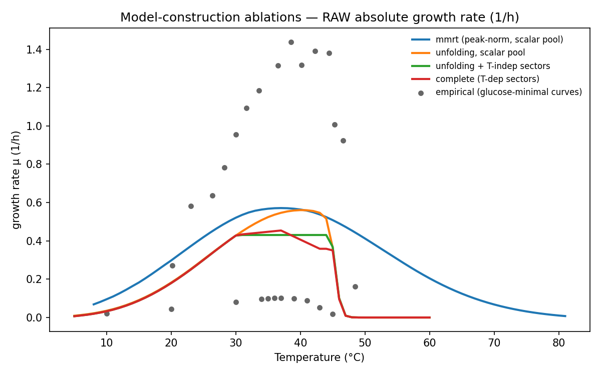

## S1. The reference operating point and its enzyme-level parameters

**What this section does.** Before testing the model against data or dissecting what controls
its predictions, it helps to open it up at a single fixed condition and see what it actually
contains and how it behaves. This section is a description, not a result: it defines the
**reference operating point** used throughout the main report, shows the growth curve
the model predicts there, and displays the per-enzyme parameters underneath that curve. The
validation section of the main report then tests this reference prediction against real data.

**The reference operating point.** The reference condition is a **rich medium (BHI)**, matching
the exact-strain curve the model is validated against (K-12 MG1655 in BHI). The organism grows
on the rich medium and the proteome budget is split using the measured **rich (LB) sector
fractions** — at 37 °C, $f_\text{metab}=0.280$ (metabolic enzymes), $f_\text{bio}=0.359$
(biosynthesis/ribosomes) and $f_\text{maint}=0.360$ (maintenance) — which give a higher ribosome
cap and faster growth than a minimal medium. @fig-reftpc shows the growth curve the model
predicts there, on absolute rate. Its descriptors read off directly: the optimum is
$T_\text{opt}=37$ °C, the maximum growth rate $r_\text{max}=1.04\,\text{h}^{-1}$, the cold and
hot limits $CT_\text{min}=9$ °C and $CT_\text{max}=51$ °C, and the rising-limb activation energy
$E_a\approx0.81$ eV. This is the predicted reference curve that the validation section then
compares against the measured strain-matched rich curve (Van Derlinden 2012, K-12 MG1655, BHI).
(A glucose-minimal reference remains available as a non-default option; the sensitivity,
decomposition and identifiability analyses later in this draft were computed at the
glucose-minimal operating point and will be rebuilt at the rich reference on the calibrated
model in a later phase.)

{#fig-reftpc fig-pos="H" width=85%}

**What sits underneath the curve: 2,560 enzymes, each with its own thermal parameters.** The
organismal curve above is the aggregate of 2,560 individual enzymes, each carrying three
grounded thermal parameters: its optimum temperature $T_\text{opt}$, its melting temperature
$T_m$, and its MMRT curvature $\Delta C_p$. @fig-enzdens shows their distributions across the
whole proteome. The enzyme optima cluster around a mean of 41 °C with a standard deviation of
**4.25 °C**, and the melting temperatures around 55 °C with a standard deviation of **6.13 °C**;
the curvature is a single literature value (−4 kJ/mol/K) held for almost every enzyme and
refined only for the handful with direct data. These per-enzyme values are **held fixed as the
model's baseline** — they are inputs grounded in independent data (a sequence-based optimum
predictor and a measured melting proteome), not quantities we adjust. The two standard
deviations are worth noting because the sensitivity analyses in the main report use exactly these spreads
(4.25 °C and 6.13 °C) to define what "a standard step" means when they shift the whole optimum
or melting-temperature distribution.

![**Per-enzyme grounded thermal parameters.** Distributions across all 2,560 enzymes of the optimum temperature $T_\text{opt}$, the melting temperature $T_m$ and the MMRT curvature $\Delta C_p$, each annotated with its mean and standard deviation (dashed line = mean). The $T_\text{opt}$ and $T_m$ standard deviations (4.25 and 6.13 °C) are the reference scales the sensitivity analyses use for their standardised temperature steps; $\Delta C_p$ is a literature prior held near −4 kJ/mol/K for all but a few enzymes.](assets/figures/enzyme_param_densities.png){#fig-enzdens fig-pos="H" width=100%}

**What one enzyme's temperature response looks like.** @fig-enzkcat shows, for a representative
spread of enzymes, the two temperature-dependent factors that combine into each enzyme's cost.
On the left is the relative turnover $\widehat{k}(T)=k_\text{cat}(T)/k_\text{cat}(T_\text{opt})$
— each enzyme's catalytic rate rises to a peak at its own optimum and falls away either side.
On the right is the native (folded) fraction $f_N(T)$, which stays near one until the enzyme's
melting temperature and then collapses to zero as the protein unfolds. Different enzymes peak
and collapse at different temperatures, so the organismal curve in @fig-reftpc is a weighted
blend of this per-enzyme heterogeneity: the coldest-melting enzymes set where the population as
a whole begins to fail.

{#fig-enzkcat fig-pos="H" width=100%}

The sensitivity and decomposition analyses in the main report do not tune these 2,560 enzymes
individually; instead they move the whole distributions in @fig-enzdens with a few global dials,
while keeping each enzyme's grounded value relative to the rest.

## S2. Measured proteome validation

**Measured proteome.** The temperature proteome shows the expected heat-stress
signature (@fig-protsec): the chaperone/stress sector **ramps 2.7-fold** (mass fraction
0.077→0.204) from 30→43 °C while the ribosome sector peaks near 37 °C then falls. Mapping
the proteome to model enzymes by UniProt covers **592/960 (62 %)**; for mapped
flux-carrying enzymes the model's predicted per-enzyme mass ($\text{cost}_i(T)\cdot|v_i|$)
correlates positively with measured abundance × MW at every temperature (Spearman
$\rho\approx0.25$–0.33; @fig-protpred, @tbl-proteome). The agreement is modest — FBA
enzyme *demand* is only one determinant of abundance, and the metabolic model has no
chaperone reactions, so it consumes the chaperone ramp as a maintenance-sector input
rather than predicting it — but it is a genuine, data-grounded test.

{#fig-protsec fig-pos="H" width=70%}

{#fig-protpred fig-pos="H" width=90%}

```{python}
#| label: tbl-proteome
#| tbl-cap: "Predicted vs measured per-enzyme proteome mass across temperature."
#| output: asis
import pandas as pd

c = pd.read_csv("assets/tables/proteome_validation_correlations.csv")
c = c.rename(columns={"temp_C": "T (°C)", "n": "n enzymes",
                      "spearman": "Spearman ρ", "log_pearson_r2": "log-Pearson R²"})
print(c.round(3).to_markdown(index=False))
```

## S3. Model construction and layer contributions

The complete model in the main report is one configuration. To show how much each layer
contributes, we build it up one layer at a time and score each version against the empirical
glucose-minimal growth curves (@fig-ablation, @tbl-ablation). Each row adds one ingredient to
the row above.

- **Simple temperature envelope with a single enzyme pool** (turnover peak-normalised, no
  unfolding): $T_\text{opt}=37$ °C, $r_\text{max}=0.571$, but an unphysical
  $CT_\text{max}=75.6$ °C because nothing sets an upper limit; $R^2=0.23$.
- **Add two-state unfolding** (still a single pool): the melting temperature now sets a
  realistic upper limit ($CT_\text{max}=46.8$ °C). This is the **decisive improvement**:
  $R^2=0.74$.
- **Add temperature-independent proteome sectors** (measured nominal split): the sector
  constraints tighten the curve and *lower* the raw fit to $R^2=0.37$.
- **Add measured temperature-dependent allocation** (the complete model): $R^2=0.49$.

So the unfolding / $T_m$ envelope is the ingredient that makes the curve physically realistic;
the allocation layers add proteome realism — and the ability to attribute control to
measurable quantities — at a modest cost in raw growth-curve fit. The DLTKcat $k_\text{cat}(T)$ overlay (@fig-dltkcat) currently touches 13 of
2560 enzymes, none pool-limiting, so it does not yet move the nominal curve; broadening it
is future work. Parameter provenance and coverage: grounded $T_\text{opt}$/$T_m$ for
90 % of enzymes (rest at dataset means), proteome-to-enzyme mapping 62 %.

{#fig-ablation fig-pos="H" width=80%}

```{python}
#| label: tbl-ablation
#| tbl-cap: "Ablation series: nominal descriptors and empirical-TPC fit R² for each layer combination. The mmrt+scalar ablation reproduces the pre-grounding nominal (sanity)."
#| output: asis
import pandas as pd

a = pd.read_csv("assets/tables/ablation_summary.csv")
print(a.round(3).to_markdown(index=False))
```

{#fig-dltkcat fig-pos="H" width=70%}

## S4. Full per-enzyme thermal-control table

Per-enzyme thermal-screen control scores and descriptor-specific control
coefficients (@tbl-control-full).

```{python}
#| label: tbl-control-full
#| tbl-cap: "Full per-enzyme thermal-control table ranked by thermal-screen score."
#| output: asis
import pandas as pd

c = pd.read_csv("assets/tables/thermal_control.csv")
print(c.round(4).to_markdown(index=False))
```

## S5. Full identifiability table

Identifiability of each per-enzyme thermal parameter from the growth TPC alone
(@tbl-ident-full).

```{python}
#| label: tbl-ident-full
#| tbl-cap: "Full identifiability table of per-enzyme thermal parameters."
#| output: asis
import pandas as pd

idf = pd.read_csv("assets/tables/identifiability.csv")
print(idf.round(3).to_markdown(index=False))
```

## S6. Run provenance (resolved configuration)

The exact merged configuration used for the calibrated run, echoed for provenance.

```{python}
#| label: resolved-config
#| echo: false
#| output: asis
with open("assets/tables/resolved_config.yaml") as fh:
    cfg = fh.read()
print("```yaml")
print(cfg.rstrip())
print("```")
```
