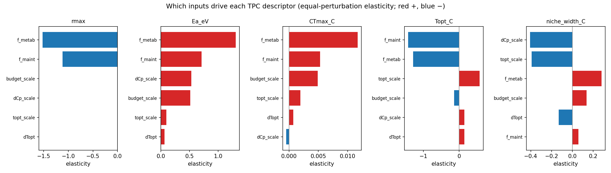
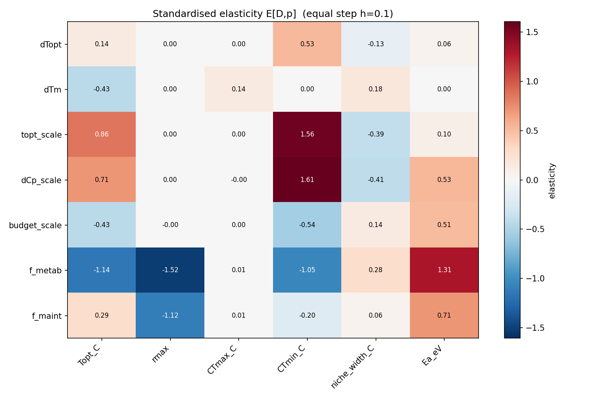

# Background and objectives

A **thermal performance curve (TPC)** is how a rate — here microbial growth rate — varies
with temperature: it rises from a cold limit, peaks at an optimum, and falls to a hot limit.
The temperature dependence of microbial growth, respiration and carbon-use efficiency governs
how microbial communities, and the carbon they cycle, respond to warming, so predicting these
curves matters for climate–carbon models. The broad aim of this work is to **predict such
curves from a genome**.

A cell's growth curve is not a single measured parameter but an emergent outcome of its whole
metabolism operating under a finite, temperature-sensitive supply of enzymes. A natural
mechanistic predictor is therefore an **enzyme- and temperature-constrained genome-scale
metabolic model (etc-GEM)**: a computational reconstruction of an organism's metabolism in
which every reaction requires a temperature-dependent amount of enzyme drawn from a limited
budget, so that supplying it with a genome plus enzyme kinetic and stability parameters yields
a predicted growth rate at any temperature. We build and validate the method on *Escherichia
coli* using **eciML1515**, an enzyme-constrained version (built with the GECKO method
[@Sanchez2017; @Domenzain2022]) of the manually curated iML1515 metabolic reconstruction
[@Monk2017] — the best-curated bacterial model available — as a proving ground before scaling
to a phylogenetically diverse library of isolates.

The in-silico work addresses six objectives:
**O1** reproduce a realistic *E. coli* growth TPC and define its components;
**O2** determine what sets the thermal **envelope** ($T_\text{opt}$, $CT_\text{max}$,
breadth, $E_a$) and whether a few enzymes dominate;
**O3** determine what sets the rate **magnitude** ($r_\text{max}$) — proteome allocation;
**O4** quantify the **separability** of a genome-set envelope from an allocation-set
magnitude — the key hypothesis;
**O5** assess **identifiability** — which parameters are inferable from growth alone;
**O6** move from a nominal scan to **calibrated uncertainty** and data-grounded inputs.

We describe the **one complete model**, validate it, and run all analyses on it; a
Supplementary ablation quantifies how much each of its layers contributes.

# The complete model

**In plain terms.** The model turns a genome plus enzyme parameters into a predicted growth
rate at any temperature, in four stacked layers. The first says growth requires enzymes and
the cell has a limited budget of them. The second makes each enzyme's efficiency
temperature-dependent — enzymes speed up with warming, then unfold and fail at high
temperature. The third fixes how the enzyme budget is split among broad functional groups,
using measured proteome data. The fourth insists that none of the numbers are tuned to match
the growth curve we are trying to predict. We now describe each layer.

**Layer 1 — metabolic network with an enzyme budget.** We start from iML1515, a manually
curated map of *E. coli* metabolism (its reaction stoichiometry and gene–protein–reaction
rules, GPRs) [@Monk2017], solved by **flux-balance analysis (FBA)** — a linear-programming
method that finds the reaction fluxes maximising growth subject to mass balance and capacity
limits, using cobrapy [@Ebrahim2013]. GECKO [@Sanchez2017; @Domenzain2022] makes it
**enzyme-constrained**: running each reaction $i$ at flux $v_i$ requires an amount of enzyme
$v_i/k_{\text{cat},i}$, where $k_{\text{cat},i}$ (the *turnover number*) is how many reactions
one copy of the enzyme catalyses per second. The total enzyme mass is capped by a shared
**proteome pool**, so the cell must *allocate* a finite protein budget across reactions —
this is what makes allocation a limiting resource and growth a competition for enzyme.

**Layer 2 — a temperature-dependent enzyme envelope (the "thermal envelope").** Each enzyme's
turnover rises with temperature following **macromolecular rate theory (MMRT)** [@Hobbs2013] —
an extension of the Arrhenius law in which the activation energy itself changes with
temperature (a heat-capacity term), giving a curved, single-peaked turnover response rather
than a straight Arrhenius line. Above a threshold the enzyme unfolds: we model the fraction
still in the working (folded) state with a **two-state native$\leftrightarrow$unfolded
equilibrium** (after Li et al. [@Li2021] and the MRes of Madkaikar [@Madkaikar2023]), the
**native fraction** $f_{N,i}(T)$, which collapses from one to zero around the enzyme's
**melting temperature** $T_m$ (the temperature at which half the protein is unfolded). The
effective per-flux cost combines both effects,
$\text{cost}_i(T)=\text{base}_i/[\,\widehat{k}_{\text{cat},i}(T)\cdot f_{N,i}(T)\,]$, so cost
rises both when turnover is slow (cold) and when the enzyme denatures (hot). Per-enzyme $T_m$
come from a measurement of which *E. coli* proteins melt at which temperature (the "melting
proteome") [@Leuenberger2017], and each enzyme's optimum temperature $T_\text{opt}$ from a
sequence-based predictor [@LiEngqvist2019] (**90 % of enzymes grounded** in these data, the
rest set to dataset means); **DLTKcat**, a deep-learning predictor of temperature-dependent
$k_\text{cat}$ [@Qiu2024], refines $T_\text{opt}$ where it fits well. Keying the collapse on
$T_m$ ties the upper thermal limit to protein *stability* and lets it differ from the
rising-limb activation energy. Turnover numbers measured in a test tube (**in vitro**) tend
to overstate the effective rate inside a cell (**in vivo**), which motivates the
data-driven-saturation correction below [@Davidi2016; @Heckmann2020].

**Layer 3 — proteome allocation from measured, medium- and temperature-matched sectors.** We
split the enzyme budget into three broad **proteome sectors** — coarse functional groups of
proteins whose fractions of the total proteome are known to shift predictably with growth
conditions (the bacterial "growth laws") [@Basan2015; @Scott2010]: a **metabolic** sector
($f_\text{metab}$, the enzymes that carry flux), a **biosynthesis** sector ($f_\text{bio}$,
dominated by ribosomes, which caps how fast biomass can be made), and a **maintenance**
sector ($f_\text{maint}$, housekeeping and stress proteins). These fractions are **taken from
the measured *E. coli* proteome, matched to both the growth medium and the temperature**
(Wang et al. [@Wang2026]; proteins grouped by function, weighted by mass; separate series for
LB, glucose and glycerol media across their measured temperatures), never hand-set or fit to
growth. This encodes the growth law directly: the measured ribosome (biosynthesis) fraction
at 37 °C is $f_\text{bio}=0.36$ on rich LB medium but only $0.18$ on glucose-minimal, so a
prediction run under LB automatically gets a higher biosynthesis cap and grows faster than
one under minimal medium. The default glucose-minimal split is $f_\text{metab}=0.483$,
$f_\text{bio}=0.191$, $f_\text{maint}=0.326$ (the maintenance sector absorbs the measured
chaperone and other housekeeping proteins, including a 2.7-fold heat-stress chaperone rise);
`set_medium` switches to another medium's measured curve. A **maintenance (NGAM,
non-growth-associated maintenance)** demand — the ATP the cell must spend just to stay alive,
independent of growth — is included and made temperature-dependent.

**Layer 4 — everything emerges; nothing is fit to the growth curve.** The central design
choice is that the predicted growth curve is a genuine forward prediction: no parameter is
adjusted to match observed growth. The rate *magnitude* follows from the enzyme budget
$P_\text{metab}=P_\text{total}\times f_\text{metab}\times\sigma$ — total protein per gram dry
weight ($P_\text{total}=0.5$ g/gDW, from the literature), the measured metabolic fraction
($f_\text{metab}$: 0.48 on glucose-minimal, 0.28 on LB), and the average **in-vivo enzyme
saturation** $\sigma$ (the fraction of an enzyme's maximum rate actually realised in the cell,
$\sigma=0.45$, an independent literature value carried with its 0.4–0.5 range
[@Davidi2016; @Heckmann2020]). This yields an emergent $r_\text{max}=0.55\,\text{h}^{-1}$ on
glucose-minimal (1.04 on LB), rather than the growth-calibrated pool GECKO ships. The
*envelope* emerges too: each enzyme's MMRT curvature $\Delta C_p$ is a single literature value
(−4 kJ/mol/K [@Hobbs2013]) refined by DLTKcat where available, with nothing chosen to hit an
activation-energy target — so the whole-organism activation energy $E_a$ (0.83–0.96 eV)
emerges and can be *tested* against an independent benchmark. All growth-fitting knobs are
switched off. The model builds and grows, with the biosynthesis cap and the enzyme pool
co-limiting at the nominal split ($\mu^\ast\approx0.55\,\text{h}^{-1}$ at 30 °C).

# Model equations, parameters and methods

**What this section contains.** The equations below make the four layers precise: how each
enzyme's turnover depends on temperature (@eq-mmrt), how the folded fraction collapses at
high temperature (@eq-fn), how the two combine into a temperature-dependent enzyme cost
(@eq-cost), and how growth is maximised under the enzyme, biosynthesis and maintenance limits
(@eq-constraints–@eq-alloc). We then define the summary numbers we read off a predicted curve
(the **descriptors**) and list where every parameter comes from (@tbl-provenance). A reader
who wants the biology rather than the algebra can skip to the descriptor definitions and the
provenance table.

**Governing equations.** Each enzyme $i$'s turnover follows macromolecular rate theory
(MMRT), with activation enthalpy/entropy $\Delta H_0,\Delta S_0$ (at reference $T_0$) and
a heat-capacity term $\Delta C_p$:

$$\ln k_i(T) = \ln\!\frac{k_B T}{h} + \frac{-\Delta H_{0} - \Delta C_p (T-T_0)}{R\,T} + \frac{\Delta S_{0} + \Delta C_p\,\ln(T/T_0)}{R}. $$ {#eq-mmrt}

The fraction of enzyme in the native (folded) state follows a two-state
native$\leftrightarrow$unfolded equilibrium keyed on the melting temperature $T_m$
(convergence temperatures $T_H,T_S$; unfolding enthalpy/entropy/heat-capacity
$\Delta H_{TH},\Delta S_{TS},\Delta C_{p,u}$):

$$f_{N,i}(T) = \frac{1}{1+\exp\!\big(-\Delta G_{u,i}(T)/(R T)\big)},\qquad \Delta G_{u,i}(T) = \Delta H_{TH} + \Delta C_{p,u}(T-T_H) - T\,\Delta S_{TS} - T\,\Delta C_{p,u}\ln(T/T_S). $$ {#eq-fn}

The effective per-flux enzyme cost combines the (Topt-anchored) turnover factor
$\widehat{k}_{i}(T)=k_i(T)/k_i(T_{\text{opt}})$ and the native fraction, so denaturation
above $T_m$ inflates cost and drives the falling limb:

$$c_i(T) = \frac{\text{base}_i}{\widehat{k}_{i}(T)\,f_{N,i}(T)},\qquad \text{base}_i = \frac{\text{MW}_i}{k_{\text{cat,ref},i}\cdot 3600}. $$ {#eq-cost}

Growth (biomass flux $v_\text{bio}$) maximises subject to the metabolic pool, the
translation (biosynthesis) cap and a temperature-dependent maintenance demand:

$$\sum_i c_i(T)\,|v_i| \le f_\text{metab}\,P_\text{total},\qquad \kappa\,v_\text{bio} \le f_\text{bio}\,P_\text{total},\qquad v_\text{ATPM} \ge \text{NGAM}(T), $$ {#eq-constraints}

with the emergent metabolic budget and the medium-/temperature-matched sector fractions

$$P_\text{metab} = f_\text{metab}(m,T)\,P_\text{total},\quad P_\text{total}=\sigma\,P^{\text{lit}},\quad \big(f_\text{metab},f_\text{bio},f_\text{maint}\big)(m,T)\ \text{from the measured medium-}m\text{ proteome}, $$ {#eq-alloc}

where $\kappa$ (`translation_coeff`) is auto-calibrated once so the biosynthesis cap and the
enzyme pool co-limit at the nominal split, and $\text{NGAM}(T)$ rises with temperature above a
basal floor.

**Curve descriptors.** From a predicted growth curve $\mu(T)$ we read a small set of standard
**thermal-performance-curve descriptors** — the numbers ecologists use to summarise a TPC:
the **optimum temperature** $T_\text{opt}$ (the temperature of peak growth), the **maximum
growth rate** $r_\text{max}$ (the height of the peak, in h⁻¹), the **critical thermal minimum
and maximum** $CT_\text{min}$ / $CT_\text{max}$ (the cold and hot temperatures where growth
falls to 5 % of the peak, i.e. the curve's lower and upper edges), the **thermal breadth** or
**niche width** ($CT_\text{max}-CT_\text{min}$, how wide a temperature range supports growth),
and the **activation energy** $E_a$ (the steepness of the rising cold-side limb, obtained as
the slope of $\ln\mu$ against $-1/(k_B T)$ over the 10–95 % rising portion — the standard
Boltzmann–Arrhenius measure of thermal sensitivity, reported in electron-volts). The allocation-vs-envelope decomposition
uses a range-fair, nominal-centred, fully-crossed **three-way** (allocation × kinetic ×
stability) functional ANOVA — every parameter moved by the same standardised half-width
$H$ about the measured nominal — giving both the exact two-group Shapley split
$\varphi_A=S_A+\tfrac12 S_{AE}$, $\varphi_E=S_E+\tfrac12 S_{AE}$ and the three-group
allocation/kinetic/stability shares, reported alongside an achievable-IQR magnitude per axis;
per-enzyme thermal control coefficients are central finite differences of each descriptor to
each enzyme's $T_{\text{opt},i}$/$\Delta C_{p,i}$, and identifiability is the max-normalised
control magnitude (a first-order proxy, not Fisher information).

**Parameter provenance.** Every input is grounded in independent data or a stated
literature value — none is fit to the growth curve (@tbl-provenance).

| Symbol | Quantity | Source | Coverage / value |
|---|---|---|---|
| $\text{MW}_i, k_{\text{cat,ref},i}$ | enzyme mass, reference turnover | GECKO ecModel of iML1515 [@Sanchez2017; @Domenzain2022; @Monk2017] | 2560 enzymes |
| $T_{\text{opt},i}$ | catalytic optimum | Li–Engqvist sequence predictor [@LiEngqvist2019]; DLTKcat overlay [@Qiu2024] | 90 % grounded; 13 DLTKcat |
| $T_{m,i}$ | melting temperature | *E. coli* melting proteome [@Leuenberger2017] | 90 % grounded, rest at mean 55.6 °C |
| $\Delta C_{p,i}$ | MMRT curvature | literature MMRT prior −4 kJ/mol/K [@Hobbs2013] + DLTKcat | prior for all; 13 DLTKcat |
| $f_\text{metab},f_\text{bio},f_\text{maint}$ | sector fractions | measured proteome, per medium & $T$ [@Wang2026] | LB/Glucose/Glycerol, 16–43 °C |
| $P^{\text{lit}}$ | total protein per gDW | literature | 0.5 g/gDW |
| $\sigma$ | in-vivo enzyme saturation | Davidi 2016 / Heckmann 2020 [@Davidi2016; @Heckmann2020] | 0.45 (range 0.4–0.5) |
| validation curve | exact-strain TPC | K-12 MG1655 in BHI, 7–46 °C [@VanDerlinden2012]; rich medium def. from MRes/Machado [@Madkaikar2023; @Machado2021] | 1 curve (+1 cross-check) |

: Parameter provenance — every value grounded in independent data or a stated literature value, never fit to growth. {#tbl-provenance}

**In-silico experiments.** (O1) The nominal growth curve over an 8–60 °C grid gives the
descriptors. (O2/O3) A **global sensitivity** sweep draws a Latin-hypercube sample (a
space-filling random sample that spreads points evenly over each input's range; $n=120$) over
envelope knobs ($dT_\text{opt}\in[-6,6]$ K, `topt_scale`$\in[0.7,1.4]$,
`dCp_scale`$\in[0.5,2]$) and a pool knob (`budget_scale`$\in[0.7,1.1]$), reducing each
TPC to descriptors and Spearman indices. (O4) The **decomposition** evaluates a fully-crossed
three-way allocation$\times$kinetic$\times$stability design, every parameter moved by the same
standardised half-width $H=0.2$ about the measured nominal (allocation $=$ sector split;
kinetic $=$ $dT_\text{opt}$/spread/curvature; stability $=$ $dT_m$), and applies the Shapley
split of @eq-alloc plus an achievable-IQR magnitude per axis. (O2/O5) The
**control/identifiability** analysis screens all
2560 enzymes (usage × thermal sensitivity), then computes finite-difference control
coefficients on the top-100, reporting proteome-wide identifiability over all
$2560\times3$ parameters. (O6) A **calibrated-uncertainty** ensemble samples the envelope
per enzyme with a one-factor correlation ($\rho=0.7$). All analyses reuse the same
`compute_tpc`/`descriptors` engine.

**Validation.** The model is validated against the one curve measured on the exact GEM strain —
K-12 MG1655 in BHI broth over 7–46 °C (Van Derlinden 2012 [@VanDerlinden2012], figure-digitized)
— predicted a priori under a rich medium (availability, uptake unpinned) with its medium-matched
sector fractions; an MG1655 LB curve (Erdos 2026 [@Erdos2026]) serves as an optional secondary
cross-check. The **primary metric is absolute** $R^2$/RMSE on raw specific growth rate
($\text{h}^{-1}$); the rising-limb $E_a$ (tested against the ~0.85 eV mesophilic-growth
benchmark) is a secondary diagnostic. The proteome is validated separately (predicted vs
measured per-enzyme mass; see the Supplementary Information).

# Validation against the exact-strain rich curve (Van Derlinden, MG1655)

**What this section does.** The strongest test of a forward model is whether it reproduces
real data it never saw. We validate the model — **with nothing fit to growth** — against the
one trusted growth curve measured on the *exact* strain the genome-scale model is built from:
**Van Derlinden & Van Impe 2012** [@VanDerlinden2012], *E. coli* K-12 MG1655 (CGSC #6300) in
Brain-Heart-Infusion (BHI) broth, spanning 7–46 °C with a peak near 2.4 h⁻¹. Its wide span
covers the cold rising limb and the hot collapse. The model is predicted a priori under a rich
medium and scored on **raw absolute growth rate (h⁻¹)**.

**Data provenance — why the validation curve changed.** We now validate only against curves
measured on the exact GEM strain. An earlier compilation (Smith et al. 2019) was dropped after
one of its curves was found mis-scaled by roughly 8-fold and the strains/media of most others
were uncertain; two strain-matched curves used in a previous draft are also set aside here —
Noll (K-12 NCM3722) is the *wrong* strain, and Erdos (MG1655, LB) is unpublished, figure-
digitized data. Van Derlinden is the exact strain (MG1655) with a wide, well-sampled TPC, so it
becomes the sole primary validation. Erdos is retained only as an **optional secondary
cross-check** (@fig-valcurves, right). The honest caveats: Van Derlinden is **figure-digitized**
(no per-temperature SD); and a rich medium is a **less stringent test than a defined minimal
medium**, because supplying amino acids and nucleosides relaxes the biosynthetic enzyme demand
the model constrains most tightly. An MG1655 *defined-minimal* TPC remains the gold-standard
future test.

**Medium as an input (BHI by availability).** The medium enters as *availability*, not as a
pinned uptake rate: we open the exchange uptakes (`EX_*_REV`) of the medium's components and let
the enzyme-constrained model determine actual uptake (pinning uptake rates would be a plain-FBA
workaround; here the enzyme constraints cap growth). BHI is not encoded *in silico* in the
literature — even a recent *Rothia* genome-scale study used LB/TSB as defined rich stand-ins and
treated BHI only as an in-vitro baseline [@RothiaGEM2024] — so we approximate BHI by a **curated rich
component list** (our LB list plus tissue-extract extras, glucose included, plant-sugar TSB
components excluded, asparagine/glutamine omitted by the hydrolysate convention); 72 of 76
components map to the model. Because the measured proteome (LB/glucose/glycerol) has no BHI
entry, BHI uses the **LB (rich) medium-matched sector allocation**.

**Result — the model tracks the shape but under-predicts the magnitude ~2.3-fold.** Predicted
a priori under BHI (@fig-valcurves, @tbl-val), the emergent model reproduces the *shape* of the
Van Derlinden curve — the cold rising limb, an optimum at $T_\text{opt}=37$ °C (observed 40 °C)
and a rising-limb $E_a=0.82$ eV (observed 0.64 eV, near the ~0.85 eV mesophilic-growth
benchmark) — giving a positive absolute $R^2=0.14$ over the full 7–46 °C span. What it does not
capture is the **absolute level**: the predicted peak $r_\text{max}=1.03$ h⁻¹ is about
**2.3-fold below** the observed 2.40 h⁻¹. This is an honest a-priori gap, not a tuning failure
(nothing is fit): a rich medium relaxes the enzyme constraints so the biosynthesis cap and pool
saturate, and the shortfall points to the in-vivo $k_\text{cat}$ scale, the saturation $\sigma$,
or the exact medium composition — the levers a later calibration phase examines. The secondary
Erdos LB cross-check (MG1655, digitized) shows the same ~2.3-fold shortfall (predicted 1.04 vs
observed 2.35 h⁻¹), consistent with a systematic rich-medium magnitude gap rather than a
curve-specific artefact.

{#fig-valcurves fig-pos="H" width=100%}

```{python}
#| label: tbl-val
#| tbl-cap: "Validation against Van Derlinden (K-12 MG1655, BHI; primary) with Erdos (LB) as a secondary cross-check. Nothing is fit to growth: the model tracks the shape (Topt, Ea) but under-predicts the absolute peak ~2.3-fold under the rich medium."
#| output: asis
import json, pandas as pd
with open("assets/tables/validation_trusted_summary.json") as fh:
    s = json.load(fh)
pr, se = s["vanderlinden_bhi"], s.get("erdos_LB")
rows = [("role", "primary", "secondary"),
        ("strain", "K-12 MG1655", "K-12 MG1655 wt"),
        ("medium", "BHI (rich)", "LB (rich)"),
        ("T range (°C)", f"{pr['T_range_C'][0]:.0f}–{pr['T_range_C'][1]:.0f}",
         f"{se['T_range_C'][0]:.0f}–{se['T_range_C'][1]:.0f}" if se else "—"),
        ("n temperatures", pr["n"], se["n"] if se else "—"),
        ("absolute R²", pr["abs_R2"], se["abs_R2"] if se else "—"),
        ("RMSE (h⁻¹)", pr["RMSE_per_h"], se["RMSE_per_h"] if se else "—"),
        ("observed r_max (h⁻¹)", pr["obs_rmax"], se["obs_rmax"] if se else "—"),
        ("predicted r_max (h⁻¹)", pr["pred_rmax"], se["pred_rmax"] if se else "—"),
        ("observed T_opt (°C)", pr["obs_Topt_C"], se["obs_Topt_C"] if se else "—"),
        ("predicted T_opt (°C)", pr["pred_Topt_C"], se["pred_Topt_C"] if se else "—"),
        ("observed E_a (eV)", pr["obs_Ea_eV"], se["obs_Ea_eV"] if se else "—"),
        ("predicted E_a (eV)", pr["pred_Ea_eV"], se["pred_Ea_eV"] if se else "—")]
print(pd.DataFrame(rows, columns=["quantity", "Van Derlinden (primary)", "Erdos (cross-check)"]).to_markdown(index=False))
```

# Which parameters move the curve? (local sensitivity) {#sec-sensitivity}

**What this section does.** Having built the model, we ask which of its inputs actually
control each feature of the growth curve. The cleanest way to compare inputs on an equal
footing is an **elasticity**: nudge one input by a small, standardised amount and measure the
fractional change it produces in a curve feature. Because every input is nudged by the *same*
relative amount, the resulting numbers are directly comparable — a larger elasticity means a
stronger lever. This is a *local* measure (it describes the model right at its operating
point); the next section gives the complementary *global* view. Two pitfalls of a cruder
approach motivate this one: if inputs are instead swept over hand-chosen ranges of differing
width, an input handed a wider range can look more important for that reason alone; and a rank
correlation (which we still report below for comparison) captures only whether a relationship
is consistently increasing or decreasing, not how *big* the effect is.

**Method.** Around the nominal complete model we perturb each input by
the same standardised step $\pm h$ (here $h=0.10$) by central finite difference and
compute, for each descriptor $D$, a local **elasticity**

$$E[D,p] = \frac{D(p+)-D(p-)}{2\,h\,D_\text{nominal}}, $$ {#eq-elasticity}

the fractional change in $D$ per standardised step of input $p$. Multiplicative inputs
(`topt_scale`, `dCp_scale`, `budget_scale`, the sector fractions) move to $1\pm h$; the
additive shifts $dT_\text{opt}$ and $dT_m$ (nominal 0) move by $\pm h\,\Delta_\text{ref}$
with $\Delta_\text{ref}=$ the standard deviation of the per-enzyme $T_\text{opt}$ / $T_m$
distribution (4.25 K / 6.13 K), so each is "$h$ of a natural temperature scale"; sector
fractions move by $\text{nominal}\times(1\pm h)$ with the biosynthesis sector renormalised.
Because every input uses the same $h$, the elasticities are directly comparable in magnitude
(@fig-elast-tornado, @fig-elast-heat, @tbl-elasticity). We include $dT_m$ (a uniform shift of
every enzyme's melting temperature) as an input so the denaturation-limited hot side has an
explicit lever.

**The inputs are global dials on whole distributions, not per-enzyme knobs.** This is the key
thing to understand about what these analyses do. Each input is a single **global scalar** that
moves the *whole* per-enzyme parameter distribution (shown in the Supplementary Information) while preserving its shape:
$dT_\text{opt}$ slides every enzyme's optimum up or down together (a rigid shift of the
$T_\text{opt}$ density), `topt_scale` stretches or compresses the spread of optima about their
mean, $dT_m$ slides the entire melting-temperature density, `dCp_scale` scales every enzyme's
curvature, and `budget_scale`, $f_\text{metab}$ and $f_\text{maint}$ set whole-cell allocation.
No enzyme is given a free parameter of its own — each keeps its grounded value, and the dial
only moves the population. So these six or seven dials are a deliberately **low-dimensional
summary of the ~7,700-parameter per-enzyme space** (2,560 enzymes × 3 thermal parameters): the
heterogeneity (illustrated in the Supplementary Information) is preserved throughout, but not individually tuned. (The
per-enzyme *control* analysis later does act enzyme-by-enzyme, and is the complementary
fine-grained view.)

**Everything here is computed on a single model curve.** These elasticities — and the
decomposition in the next section — are computed on **one** model growth curve at the
glucose-minimal operating point, evaluated over the temperature grid. (This draft's
sensitivity/decomposition/identifiability were run at the glucose-minimal point; they will be
rebuilt at the rich reference operating point (Supplementary Information) on the calibrated model in a later phase — the
qualitative structure is not expected to change.) They are *not* an average over the empirical
curves; those enter only in
the validation section, each predicted under its own medium. So "what moves the curve" here
means "what moves this one reference curve at its operating point".

**Result — allocation drives the rate, kinetics drive the cold side, $T_m$ sets the hot
limit.** The ranking is clear and, in places, sharper than the rank-correlation view:

- **$r_\text{max}$ is driven by the allocation split** ($E=-1.5$ for $f_\text{metab}$,
  $-1.1$ for $f_\text{maint}$) and, locally, *not* by the pool budget or the envelope
  ($|E|\lesssim0.01$): reallocating proteome mass out of the biosynthesis sector lowers
  the translation cap and the rate.
- **$E_a$ is driven by the allocation and the curvature** ($f_\text{metab}$ $E=+1.3$,
  `dCp_scale` $+0.53$, `budget_scale` $+0.51$).
- **$CT_\text{max}$ has exactly one lever — $T_m$.** It is essentially insensitive to
  allocation, budget and kinetics ($|E|\le0.01$), and its top (and only meaningful) input is
  $dT_m$ ($E=+0.14$): the hot limit is set by protein stability alone. This is why adding the
  $dT_m$ knob matters — without it $CT_\text{max}$ looked inert; with it, its single control
  is explicit.
- **$T_\text{opt}$ is coupled** — allocation ($f_\text{metab}$ $E=-1.1$), enzyme-optimum
  spread (`topt_scale` $+0.9$), curvature (`dCp_scale` $+0.7$) and, weakly, $dT_m$ ($-0.4$)
  all move it, foreshadowing the large interaction the decomposition finds.
- **Thermal breadth** is kinetic-envelope-driven (`dCp_scale`, `topt_scale`), acting through
  the cold limit $CT_\text{min}$ rather than the $T_m$-pinned $CT_\text{max}$.

This differs from the rank-correlation ranking (@fig-sens) mainly because that view swept
inputs over *unequal* ranges and scored monotonic consistency, whereas the equal-step *local*
elasticities isolate the structural leverage — the allocation split for the rate, kinetics for
the cold side, and $T_m$ for the upper limit. The next section shows the *global*, grouped
decomposition tells the **same** story with the interaction made explicit. These elasticities
answer the **structural** question ("which parts of the model drive the TPC"); a complementary
**uncertainty-weighted** analysis — varying each input across its real measurement uncertainty
to prioritise *what to measure* — is a planned follow-up.

{#fig-elast-tornado fig-pos="H" width=95%}

{#fig-elast-heat fig-pos="H" width=85%}

```{python}
#| label: tbl-elasticity
#| tbl-cap: "Standardised elasticities E[D,p] on the complete model (equal step h=0.10; additive dTopt/dTm by ±h·Δref, Δref = sd of enzyme Topt/Tm = 4.25/6.13 K). Directly comparable in magnitude across inputs."
#| output: asis
import pandas as pd

e = pd.read_csv("assets/tables/elasticity_table.csv", index_col=0)
keep = [c for c in ["Topt_C", "rmax", "CTmax_C", "niche_width_C", "Ea_eV"] if c in e.columns]
print(e[keep].round(2).to_markdown())
```

**Rank-consistency view (Spearman).** For comparison, a Latin-hypercube sweep with
hand-set ranges and Spearman rank correlations (@fig-sens, @tbl-sens) gives the monotonic
*consistency* of each input–descriptor relationship over those ranges — useful but
range-dependent and magnitude-blind.

{#fig-sens fig-pos="H" width=90%}

```{python}
#| label: tbl-sens
#| tbl-cap: "Spearman rank-consistency indices (input × TPC descriptor) over the hand-set LHS ranges — the range-dependent, magnitude-blind view."
#| output: asis
import pandas as pd

s = pd.read_csv("assets/tables/sensitivity_spearman.csv", index_col=0)
keep = [c for c in ["Topt_C", "rmax", "CTmax_C", "niche_width_C", "Ea_eV"] if c in s.columns]
print(s[keep].round(2).to_markdown())
```

**Calibrated uncertainty.** Sampling the envelope per enzyme with a one-factor
correlation ($\rho=0.7$; per-enzyme $T_\text{opt}$ sd 4 K) gives the calibrated ensemble
(@fig-calens, @tbl-calibrated). It sharpens the physically pinned descriptors — the
$CT_\text{max}$ IQR shrinks to 0.4 °C (vs 1.2 °C) because the melting temperatures are
fixed — while faithfully propagating per-enzyme optimum uncertainty into $T_\text{opt}$
and breadth.

{#fig-calens fig-pos="H" width=75%}

```{python}
#| label: tbl-calibrated
#| tbl-cap: "Calibrated-run descriptor median and interquartile range (per-enzyme correlated envelope sampling)."
#| output: asis
import pandas as pd

cal = pd.read_csv("assets/tables/calibrated_descriptors.csv")
keep = [c for c in ["Topt_C", "rmax", "CTmax_C", "niche_width_C", "Ea_eV"] if c in cal.columns]
q = cal[keep].quantile([0.25, 0.5, 0.75])
out = pd.DataFrame({"Descriptor": keep, "Median": q.loc[0.5].values,
                    "IQR": (q.loc[0.75] - q.loc[0.25]).values}).round(3)
print(out.to_markdown(index=False))
```

# What sets each feature of the curve: allocation, kinetics, or stability? (objective O4)

**What this section does.** The elasticity above measured how much each individual parameter
moves each curve feature. Here we group the parameters into the three biological levers a
cell actually has and ask how much of each feature's variability each lever owns. The three
levers are: **proteome allocation** (how the finite enzyme budget is divided between
metabolism, ribosomes and maintenance — the sector fractions $f_\text{metab}$,
$f_\text{maint}$); the **kinetic envelope** (where each enzyme works best and how sharply its
turnover falls away either side of that optimum — the optima $T_\text{opt}$, their spread,
and the MMRT curvature); and **protein stability** (the melting temperatures $T_m$ that set
where enzymes unfold). The question — objective O4 — is whether these levers divide the
labour cleanly: does allocation set the curve's *height* while the envelope sets its *shape
and position*, or are they entangled?

**How the decomposition works, in words.** We vary all three levers together and record each
curve feature across the resulting ensemble. A **variance decomposition** then splits the
total spread (variance) of each feature into the part attributable to each lever on its own
plus an **interaction** part — variability that appears only when two levers move together
and cannot be assigned to either alone. Each lever's share is reported as a **Shapley value**
(written $\varphi$), a fair-division rule from cooperative game theory that splits the
interaction evenly among the levers involved, so the shares sum to one. We run one
fully-crossed design over allocation × kinetic-envelope × stability, which yields both a
two-lever split (allocation $\varphi_A$ vs the whole envelope $\varphi_E$, where envelope $=$
kinetic $+$ stability) and the finer three-lever split (allocation / kinetic / stability), so
we can separate the cold-side kinetics from the hot-side melting temperature. As in the
elasticity, each lever is moved by the same **global dials on the whole per-enzyme
distributions** (Supplementary Information) rather than by tuning individual enzymes, and the whole analysis
runs on the **single reference growth curve** (glucose-minimal; Supplementary Information) over the
temperature grid — not per empirical curve.

**Equal, operating-point-centred perturbations.** So the shares reflect biology rather than
how wide we happened to sweep each dial, every parameter is moved by the **same** standardised
relative half-width $H=0.2$ about its **measured** value: multiplicative parameters over
$\text{value}\times(1\pm H)$; the additive temperature shifts $dT_\text{opt}$ and $dT_m$ over
$\pm H\,\Delta_\text{ref}$, where $\Delta_\text{ref}$ is the standard deviation of the
per-enzyme $T_\text{opt}$ / $T_m$ distribution (4.25 / 6.13 K, i.e. "$H$ of a natural
temperature scale"); the sector fractions over $\text{value}\times(1\pm H)$ with the
biosynthesis fraction renormalised so the budget still sums to one. This uses the same step
philosophy as the elasticity, so the two analyses are directly comparable.

**Share and magnitude together.** A share answers "of whatever variability exists, which
lever owns it" — but a lever can own almost all of a movement that is itself tiny. So
alongside each share we report a **magnitude**: the achievable **interquartile range** (IQR,
the spread between the 25th and 75th percentiles) of each feature when that lever alone is
varied over the standardised range. Reporting both prevents a large share on a negligible
movement from reading as importance.

@fig-decompiqr is the central result. For each lever it shows the family of absolute growth
curves (in h⁻¹, not height-normalised) reachable by moving that lever alone, drawn as a
median curve with a shaded interquartile band and the unperturbed nominal overlaid. The
mapping is visually immediate: **allocation moves the plateau height, the kinetic envelope
moves the cold-side rising limb, and the melting temperature moves the hot falling edge
alone**.

{#fig-decompiqr fig-pos="H" width=100%}

**What controls what** (@tbl-decomp, @fig-decomprecast):

- **The maximum growth rate is set by allocation.** $r_\text{max}$ has $\varphi_A=1.00$: the
  envelope leaves it essentially unchanged (achievable IQR $\approx0$ vs $0.13$ h⁻¹ for
  allocation), consistent with the elasticity, where the envelope elasticity on $r_\text{max}$
  is $\approx0$. The rate is a budget quantity, set by how much enzyme the cell can afford.
- **The upper thermal limit is set by protein stability.** $CT_\text{max}$ has
  $\varphi_E=0.93$, and within the envelope this is essentially all stability
  ($\varphi_\text{stab}=0.93$, kinetic $0.00$), with an achievable spread of $1.3$ °C under
  $T_m$ versus $0.02$ (kinetic) and $0.09$ (allocation). The melting temperature is the one
  lever that moves where the curve collapses.
- **The cold side and the breadth are set by the kinetic envelope.** The lower limit
  $CT_\text{min}$ has $\varphi_\text{kin}=0.83$ (IQR 3.5 °C) and the niche width (the span
  between the lower and upper limits) has $\varphi_\text{kin}=0.73$: the rising-limb shape is
  governed by where enzymes work best and how curved their turnover response is.
- **The optimum and the activation energy are shared, not cleanly owned.** $T_\text{opt}$
  divides $\varphi_A=0.67$ / $\varphi_E=0.33$ with a **large interaction** $S_{AE}=0.44$ —
  allocation and envelope shift the optimum together, so neither owns it. The activation
  energy $E_a$ is mostly allocation ($\varphi_A=0.85$) with a kinetic remainder
  ($\varphi_\text{kin}=0.15$). Because a purely local elasticity cannot see an interaction,
  these two features are exactly where a local and a grouped view differ; only the crossed
  design resolves the sharing.

**The answer to the separability question.** The division of labour is **partly clean and
measure-dependent**, and that is the finding. Two features sit in clean, opposite corners —
the rate is owned by allocation and the upper limit by the melting temperature — and the
cold side is owned by the kinetic envelope; but the optimum and the activation energy are
genuinely shared between allocation and envelope (a large interaction term). No single lever
sets the *whole* curve's shape or the *whole* curve's height. This is why pinning a real
organism's growth curve needs both classes of measurement: the proteome allocation that sets
the rate, and the melting proteome ($T_m$) that sets the upper limit.

{#fig-decomprecast fig-pos="H" width=95%}

```{python}
#| label: tbl-decomp
#| tbl-cap: "Grouped variance decomposition (complete model; equal half-width H=0.2 about the measured operating point). Two-lever allocation (φ_A) vs whole-envelope (φ_E) Shapley shares with the interaction term S_AE; the three-lever kinetic/stability split (φ_kin, φ_stab); and the achievable IQR magnitude of each feature under each lever alone."
#| output: asis
import pandas as pd, json

d = pd.read_csv("assets/tables/decomposition_recast_table.csv").set_index("descriptor")
m = pd.read_csv("assets/tables/decomposition_recast_magnitude.csv").set_index("descriptor")
keep = ["Topt_C", "rmax", "CTmin_C", "CTmax_C", "niche_width_C", "Ea_eV"]
keep = [k for k in keep if k in d.index]
tab = pd.DataFrame({
    "feature": keep,
    "φ_A": d.loc[keep, "phi_A"].values,
    "φ_E": d.loc[keep, "phi_E"].values,
    "S_AE": d.loc[keep, "S_AE"].values,
    "φ_kin": d.loc[keep, "phi_kin"].values,
    "φ_stab": d.loc[keep, "phi_stab"].values,
    "IQR alloc": m.loc[keep, "IQR_allocation"].values,
    "IQR kin": m.loc[keep, "IQR_kinetic"].values,
    "IQR stab": m.loc[keep, "IQR_stability"].values,
}).round(3)
print(tab.to_markdown(index=False))
```

**Sector trade-off — the measured allocation sits near the model's growth optimum.** Allocation
is a trade-off: giving more of the proteome to metabolic enzymes ($f_\text{metab}$) adds flux
capacity but starves the biosynthesis (ribosome) sector that caps how fast biomass is made. To
see where the cell sits on this trade-off, we sweep $f_\text{metab}$ around the measured
operating point (with maintenance held near its nominal 0.326) and read off $r_\text{max}$
(@fig-sectrade, @fig-secsens). The maximum growth rate rises with $f_\text{metab}$, reaches an
**interior optimum plateau around $f_\text{metab}\approx0.41$–0.48, then falls** as the
ribosome sector is squeezed. The **measured glucose-minimal operating point,
$f_\text{metab}=0.483$, lies within this optimal plateau** — so the cell's measured proteome
partition is essentially the split that maximises growth in the model, rather than an arbitrary
point on the trade-off. The upper thermal limit $CT_\text{max}$ stays pinned near 47 °C across
the whole sweep, because it is set by the enzyme melting temperatures and not by how the budget
is allocated.

![**Proteome-sector trade-off.** Maximum growth rate $r_\text{max}$ (left) and upper thermal limit $CT_\text{max}$ (right) versus the metabolic sector fraction $f_\text{metab}$, each point a sampled allocation coloured by its maintenance fraction $f_\text{maint}$. Growth rises to an interior optimum plateau ($f_\text{metab}\approx0.41$–0.48) that contains the measured operating point (0.483), then falls as biosynthesis is starved; $CT_\text{max}$ stays near 47 °C throughout, fixed by the melting temperatures.](assets/figures/sector_tradeoff.png){#fig-sectrade fig-pos="H" width=90%}

{#fig-secsens fig-pos="H" width=85%}

# Which enzymes matter, and can we learn them from growth? (control and identifiability)

**What this section does.** The previous sections grouped parameters; here we ask two
enzyme-level questions. First, **which individual enzymes control the thermal envelope** — do
a few enzymes dominate, or is control spread thinly across the whole proteome? We answer with
a *control score* that combines how heavily each enzyme is used with how thermally sensitive
it is. Second, **could the ~7,700 per-enzyme parameters be inferred from a growth curve
alone**, or do they need direct measurement? We answer with an *identifiability* score: a
parameter is identifiable if changing it visibly changes the growth curve (a first-order
proxy — a full profile-likelihood analysis is future work).

**Thermal control is concentrated in very few enzymes** (@fig-ctrlthermal, @tbl-control): the
top determinant is homoserine dehydrogenase (reaction `HSDy`, enzyme `P00562`), and the score
falls essentially to zero thereafter — so a handful of enzymes set the envelope, which is what
makes sequence-based prediction of the envelope plausible (objective O2). Computed across all
2560 enzymes × 3 parameters (7680 in total), only **175 (2.3 %)** are identifiable from growth
alone, and these lie almost entirely within the 300 highest-control enzymes (**58 %** of that
subset are identifiable; @tbl-ident). Growth data therefore constrain only a small,
high-control subset of parameters; the remaining ~98 % must come from independent measurement
(objective O5).

{#fig-ctrlthermal fig-pos="H" width=85%}

{#fig-ctrlident fig-pos="H" width=70%}

```{python}
#| label: tbl-control
#| tbl-cap: "Top enzymes by thermal-screen control score (complete model)."
#| output: asis
import pandas as pd

c = pd.read_csv("assets/tables/thermal_control.csv")
cols = [x for x in ["rank", "rxn_id", "enzyme_id", "thermal_screen"] if x in c.columns]
print(c[cols].head(10).round(4).to_markdown(index=False))
```

```{python}
#| label: tbl-ident
#| tbl-cap: "Identifiability of per-enzyme parameters from the growth TPC, proteome-wide (all enzymes × {Topt_i, dCp_i, kcat_i}), a first-order control-magnitude proxy: small proteome-wide, larger among the top-K control enzymes."
#| output: asis
import pandas as pd

idf = pd.read_csv("assets/tables/identifiability.csv")
n = len(idf); n_ident = int(idf["identifiable_from_growth"].sum())
ref = idf[idf["refined"]] if "refined" in idf.columns else idf.iloc[0:0]
n_ref = len(ref); n_ident_ref = int(ref["identifiable_from_growth"].sum()) if n_ref else 0
summ = pd.DataFrame({
    "quantity": ["parameters (enzymes × 3)", "identifiable (proteome-wide)",
                 "identifiable among top-K control enzymes", "mean identifiability score"],
    "value": [n, f"{n_ident}/{n} ({n_ident/n:.1%})",
              f"{n_ident_ref}/{n_ref} ({n_ident_ref/n_ref:.1%})" if n_ref else "n/a",
              round(idf["ident"].mean(), 3)]})
print(summ.to_markdown(index=False))
```

# Interpretation and caveats

Control of the growth curve is **shared and feature-specific**, not owned by any single
lever. **Proteome allocation sets the maximum rate** ($r_\text{max}$, $\varphi_A=1.0$), and the
model's growth-optimal metabolic fraction is an interior optimum ($f_\text{metab}\approx0.41$–
0.48) that contains the measured glucose-minimal operating point (0.483) — the cell's measured
proteome partition sits close to the growth-maximising split.
**Protein stability — the melting temperature $T_m$ — sets the upper thermal limit**
($CT_\text{max}$, $\varphi_\text{stab}=0.93$, an achievable spread of $\approx1.3$ °C). **The
kinetic envelope — where enzymes work best and how curved their turnover is — sets the
cold-side shape and the thermal breadth.** And **the optimum $T_\text{opt}$ and the activation
energy $E_a$ are shared** between allocation and envelope (a large interaction term). So the
intuitive picture "allocation sets the height, the envelope sets the shape" is half right: the
rate and the upper limit are cleanly and separately owned, but the optimum and the activation
energy are entangled. Thermal control is concentrated in a few enzymes, yet ~98 % of
per-enzyme parameters cannot be inferred from a growth curve alone, which is why we ground
them in independent data (the melting proteome, sequence-based optima, DLTKcat and temperature
proteomics) rather than fitting them to growth. Grounding the allocation layer *costs* some
empirical growth-curve fit — the sector constraints tighten the curve and the fit $R^2$ falls
from 0.74 (enzyme-envelope only) to 0.49 (complete model) — so its value is the proteome
realism and the ability to attribute control to measurable quantities, not a better growth
fit.

Remaining limitations, all structural / in-silico, and framed by the exact-strain (Van
Derlinden, MG1655/BHI) validation: **(i)** the emergent model **under-predicts the absolute
peak ~2.3-fold** (predicted 1.03 vs observed 2.40 h⁻¹) while tracking the curve *shape* (optimum
37 vs 40 °C; $E_a$ 0.82 vs 0.64 eV, near benchmark); the magnitude shortfall reflects residual
uncertainty in the in-vivo $k_\text{cat}$ scale, the saturation $\sigma$ and the exact rich-medium
composition (all carried as literature values/availability, not tuned), and a rich medium is a
less stringent test than a defined minimal one; **(ii)** the rising-limb curvature is set by a
single literature $\Delta C_p$ prior, so per-enzyme curvature (from broader DLTKcat coverage) is
the route to a more accurate cold side; **(iii)** the chaperone/stress sector is imposed as a
maintenance input, not modelled as flux-carrying reactions; **(iv)** identifiability is a
first-order proxy; **(v)** parameters and proteome are *E. coli*-specific (per-strain proteomes
/ predictors are the library-scale route); **(vi)** growth only — respiration and carbon-use
efficiency are future work [@Machado2021]. The sensitivity, decomposition and identifiability
results in this draft were computed at the glucose-minimal operating point and will be rebuilt
at the rich reference on the calibrated model in a later phase.

# Next steps

Prioritised (✓ scaffolded, ○ future): 1. **Per-enzyme $\Delta C_p$ curvature calibration**
to bring $E_a$ to the conserved value while keeping the $T_m$-set $CT_\text{max}$ (○).
2. **An explicit temperature-dependent chaperone/stress sector** with flux-carrying
folding load, beyond the current maintenance-input treatment (○). 3. **Profile-likelihood
identifiability** replacing the first-order proxy (○). 4. **Respiration and carbon-use-
efficiency TPCs** (○). 5. **Scale across the isolate library** with per-strain proteomes
and sequence-based $T_\text{opt}$/$T_m$ predictors to estimate the envelope-vs-allocation
control across taxa (○). 6. **Hierarchical-Bayesian calibration** of the remaining
free couplings against phenotype/proteome/flux data [@Li2021; @Pettersen2023] (○).
