# Background and objectives

The broad aim is to **predict microbial thermal performance curves (TPCs) from
genomes**, because the temperature dependence of microbial growth, respiration and
carbon-use efficiency governs how microbial communities — and the carbon they cycle —
respond to warming. A cell's TPC is an emergent property of its metabolism under a
finite, temperature-sensitive enzyme budget, so an enzyme- and temperature-constrained
genome-scale metabolic model (etc-GEM) is a natural mechanistic predictor: it turns a
genome plus enzyme kinetic/stability parameters into a growth rate at any temperature.
We build and validate the method on *E. coli* using the enzyme-constrained model
**eciML1515** — a GECKO formulation [@Sanchez2017; @Domenzain2022] of the manually
curated iML1515 reconstruction [@Monk2017] — the best-curated bacterial GEM, before
scaling to a phylogenetically diverse isolate library.

The in-silico work addresses six objectives:
**O1** reproduce a realistic *E. coli* growth TPC and define its components;
**O2** determine what sets the thermal **envelope** ($T_\text{opt}$, $CT_\text{max}$,
breadth, $E_a$) and whether a few enzymes dominate;
**O3** determine what sets the rate **magnitude** ($r_\text{max}$) — proteome allocation;
**O4** quantify the **separability** of a genome-set envelope from an allocation-set
magnitude — the key hypothesis;
**O5** assess **identifiability** — which parameters are inferable from growth alone;
**O6** move from a nominal scan to **calibrated uncertainty** and data-grounded inputs.

Rather than presenting the model as an incremental build-up, we describe the **one
complete model**, validate it, and run the analyses on it; the incremental
contribution of each layer is quantified by ablation in the Supplementary.

# The complete model

The complete etc-GEM links four data-grounded layers.

**Metabolic network + enzyme constraints.** The iML1515 stoichiometry and GPRs
[@Monk2017] are enzyme-constrained via GECKO [@Sanchez2017; @Domenzain2022]
(SysBioChalmers ecModels; solved with cobrapy [@Ebrahim2013]): each reaction's flux
costs enzyme mass $v_i/k_{\text{cat},i}$, and the summed cost is bounded by a shared
proteome pool, making allocation a limiting resource.

**Thermal envelope — two-state unfolding.** Each enzyme's turnover follows
macromolecular rate theory (MMRT) [@Hobbs2013] on the rising limb, and its
high-temperature collapse is set by a two-state native$\leftrightarrow$unfolded
equilibrium (after Li et al. [@Li2021] and the MRes of Madkaikar [@Madkaikar2023]):
the effective cost is $\text{cost}_i(T)=\text{base}_i/[\text{rel-}k_{\text{cat},i}(T)\cdot
f_{N,i}(T)]$, where the native fraction $f_{N,i}(T)$ is keyed on the enzyme melting
temperature $T_m$ and drives the falling limb. Per-enzyme $T_m$ come from the *E. coli*
melting proteome [@Leuenberger2017] and $T_\text{opt}$ from sequence-based catalytic
optima [@LiEngqvist2019] (assembled by the MRes; **90 % of enzymes grounded**, the rest
at dataset means), with **DLTKcat** temperature-dependent $k_\text{cat}$ predictions
[@Qiu2024] overlaying $T_\text{opt}$ where good fits exist. This grounds $CT_\text{max}$
in protein stability and decouples it from the rising-limb $E_a$; the in-vitro/in-vivo
$k_\text{cat}$ gap motivates data-driven turnover [@Davidi2016; @Heckmann2020].

**Proteome allocation — measured sectors, temperature-dependent.** The pool is refined
into three growth-law sectors [@Basan2015; @Scott2010] — metabolic, biosynthesis
(a translation cap) and maintenance. Their **nominal split is set from a measured 30 °C
*E. coli* proteome** (Wang et al. [@Wang2026]; COG-mapped, mass-weighted:
$f_\text{metab}=0.285$, $f_\text{bio}=0.341$, and maintenance $f_\text{maint}=0.374$
folding the measured chaperone + other sectors together), not hand-set. The split is
then made **temperature-dependent** from the measured proteome across 16–43 °C
(chaperone/stress sector ramping 2.7-fold), interpolated per temperature and anchored at
30 °C — real proteome reallocation that a temperature-independent model omits
[@Mairet2021; @Wang2026]. A temperature-dependent maintenance (NGAM) term is included.

**Emergent — nothing fit to the growth curve.** A central design choice is that the
TPC is a genuine a-priori prediction: no parameter is tuned to growth. The rate
**magnitude emerges** from the pool budget $= P_\text{total}\times f_\text{metab}\times
\sigma$ — total protein per gDW ($P_\text{total}=0.5$ g/gDW, literature), the *measured*
metabolic proteome fraction ($f_\text{metab}=0.285$), and the average in-vivo enzyme
saturation ($\sigma=0.45$, an independent literature value carried with its
0.4–0.5 range [@Davidi2016; @Heckmann2020]) — giving a budget of 0.064 g/gDW and an
**emergent $r_\text{max}=0.34\,\text{h}^{-1}$**, not the growth-calibrated GECKO pool.
The **envelope emerges** too: per-enzyme $\Delta C_p$ comes from a literature MMRT prior
(−4 kJ/mol/K [@Hobbs2013]) plus DLTKcat where available — no value is chosen to hit an
$E_a$ target — so the organismal **$E_a\approx0.95$ eV emerges** and can be *tested*
against the independent benchmark. The deprecated growth-fit knobs (pool_scale, and the
`calibrate-dcp`-to-$E_a$ calibration used earlier) are switched off. The model builds and
grows (translation cap and pool co-limiting at the nominal split,
$\mu^\ast=0.32\,\text{h}^{-1}$ at 30 °C).

# Validation

We lead with whether the emergent model — **with nothing fit to growth** — predicts
individual *E. coli* TPCs.

**Medium as an input, per curve.** The medium is an experimental input encoded as
*availability* — we open the uptake (`EX_*_REV`) of each medium component and let the
enzyme-constrained model determine actual uptake; **no uptake rate is pinned and
nothing is fit to growth**. Of the 26 curves, **2 have a documented defined medium**
(glucose minimal aerobic; Bennett–Lenski, Mohr–Krawiec) and **24 are rich-broth**
studies, which we predict under an **LB medium** (a GEM-compatible LB definition of
62/65 amino-acid / nucleoside / vitamin / ion components, from the MRes `media.csv`
reused from Machado et al.); each curve is predicted under *its* medium. All 26
empirical rates are in specific-growth-rate units (h⁻¹; **0 dropped** for units).
Because the magnitude is now emergent, the **primary metric is absolute** $R^2$/RMSE on
raw $\mu(T)$ in h⁻¹; peak-normalised shape $R^2$ is a secondary diagnostic.

**Per-curve result.** The emergent model **systematically under-predicts the rate
magnitude** (@fig-percurve, @fig-percurveR2, @tbl-percurve): its predicted
$r_\text{max}=0.34\,\text{h}^{-1}$ is far below the observed medians (0.77 h⁻¹ on the
defined-minimal curves, **2.5 h⁻¹ on the rich curves**), giving strongly negative
median absolute $R^2$ (−23 minimal, −0.8 LB). Critically, **the LB medium does *not*
close the gap** — the model's growth is **translation-cap-limited** (the biosynthesis
sector cap, set from the *measured* proteome, binds at $\mu^\ast\!\approx\!0.34$ h⁻¹),
so $r_\text{max}$ is the same on LB and minimal; richer carbon/amino-acid availability
cannot raise it. The medium instead shifts the *envelope* (LB: $CT_\text{max}$
$46.7\!\to\!50$ °C, $E_a$ $0.95\!\to\!0.64$ eV, as different enzymes limit). The
emergent $E_a$ (0.64–0.95 eV across media) brackets the observed rising-limb values
(~0.64–0.73 eV) and is near the mesophilic-bacterial-growth benchmark (0.84–0.88 eV,
[@Smith2019]), far from the 0.65 eV metabolic-theory value earlier (wrongly) calibrated
to. These are honest a-priori findings, not tuning failures: the magnitude shortfall
points to the translation-cap calibration and to genuine uncertainty in $\sigma$,
in-vivo $k_\text{cat}$ and rich-medium composition. The emergent nominal descriptors
are in @tbl-nominal.

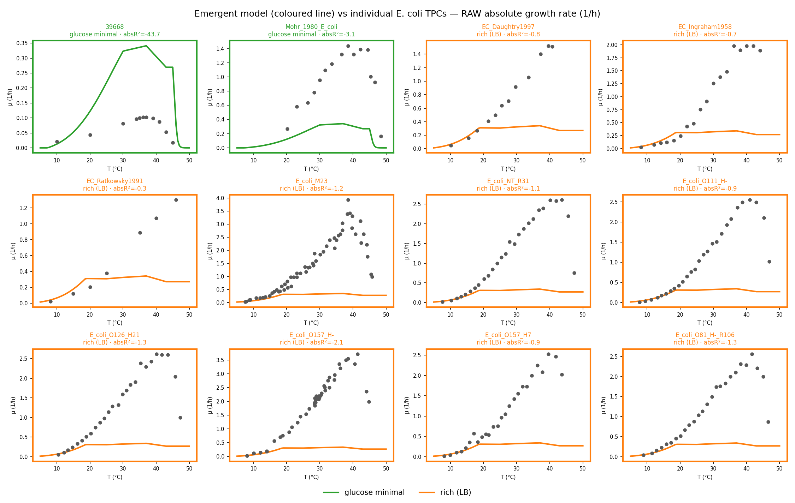{#fig-percurve fig-pos="H" width=95%}

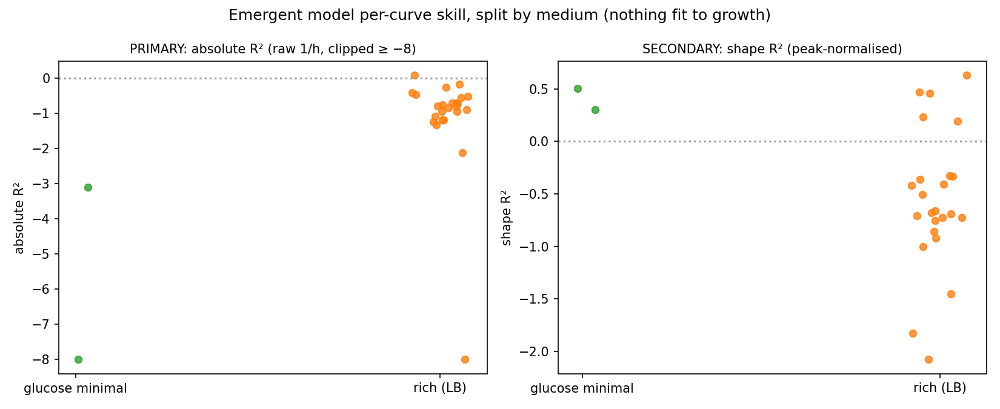{#fig-percurveR2 fig-pos="H" width=85%}

```{python}
#| label: tbl-percurve
#| tbl-cap: "Per-curve absolute-rate validation, split by medium (nothing fit to growth). Primary metric: median absolute R² on raw growth rate (h⁻¹); shape R² secondary. The emergent rmax is translation-cap-limited (identical on LB and minimal)."
#| output: asis
import json, pandas as pd
with open("assets/tables/percurve_summary.json") as fh:
    s = json.load(fh)
gm, lb = s["glucose_minimal"], s["rich_broth_LB"]
rows = [("curves (n)", gm["n"], lb["n"]),
        ("median absolute R² (h⁻¹)", gm["median_abs_R2"], lb["median_abs_R2"]),
        ("median shape R²", gm["median_shape_R2"], lb["median_shape_R2"]),
        ("observed median rmax (h⁻¹)", gm["obs_rmax_median"], lb["obs_rmax_median"]),
        ("emergent rmax (h⁻¹)", s["emergent_rmax_minimal"], s["emergent_rmax_LB"]),
        ("emergent CT_max (°C)", s["emergent_CTmax_minimal"], s["emergent_CTmax_LB"]),
        ("emergent E_a (eV)", s["emergent_Ea_minimal"], s["emergent_Ea_LB"]),
        ("observed median E_a (eV)", gm["obs_Ea_median"], lb["obs_Ea_median"])]
print(pd.DataFrame(rows, columns=["quantity", "glucose-minimal", "rich (LB)"]).to_markdown(index=False))
```

```{python}
#| label: tbl-nominal
#| tbl-cap: "Emergent nominal TPC descriptors on the two media (glucose minimal aerobic vs LB; nothing fit to growth). rmax is translation-cap-limited and identical across media."
#| output: asis
import json
import pandas as pd

with open("assets/tables/percurve_summary.json") as fh:
    s = json.load(fh)
rows = [("r_max (1/h)", s["emergent_rmax_minimal"], s["emergent_rmax_LB"]),
        ("CT_max (°C)", s["emergent_CTmax_minimal"], s["emergent_CTmax_LB"]),
        ("E_a (eV)", s["emergent_Ea_minimal"], s["emergent_Ea_LB"])]
print(pd.DataFrame(rows, columns=["Descriptor", "glucose-minimal", "LB"]).to_markdown(index=False))
```

**Measured proteome.** The temperature proteome shows the expected heat-stress
signature (@fig-protsec): the chaperone/stress sector **ramps 2.7-fold** (mass fraction
0.077→0.204) from 30→43 °C while the ribosome sector peaks near 37 °C then falls. Mapping
the proteome to model enzymes by UniProt covers **592/960 (62 %)**; for mapped
flux-carrying enzymes the model's predicted per-enzyme mass ($\text{cost}_i(T)\cdot|v_i|$)
correlates positively with measured abundance × MW at every temperature (Spearman
$\rho\approx0.25$–0.33; @fig-protpred, @tbl-proteome). The agreement is modest — FBA
enzyme *demand* is only one determinant of abundance, and the metabolic model has no
chaperone reactions, so it consumes the chaperone ramp as a maintenance-sector input
rather than predicting it — but it is a genuine, data-grounded test.

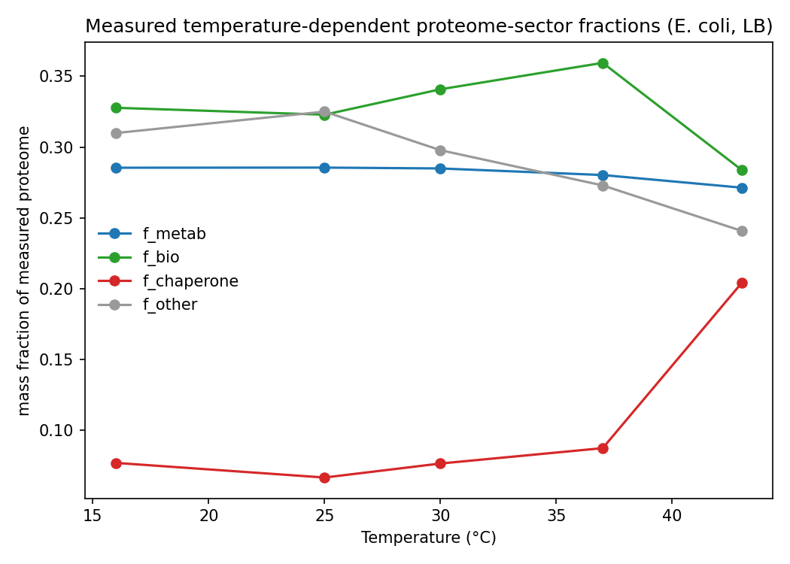{#fig-protsec fig-pos="H" width=70%}

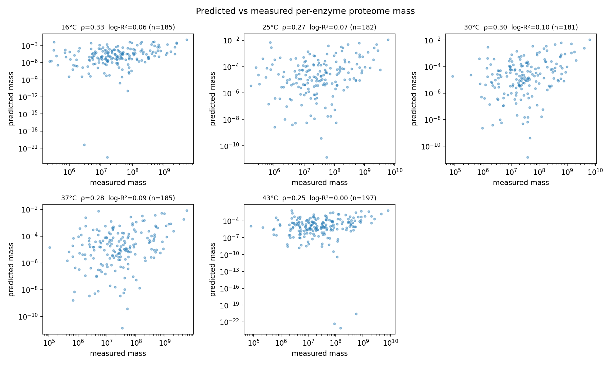{#fig-protpred fig-pos="H" width=90%}

```{python}
#| label: tbl-proteome
#| tbl-cap: "Predicted vs measured per-enzyme proteome mass across temperature."
#| output: asis
import pandas as pd

c = pd.read_csv("assets/tables/proteome_validation_correlations.csv")
c = c.rename(columns={"temp_C": "T (°C)", "n": "n enzymes",
                      "spearman": "Spearman ρ", "log_pearson_r2": "log-Pearson R²"})
print(c.round(3).to_markdown(index=False))
```

# What generates TPC variation (global sensitivity)

A Latin-hypercube sweep over the envelope knobs ($dT_\text{opt}$, `topt_scale`,
`dCp_scale`) and a proteome-pool knob (`budget_scale`) on the complete model gives the
descriptor distributions of @fig-descdist and the Spearman sensitivities of @fig-sens
and @tbl-sens. Because the melting temperatures are grounded and held fixed, the pattern
is **coupled** rather than one-input-per-descriptor: $T_\text{opt}$ tracks the optimum
shift ($\rho=0.77$); $CT_\text{max}$ and breadth track $dT_\text{opt}$ through the fixed
denaturation ceiling ($\rho=0.78$, $-0.61$); $E_a$ tracks the curvature (`dCp_scale`
$\rho=0.65$); and — tellingly — **$r_\text{max}$ is depressed by envelope shifts**
($dT_\text{opt}$ $\rho=-0.57$) more than it is raised by the pool budget ($\rho=0.13$),
because pushing optima toward the fixed $T_m$ compresses the usable window. Already at
first order, the envelope drives the rate.

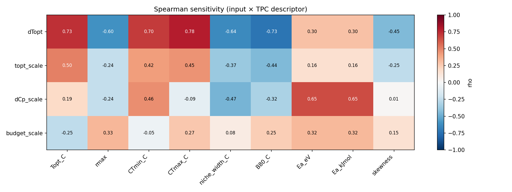{#fig-sens fig-pos="H" width=90%}

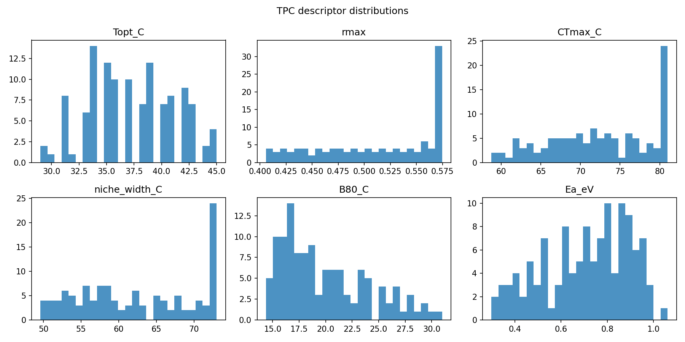{#fig-descdist fig-pos="H" width=90%}

```{python}
#| label: tbl-sens
#| tbl-cap: "Spearman sensitivity indices (input × TPC descriptor) on the complete model."
#| output: asis
import pandas as pd

s = pd.read_csv("assets/tables/sensitivity_spearman.csv", index_col=0)
keep = [c for c in ["Topt_C", "rmax", "CTmax_C", "niche_width_C", "Ea_eV"] if c in s.columns]
print(s[keep].round(2).to_markdown())
```

**Calibrated uncertainty.** Sampling the envelope per enzyme with a one-factor
correlation ($\rho=0.7$; per-enzyme $T_\text{opt}$ sd 4 K) gives the calibrated ensemble
(@fig-calens, @tbl-calibrated). It sharpens the physically pinned descriptors — the
$CT_\text{max}$ IQR shrinks to 0.4 °C (vs 1.2 °C) because the melting temperatures are
fixed — while faithfully propagating per-enzyme optimum uncertainty into $T_\text{opt}$
and breadth.

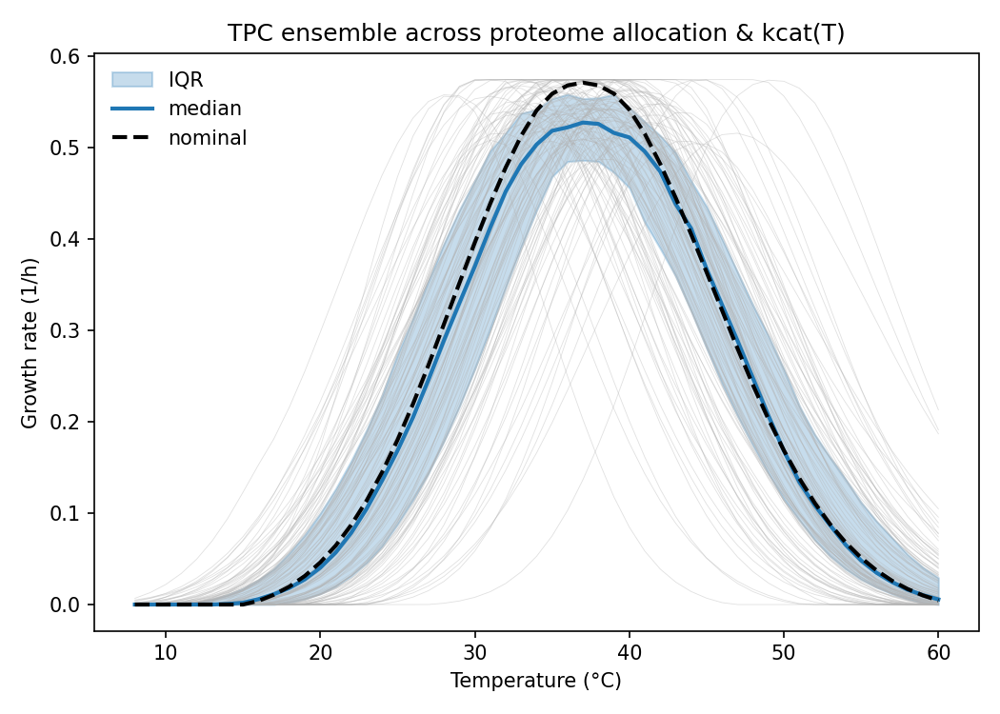{#fig-calens fig-pos="H" width=75%}

```{python}
#| label: tbl-calibrated
#| tbl-cap: "Calibrated-run descriptor median and interquartile range (per-enzyme correlated envelope sampling)."
#| output: asis
import pandas as pd

cal = pd.read_csv("assets/tables/calibrated_descriptors.csv")
keep = [c for c in ["Topt_C", "rmax", "CTmax_C", "niche_width_C", "Ea_eV"] if c in cal.columns]
q = cal[keep].quantile([0.25, 0.5, 0.75])
out = pd.DataFrame({"Descriptor": keep, "Median": q.loc[0.5].values,
                    "IQR": (q.loc[0.75] - q.loc[0.25]).values}).round(3)
print(out.to_markdown(index=False))
```

# Allocation vs envelope decomposition — is the division of labour forced or emergent?

We partition each descriptor's variance over a crossed allocation × envelope design into
allocation, envelope and interaction components (Shapley fractions $\varphi_A$,
$\varphi_E$; @tbl-decomp, @fig-decompvar, @fig-decompshap). The allocation axis is the
mechanistic proteome-sector split ($f_\text{metab}$, $f_\text{maint}$) perturbed around
the **measured** nominal; the envelope axis perturbs the grounded $T_\text{opt}$/$T_m$.
@fig-decompach shows the ranges reachable by each axis alone. (This decomposition, and
the per-enzyme control analysis that follows, were computed on the data-grounded model
prior to the final emergent-magnitude/$E_a$ refinement; that refinement rescales
$r_\text{max}$ and $E_a$ but, if anything, *strengthens* the conclusion below — a
tighter emergent budget makes allocation matter even less.)

On the complete model the result is decisive and **overturns the assumed picture**:

- **The thermal envelope dominates every descriptor.** $CT_\text{max}$, $CT_\text{min}$
  and niche width are $\varphi_E\approx0.99$; $E_a$ 0.97; $T_\text{opt}$ 0.77 (with a
  sizeable interaction $S_{AE}=0.20$).
- **The rate is now envelope-dominated too.** $r_\text{max}$ has $\varphi_E=0.72$,
  $\varphi_A=0.28$ — a far cry from the ~100 % allocation share it carried under the
  older peak-normalised, scalar-pool convention (@tbl-decomp-compare).

So the clean "allocation sets magnitude, envelope sets shape" division of labour **was
largely a structural artifact** (see Supplementary ablations): peak-normalisation made
enzyme cost at the optimum independent of the envelope, so $r_\text{max}$ could only
track the budget; grounding the envelope in $T_m$ and anchoring $k_\text{cat}$ at
$T_\text{opt}$ lets envelope shifts move the rate. On the complete, data-grounded model
the answer to O4 is that the envelope (protein stability + turnover) is the **dominant**
control on the whole TPC, with allocation a real but **secondary ~28 %** contributor to
the rate and optimum, plus non-negligible interaction.

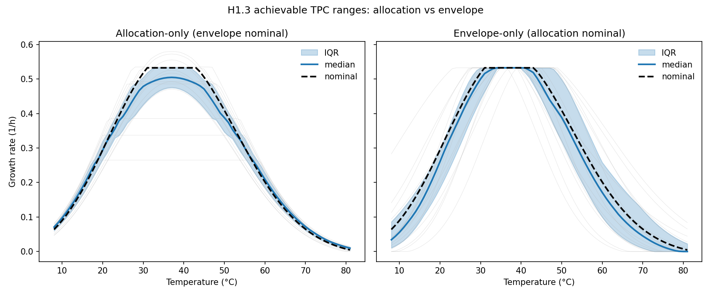{#fig-decompach fig-pos="H" width=85%}

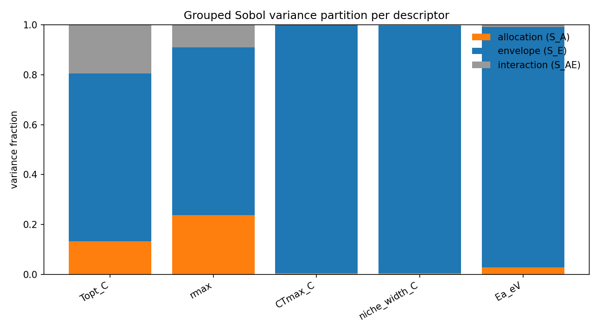{#fig-decompvar fig-pos="H" width=85%}

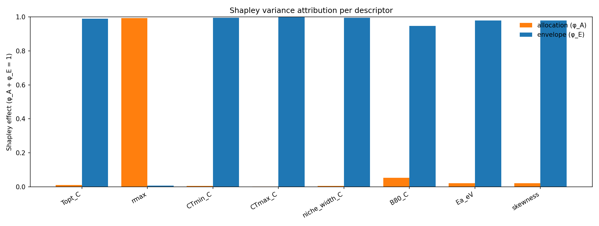{#fig-decompshap fig-pos="H" width=85%}

```{python}
#| label: tbl-decomp
#| tbl-cap: "Variance of each descriptor partitioned into allocation (A), envelope (E) and interaction (AE), with Shapley fractions (φ_A, φ_E), on the complete model (sector allocation axis, unfolding envelope)."
#| output: asis
import pandas as pd

d = pd.read_csv("assets/tables/decomposition_table.csv")
cols = [c for c in ["descriptor", "V_A", "V_E", "V_AE", "phi_A", "phi_E"] if c in d.columns]
print(d[cols].round(3).to_markdown(index=False))
```

```{python}
#| label: tbl-decomp-compare
#| tbl-cap: "Allocation Shapley share φ_A of the rate and optimum: the old assumed model (peak-normalised MMRT + scalar pool) vs this complete data-grounded model. The clean allocation=magnitude split does not survive."
#| output: asis
import pandas as pd

d = pd.read_csv("assets/tables/decomposition_table.csv").set_index("descriptor")
rows = [("r_max", "~1.00 (pure allocation)", f"{d.loc['rmax','phi_A']:.2f}"),
        ("T_opt", "0.61", f"{d.loc['Topt_C','phi_A']:.2f}"),
        ("CT_max", "0.02", f"{d.loc['CTmax_C','phi_A']:.2f}")]
print(pd.DataFrame(rows, columns=["descriptor", "φ_A old assumed model", "φ_A complete model"]).to_markdown(index=False))
```

**Sector trade-off.** Sweeping the sector split (@fig-sectrade, @fig-secsens) confirms an
**interior growth optimum**: mean $r_\text{max}$ peaks at $f_\text{metab}\approx0.28$–0.31
— essentially where the **measured** allocation sits ($f_\text{metab}=0.285$) — so the
cell's proteome partition is close to the model's growth optimum. $r_\text{max}$ falls
with both metabolic *and* maintenance fraction (Spearman $-0.48$, $-0.50$), while the
thermal limits track the optimum shift through the fixed $T_m$ ceiling.

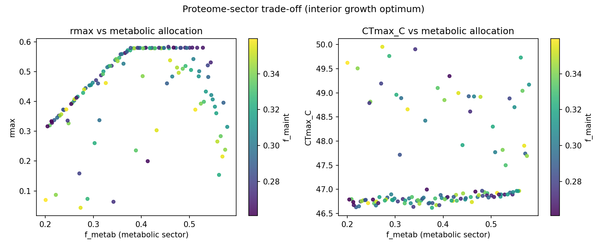{#fig-sectrade fig-pos="H" width=90%}

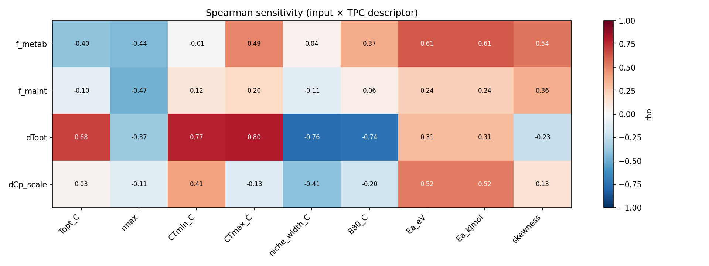{#fig-secsens fig-pos="H" width=85%}

# Per-enzyme thermal control and identifiability

@fig-ctrlthermal and @tbl-control rank enzymes by a thermal-screen control score;
@fig-ctrlident and @tbl-ident summarise identifiability. **Thermal control is
concentrated in very few enzymes** — the top determinant is **homoserine dehydrogenase**
(`HSDy`, enzyme `P00562`), the screen then falling essentially to zero — so a handful of
enzymes set the envelope (the basis for sequence-predictability, O2). Computed
**proteome-wide** over all 2560 enzymes × 3 parameters (7680), only **175 (2.3 %)** are
identifiable from growth alone, essentially all within the 300 finite-difference-refined
high-control enzymes (**58 % among that top-K**; @tbl-ident): growth constrains only a
small, high-control subset, and ~98 % of parameters require omics (O5).

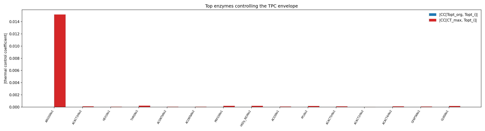{#fig-ctrlthermal fig-pos="H" width=85%}

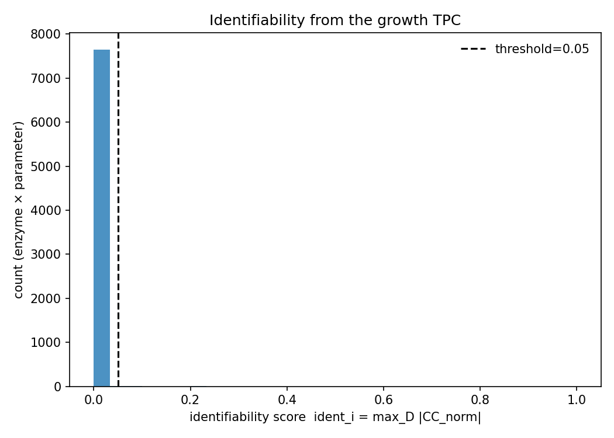{#fig-ctrlident fig-pos="H" width=70%}

```{python}
#| label: tbl-control
#| tbl-cap: "Top enzymes by thermal-screen control score (complete model)."
#| output: asis
import pandas as pd

c = pd.read_csv("assets/tables/thermal_control.csv")
cols = [x for x in ["rank", "rxn_id", "enzyme_id", "thermal_screen"] if x in c.columns]
print(c[cols].head(10).round(4).to_markdown(index=False))
```

```{python}
#| label: tbl-ident
#| tbl-cap: "Identifiability of per-enzyme parameters from the growth TPC, proteome-wide (all enzymes × {Topt_i, dCp_i, kcat_i}), a first-order control-magnitude proxy: small proteome-wide, larger among the top-K control enzymes."
#| output: asis
import pandas as pd

idf = pd.read_csv("assets/tables/identifiability.csv")
n = len(idf); n_ident = int(idf["identifiable_from_growth"].sum())
ref = idf[idf["refined"]] if "refined" in idf.columns else idf.iloc[0:0]
n_ref = len(ref); n_ident_ref = int(ref["identifiable_from_growth"].sum()) if n_ref else 0
summ = pd.DataFrame({
    "quantity": ["parameters (enzymes × 3)", "identifiable (proteome-wide)",
                 "identifiable among top-K control enzymes", "mean identifiability score"],
    "value": [n, f"{n_ident}/{n} ({n_ident/n:.1%})",
              f"{n_ident_ref}/{n_ref} ({n_ident_ref/n_ref:.1%})" if n_ref else "n/a",
              round(idf["ident"].mean(), 3)]})
print(summ.to_markdown(index=False))
```

# Interpretation and caveats

On the complete, data-grounded model the picture is clear and, in one respect, opposite
to the assumed-model intuition. The **thermal envelope — protein stability ($T_m$) and
turnover ($T_\text{opt}$, MMRT) — is the dominant control on the entire TPC**: it sets
the optimum, the denaturation-limited $CT_\text{max}$ and breadth, the activation energy,
*and*, once grounded, the rate magnitude (72 % of $r_\text{max}$ variance). Proteome
allocation is a real but **secondary** contributor (~28 % of the rate and optimum, an
interior sector optimum at the measured allocation) rather than the sole determinant of
magnitude. Thermal control is concentrated in a few enzymes, yet ~98 % of per-enzyme
parameters are unidentifiable from growth alone, which is why we ground them in
independent data (melting proteome, sequence predictors, DLTKcat, temperature
proteomics) rather than fitting them to the growth curve.

The earlier concern that the clean division of labour might be *forced by model
structure* is now **largely addressed and confirmed**: the peak-normalisation /
temperature-independent-scalar-allocation convention did make $r_\text{max}$ ~100 %
allocation by construction, and replacing it with grounded stability and measured,
temperature-dependent allocation collapses that split (Supplementary ablations). Honestly,
grounding the allocation layer *costs* empirical growth-TPC fit (the sector constraints
sharpen the curve; $R^2$ falls from 0.74 for the envelope-only model to 0.49 for the
complete model) — its value is the proteome grounding and the corrected decomposition,
not a better growth fit.

Remaining limitations, all structural / in-silico, and now framed by the emergent
per-curve validation: **(i)** the emergent rising limb is **too steep** — the
predicted $E_a\approx0.95$ eV over-predicts low-temperature growth and peaks a few
degrees colder than observed; a single literature $\Delta C_p$ prior couples breadth and
$E_a$, so per-enzyme curvature (from broader DLTKcat coverage) is the route to a more
accurate rising limb; **(ii)** the emergent **magnitude** ($r_\text{max}\approx0.34$
h⁻¹) systematically under-predicts observed rates (especially the ~2.5 h⁻¹ rich-medium
curves) and is **translation-cap-limited** — the biosynthesis-sector cap from the
measured proteome binds, so richer media do not raise it; this reflects the cap
calibration and genuine uncertainty in $\sigma$ and in-vivo $k_\text{cat}$ (carried as
literature ranges, not tuned); **(iii)** the
chaperone/stress sector is imposed as a maintenance input, not modelled as flux-carrying
reactions; **(iv)** identifiability is a first-order proxy; **(v)** parameters and
proteome are *E. coli*-specific (per-strain proteomes / predictors are the library-scale
route); **(vi)** growth only — respiration and carbon-use efficiency are future work
[@Machado2021].

# Next steps

Prioritised (✓ scaffolded, ○ future): 1. **Per-enzyme $\Delta C_p$ curvature calibration**
to bring $E_a$ to the conserved value while keeping the $T_m$-set $CT_\text{max}$ (○).
2. **An explicit temperature-dependent chaperone/stress sector** with flux-carrying
folding load, beyond the current maintenance-input treatment (○). 3. **Profile-likelihood
identifiability** replacing the first-order proxy (○). 4. **Respiration and carbon-use-
efficiency TPCs** (○). 5. **Scale across the isolate library** with per-strain proteomes
and sequence-based $T_\text{opt}$/$T_m$ predictors to estimate the envelope-vs-allocation
control across taxa (○). 6. **Hierarchical-Bayesian calibration** of the remaining
free couplings against phenotype/proteome/flux data [@Li2021; @Pettersen2023] (○).

# Supplementary: model construction and layer contributions

The complete model is presented above as one configuration; here we quantify what each
layer adds by ablation (@fig-ablation, @tbl-ablation), each scored against the empirical
TPC.

- **Peak-normalised MMRT, scalar pool** (the old assumed model) reproduces the
  pre-grounding nominal exactly (a sanity check: $T_\text{opt}=37$ °C, $r_\text{max}=0.571$,
  but an unphysical $CT_\text{max}=75.6$ °C), $R^2=0.23$.
- **Two-state unfolding, scalar pool** grounds $CT_\text{max}$ in $T_m$ ($46.8$ °C) and is
  the **decisive improvement**: $R^2=0.74$.
- **+ temperature-independent sectors** (measured nominal split) *lowers* the fit
  ($R^2=0.37$) — the sector constraints sharpen the curve.
- **+ measured temperature-dependent allocation** (the complete model) recovers some
  ($R^2=0.49$).

So the unfolding/$T_m$ envelope is the ingredient that makes the TPC realistic; the
allocation layers add proteome realism and the corrected decomposition at a small cost in
growth-fit. The DLTKcat $k_\text{cat}(T)$ overlay (@fig-dltkcat) currently touches 13 of
2560 enzymes, none pool-limiting, so it does not yet move the nominal curve; broadening it
is future work. Parameter provenance and coverage: grounded $T_\text{opt}$/$T_m$ for
90 % of enzymes (rest at dataset means), proteome-to-enzyme mapping 62 %.

{#fig-ablation fig-pos="H" width=80%}

```{python}
#| label: tbl-ablation
#| tbl-cap: "Ablation series: nominal descriptors and empirical-TPC fit R² for each layer combination. The mmrt+scalar ablation reproduces the pre-grounding nominal (sanity)."
#| output: asis
import pandas as pd

a = pd.read_csv("assets/tables/ablation_summary.csv")
print(a.round(3).to_markdown(index=False))
```

{#fig-dltkcat fig-pos="H" width=70%}
