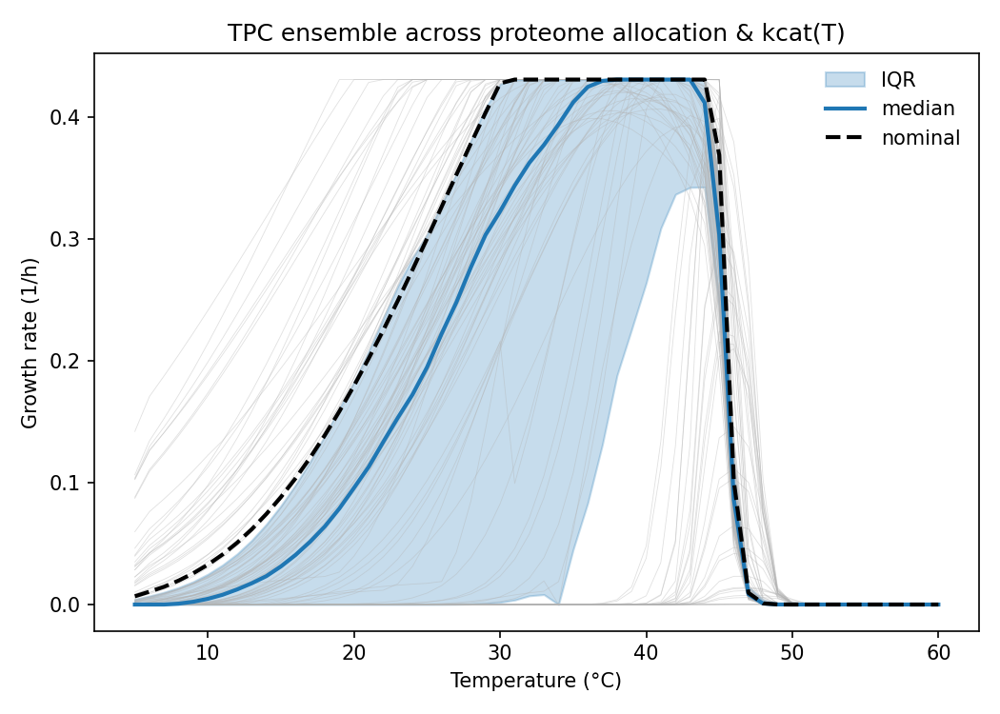
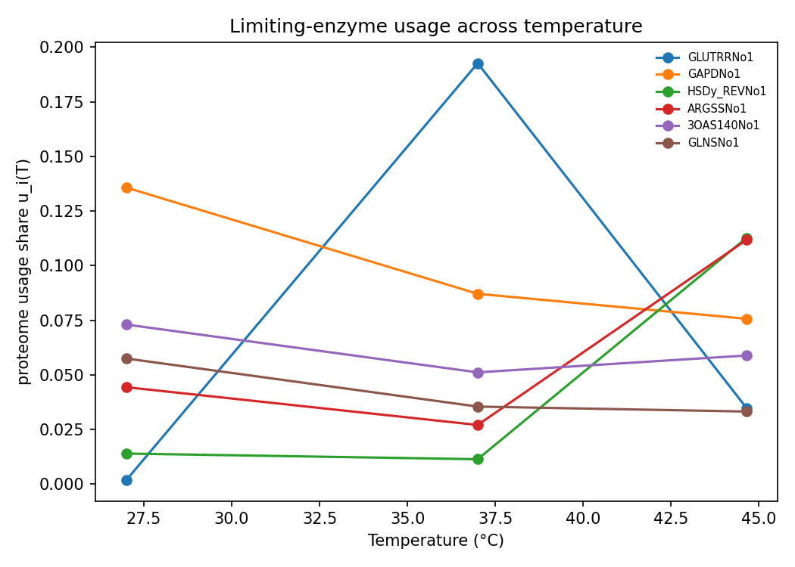
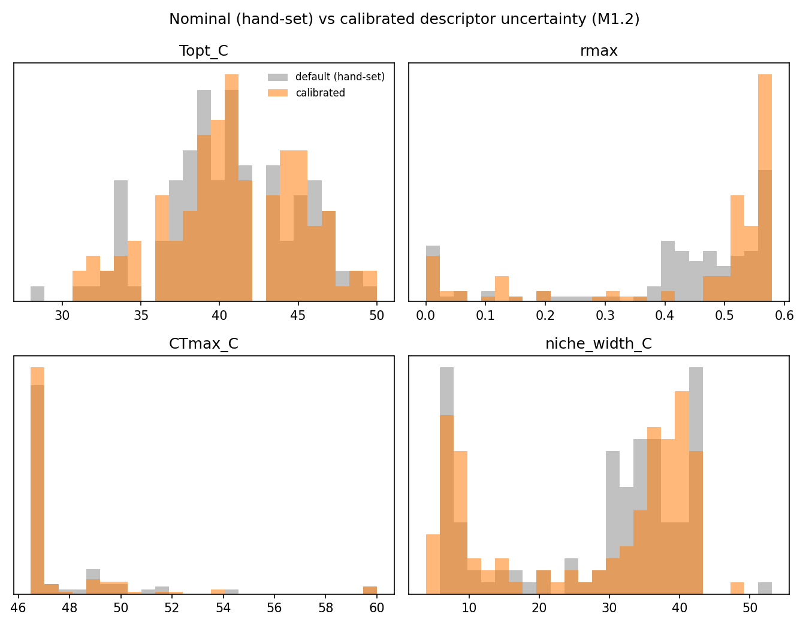

# Background and objectives

The broader aim of this work is to **predict microbial thermal performance curves
(TPCs) from genomes**. The temperature dependence of microbial growth, respiration
and carbon-use efficiency governs how microbial communities respond to warming, and
therefore how much of the terrestrial carbon store is stabilised or lost as the
climate changes. Scaling that response from cells to communities and to
carbon-cycle feedbacks requires a way to predict a taxon's TPC from information that
scales — ideally its genome. Because a cell's TPC is an emergent property of its
metabolism operating under a finite, temperature-sensitive enzyme budget, an
enzyme- and temperature-constrained genome-scale metabolic model (etc-GEM) is a
natural mechanistic predictor: it turns a genome and a set of enzyme kinetic
parameters into a growth rate at any temperature.

We establish and de-risk the method on **_Escherichia coli_**, using the
enzyme-constrained model **eciML1515** — a GECKO formulation [@Sanchez2017;
@Domenzain2022] of the manually curated iML1515 reconstruction [@Monk2017]. *E.
coli* / iML1515 is the best-curated bacterial genome-scale model, with the
best-characterised turnover numbers ($k_\text{cat}$), so it is the right place to
build, test and stress the modelling machinery before scaling it to a large,
phylogenetically diverse bacterial isolate library where curation and kinetic data
are far sparser.

The in-silico work is organised around six objectives, which the rest of the report
returns to:

- **O1** — reproduce a realistic *E. coli* growth TPC and define its components.
- **O2** — determine which model components set the thermal **envelope**
  ($T_\text{opt}$, $CT_\text{max}$, breadth, $E_a$), and whether a few enzymes
  dominate (the basis for sequence-predictability).
- **O3** — determine what sets the rate **magnitude** / baseline rate ($r_\text{max}$),
  i.e. proteome allocation.
- **O4** — quantify the **separability** of a genome-set envelope from an
  allocation-set magnitude (the key hypothesis).
- **O5** — assess **identifiability**: which parameters are inferable from growth data
  alone versus which require omics.
- **O6** — move from a nominal parameter scan to **calibrated uncertainty** using
  sequence/temperature-aware $k_\text{cat}$ predictions.

# The model: an enzyme- and temperature-constrained genome-scale model

The etc-GEM links four layers; understanding how they connect is what motivates the
experimental design.

**Metabolic network.** The stoichiometric backbone and gene–protein–reaction (GPR)
rules are those of iML1515, a genome-scale reconstruction of *E. coli* K-12 MG1655
covering 1515 genes [@Monk2017]. Flux balance analysis on this network is solved
with cobrapy [@Ebrahim2013].

**Enzyme constraints (GECKO).** Each reaction is coupled to the enzyme(s) that
catalyse it: carrying flux $v_i$ costs enzyme mass $v_i / k_{\text{cat},i}$, and the
summed cost of all enzymes is bounded by a shared **protein pool**. This is the
GECKO enzyme-constraint formulation [@Sanchez2017; @Domenzain2022]; the eciML1515
model is taken from the SysBioChalmers ecModels container
(<https://github.com/SysBioChalmers/ecModels>). The pool makes proteome allocation a
first-class, limiting resource: at the growth optimum the pool binds, so faster flux
through one pathway must come at the expense of another.

**Temperature layer (MMRT).** Each enzyme's turnover number is made
temperature-dependent through macromolecular rate theory (MMRT), in which a negative
change in the heat capacity of activation, $\Delta C_p^\ddagger$, curves the
Arrhenius plot and produces a single-peaked $k_\text{cat}(T)$ [@Hobbs2013]. We adopt
a **peak-normalisation** convention: each enzyme's reference $k_\text{cat}$ is its
own maximum over temperature, so warming or cooling away from that enzyme's optimum
only ever *raises* its cost. This choice (i) prevents any enzyme from becoming
"super-efficient" relative to its tabulated $k_\text{cat}$, (ii) keeps the proteome
pool binding across the temperature range, and (iii) yields a single-peaked
organismal TPC rather than a monotonic Arrhenius rise. The MMRT curvature
$\Delta C_p^\ddagger$ jointly sets thermal breadth and the rising-limb apparent
activation energy $E_a$; because its default value is a modelling choice, we
calibrate it (by bisection) so the nominal $E_a$ matches a target (here 0.65 eV, the
conserved metabolic-theory value [@Davidi2016]), extending the temperature grid so
$CT_\text{max}$ stays resolved.

**Proteome allocation and sectors.** In the baseline model the shared pool is a
single scalar. Following the bacterial growth laws [@Basan2015; @Scott2010], it can
be refined into three coarse-grained **sectors** — metabolic enzymes ($f_\text{metab}$),
biosynthesis/ribosomes ($f_\text{bio}$, a translation cap on growth) and
maintenance/housekeeping ($f_\text{maint}$) — that sum to one. This makes the
baseline rate an explicit allocation trade-off rather than a single number.

**$k_\text{cat}(T)$ data and the in-vitro/in-vivo gap.** Temperature-dependent
turnover numbers are drawn from DLTKcat, a deep-learning predictor of
sequence- and temperature-aware $k_\text{cat}$ [@Qiu2024]
(<https://github.com/SizheQiu/DLTKcat>), fitted per enzyme to MMRT parameters
($T_\text{opt}$, $\Delta C_p^\ddagger$). Data-driven $k_\text{cat}$ are needed
because in-vitro turnover numbers systematically mispredict in-vivo apparent rates
[@Davidi2016; @Heckmann2020]. This etc-GEM construction builds directly on the
Bayesian temperature-constrained GEM programme [@Li2021; @Pettersen2023].

**How the linked structure maps onto the design.** Because the organismal TPC emerges
from a thermal **envelope** (per-enzyme $k_\text{cat}(T)$) acting through a binding
proteome **allocation** budget, the model exposes two natural, largely separable
axes to perturb: thermal-envelope parameters and proteome allocation. The
sensitivity, decomposition and control experiments below interrogate exactly these
two axes to address O2–O5.

# In-silico experimental design and key assumptions

We run five complementary analyses, each targeting specific objectives:

- **Global sensitivity** (O2, O3): a Latin-hypercube sweep over envelope knobs
  (a uniform shift $dT_\text{opt}$ of all enzyme optima, a spread factor
  `topt_scale`, and a curvature scaling `dCp_scale`) and an allocation knob
  (`budget_scale`), reducing each sampled TPC to descriptors and computing Spearman
  rank sensitivities.
- **Allocation-vs-envelope variance decomposition** (O4): a crossed two-group design
  (allocation samples × envelope samples), with each descriptor's variance split into
  allocation, envelope and interaction components via an exact two-group Shapley
  attribution. The allocation axis here is the mechanistic proteome-sector split
  ($f_\text{metab}$, $f_\text{maint}$), not a scalar budget.
- **Per-enzyme thermal control and identifiability** (O2, O5): a cheap proteome-wide
  screen (usage share × analytic thermal sensitivity) over all enzymes, refined by
  targeted finite-difference control coefficients on the highest-control (top-K)
  enzymes; identifiability is reported as a first-order control-magnitude proxy.
- **DLTKcat-calibrated envelope and calibrated sampling** (O6): a sweep whose nominal
  envelope is the DLTKcat per-enzyme fit, and a calibrated ensemble that samples the
  envelope per enzyme with a one-factor correlation (shared fraction $\rho$), with an
  option to draw per-enzyme means and standard deviations from the DLTKcat posterior.
- **Proteome-sector allocation trade-off** (O3): a sweep over the sector split
  ($f_\text{metab}$, $f_\text{maint}$) to expose the interior growth optimum.

**Key assumptions**, stated plainly so results can be read appropriately:

1. **Peak-normalised reference $k_\text{cat}$** ($k_{\text{cat,ref}}$ = each enzyme's
   maximum over $T$): warming away from an enzyme's optimum only raises its cost.
2. The proteome **pool operates in the binding regime**, so allocation is limiting at
   the optimum.
3. **MMRT curvature governs breadth and $E_a$**; its default is a modelling choice,
   here calibrated to a target $E_a$. A single curvature cannot independently set
   breadth and $E_a$, so matching a low $E_a$ produces a broad curve (see caveats).
4. The **one-factor $\rho$** used in calibrated sampling is a simple stand-in for the
   true (unknown) covariance of thermostability across enzymes.
5. **Variance fractions are defined relative to the swept input ranges** — they
   describe what the model *can* generate under those ranges, not a claim about real
   populations.
6. **Identifiability is first-order** (a control-magnitude proxy), not a full
   Fisher-information / profile-likelihood analysis.
7. **DLTKcat skill is limited** (log-scale $R^2 \approx 0.6$ [@Qiu2024]), and only a
   subset of enzymes currently have usable fits.
8. Only **growth** is modelled here; respiration and carbon-use efficiency — the
   community-relevant currencies — are future work.
9. All results are **structural / in-silico predictions** pending phenotype and omics
   calibration.

# Results

## Nominal TPC on eciML1515 (O1)

The nominal (unperturbed) TPC and its sampled ensemble are shown in @fig-tpc; the
descriptors are in @tbl-nominal. The model reproduces a realistic mesophilic *E.
coli* growth response: **optimum $T_\text{opt} = 37\,°\text{C}$** and **maximum rate
$r_\text{max} = 0.57\,\text{h}^{-1}$** (a ~1.2 h doubling time, in the right range for
aerobic growth on a defined medium), built from 2560 enzyme constraints under a pool
budget of 0.082. With the MMRT curvature calibrated to the metabolic-theory value,
the rising-limb **$E_a = 0.66\,\text{eV}$** (63.5 kJ mol⁻¹), close to the target
0.65 eV. The high-temperature critical point ($CT_\text{max} = 75.6\,°\text{C}$) and
the resulting breadth ($67.6\,°\text{C}$) are, however, biologically too high for *E.
coli*: this is a direct and expected consequence of forcing a single MMRT curvature
to hit a low $E_a$, which over-broadens the falling limb (see Interpretation). The
cold critical point sits at the grid floor ($CT_\text{min} = 8\,°\text{C}$), so
$CT_\text{min}$ and the niche width are lower bounds set partly by the temperature
grid. Objective O1 is met for the ecologically central descriptors ($T_\text{opt}$,
$r_\text{max}$, $E_a$).

{#fig-tpc fig-pos="H" width=80%}

```{python}
#| label: tbl-nominal
#| tbl-cap: "Nominal TPC descriptors for eciML1515 read from the sweep summary (optimum temperature, maximum growth rate, critical temperatures, thermal breadth and apparent activation energy)."
#| output: asis
import json
import pandas as pd

with open("assets/tables/summary.json") as fh:
    nom = json.load(fh)["nominal"]
rows = [
    ("T_opt (°C)",         nom["Topt_C"]),
    ("r_max (1/h)",        nom["rmax"]),
    ("CT_min (°C)",        nom["CTmin_C"]),
    ("CT_max (°C)",        nom["CTmax_C"]),
    ("Niche width (°C)",   nom["niche_width_C"]),
    ("E_a (eV)",           nom["Ea_eV"]),
]
df = pd.DataFrame(rows, columns=["Descriptor", "Nominal"])
df["Nominal"] = df["Nominal"].round(3)
print(df.to_markdown(index=False))
```

## Global sensitivity: what generates TPC variation (O2, O3)

A Latin-hypercube sweep over the envelope and allocation inputs yields the descriptor
distributions of @fig-descdist and the Spearman sensitivity matrix of @fig-sens and
@tbl-sens. The pattern is a clean **division of labour between envelope and
allocation**:

- **Position ($T_\text{opt}$) tracks the envelope shift.** $T_\text{opt}$ correlates
  almost perfectly with the uniform optimum shift $dT_\text{opt}$ ($\rho = 0.92$) and
  weakly with the spread (`topt_scale`, $\rho = 0.36$); allocation (`budget_scale`)
  has essentially no effect ($\rho \approx 0$). This is the envelope setting curve
  position — the basis of sequence-predictability (O2).
- **Magnitude ($r_\text{max}$) is purely allocation.** $r_\text{max}$ correlates
  perfectly with `budget_scale` ($\rho = 1.00$) and negligibly with any envelope knob
  ($|\rho| \le 0.06$): the pool budget sets the height and nothing else does (O3).
- **Shape ($CT_\text{max}$, breadth, $E_a$) tracks the curvature.** The curvature
  scaling `dCp_scale` dominates $CT_\text{max}$ ($\rho = -0.83$), niche width
  ($\rho = -0.96$) and $E_a$ ($\rho = 0.97$), and also $CT_\text{min}$
  ($\rho = 0.78$): steeper curvature (more negative $\Delta C_p^\ddagger$) narrows the
  curve and raises $E_a$ (O2).

So each descriptor is governed by a distinct input, and the envelope/allocation split
is already visible at the level of first-order sensitivities.

{#fig-sens fig-pos="H" width=90%}

{#fig-descdist fig-pos="H" width=90%}

```{python}
#| label: tbl-sens
#| tbl-cap: "Spearman sensitivity indices (input × TPC descriptor) for the headline descriptors from the global sweep."
#| output: asis
import pandas as pd

s = pd.read_csv("assets/tables/sensitivity_spearman.csv", index_col=0)
keep = [c for c in ["Topt_C", "rmax", "CTmax_C", "niche_width_C", "Ea_eV"] if c in s.columns]
print(s[keep].round(2).to_markdown())
```

## Allocation vs envelope decomposition (O4)

To move beyond one-at-a-time sensitivities we partition each descriptor's *variance*
over a crossed allocation × envelope design into allocation, envelope and interaction
components (Shapley-normalised fractions $\varphi_A$, $\varphi_E$; @tbl-decomp,
@fig-decompvar, @fig-decompshap). Crucially, the allocation axis here is the
**mechanistic proteome-sector split** ($f_\text{metab}$, $f_\text{maint}$;
[@Basan2015; @Scott2010]), not a single scalar budget — this matters because a
scalar budget can only rescale the pool and *by construction* cannot move
$T_\text{opt}$ or $CT_\text{max}$, which would inflate the apparent separability.
@fig-decompach shows the descriptor ranges reachable by allocation alone versus
envelope alone.

The decomposition confirms a strong but **imperfect** separation:

- **$r_\text{max}$ is essentially pure allocation** ($\varphi_A = 1.00$,
  $\varphi_E \approx 0$).
- **$CT_\text{max}$, $CT_\text{min}$ and niche width are essentially pure envelope**
  ($\varphi_E = 0.98,\ 0.96,\ 0.97$), as is skewness ($\varphi_E = 0.79$);
  $E_a$ is envelope-leaning ($\varphi_E = 0.63$).
- **$T_\text{opt}$ is mixed** ($\varphi_A = 0.61$, $\varphi_E = 0.39$) with a sizeable
  **interaction** ($S_{AE} = 0.21$), and the 80 %-breadth descriptor $B_{80}$ is
  allocation-leaning ($\varphi_A = 0.69$).

In other words, the height/shape separation (allocation ↔ $r_\text{max}$; envelope ↔
$CT_\text{max}$/breadth) is robust and largely additive, but once allocation is
represented mechanistically (reallocating between sectors can change *which* enzymes
limit) $T_\text{opt}$ acquires a real allocation component and an interaction term.
This is the honest, mechanistic version of O4: the genome-set envelope and
allocation-set magnitude are separable for the rate and the thermal limits, but not
perfectly for the optimum temperature.

{#fig-decompach fig-pos="H" width=85%}

{#fig-decompvar fig-pos="H" width=85%}

{#fig-decompshap fig-pos="H" width=85%}

```{python}
#| label: tbl-decomp
#| tbl-cap: "Variance of each TPC descriptor partitioned into allocation (A), envelope (E) and interaction (AE) components, with Shapley-normalised allocation/envelope fractions (φ_A, φ_E), from the H1.3 decomposition on the mechanistic sector allocation axis."
#| output: asis
import pandas as pd

d = pd.read_csv("assets/tables/decomposition_table.csv")
cols = [c for c in ["descriptor", "V_A", "V_E", "V_AE", "phi_A", "phi_E"] if c in d.columns]
print(d[cols].round(3).to_markdown(index=False))
```

## Per-enzyme thermal control and identifiability (O2, O5)

We next ask *which* enzymes set the envelope, and *which* per-enzyme parameters could
be recovered from growth data alone. @fig-ctrlthermal and @tbl-control rank enzymes
by a thermal-screen control score; @fig-ctrlbottle shows how the rate-limiting enzyme
shifts with temperature; @fig-ctrlident and @tbl-ident summarise identifiability.

**Thermal control is concentrated in very few enzymes (O2).** The top thermal
determinant is **glyceraldehyde-3-phosphate dehydrogenase** (`GAPDNo1`, enzyme
`P0A9B2`), with a control coefficient $\mathrm{CC}[CT_\text{max}, T_{\text{opt},i}]
= 0.16$; the screen score then falls ~40-fold to the next enzyme. (The control of the
*optimum* $T_\text{opt}$ on any single enzyme is ≈ 0 because $T_\text{opt}$ is an
argmax descriptor — a discrete jump — so single-enzyme envelope control instead
registers on the interpolated $CT_\text{max}$.) A handful of central-carbon enzymes
therefore set the organism's thermal envelope, which is precisely the property that
makes the envelope potentially predictable from sequence (O2).

**Most per-enzyme parameters are not identifiable from growth alone (O5).**
Computed **proteome-wide** — over all 2560 enzymes × three parameters ($T_{\text{opt},i}$,
$\Delta C_{p,i}$, $k_{\text{cat},i}$) = 7680 parameters — only **92 (1.2 %)** clear the
identifiability threshold, and essentially all of them lie within the 300
finite-difference-refined high-control enzymes (**92/300 = 30.7 %** among that
top-K subset; @tbl-ident). The identifiable fraction is uniformly small across
parameter types (1.0 % of $T_{\text{opt},i}$, 1.1 % of $\Delta C_{p,i}$, 1.5 % of
$k_{\text{cat},i}$). The previous top-K-only reporting (which conditioned on the
high-control enzymes) badly overstated identifiability; the proteome-wide view shows
that growth alone constrains only a small, high-control subset and that the remaining
~99 % of parameters require proteome/flux (omics) data to pin down — the central
motivation for the omics arm of the programme (O5).

{#fig-ctrlthermal fig-pos="H" width=85%}

{#fig-ctrlbottle fig-pos="H" width=85%}

{#fig-ctrlident fig-pos="H" width=75%}

```{python}
#| label: tbl-control
#| tbl-cap: "Top enzymes by thermal-screen control score, with their reaction and enzyme identifiers."
#| output: asis
import pandas as pd

c = pd.read_csv("assets/tables/thermal_control.csv")
cols = [x for x in ["rank", "rxn_id", "enzyme_id", "thermal_screen"] if x in c.columns]
print(c[cols].head(10).round(4).to_markdown(index=False))
```

```{python}
#| label: tbl-ident
#| tbl-cap: "Identifiability of per-enzyme thermal/catalytic parameters from the growth TPC, computed proteome-wide (all enzymes × {Topt_i, dCp_i, kcat_i}) as a first-order control-magnitude proxy. The proteome-wide identifiable fraction is small, whereas among the top-K finite-difference control enzymes (`refined`) a much larger fraction is identifiable — few enzymes dominate control (O2) while most parameters need omics constraints (O5)."
#| output: asis
import pandas as pd

idf = pd.read_csv("assets/tables/identifiability.csv")
n = len(idf)
n_ident = int(idf["identifiable_from_growth"].sum())
ref = idf[idf["refined"]] if "refined" in idf.columns else idf.iloc[0:0]
n_ref = len(ref)
n_ident_ref = int(ref["identifiable_from_growth"].sum()) if n_ref else 0
frac = f"{n_ident}/{n} ({n_ident/n:.1%})" if n else "n/a"
frac_topk = f"{n_ident_ref}/{n_ref} ({n_ident_ref/n_ref:.1%})" if n_ref else "n/a"
summ = pd.DataFrame({
    "quantity": ["parameters (enzymes × 3)",
                 "identifiable from growth (proteome-wide)",
                 "identifiable among top-K control enzymes",
                 "mean identifiability score"],
    "value": [n, frac, frac_topk, round(idf["ident"].mean(), 3)],
})
print(summ.to_markdown(index=False))
```

## DLTKcat-calibrated envelope (O6)

Replacing the hand-set thermal envelope with per-enzyme MMRT parameters fitted from
DLTKcat $k_\text{cat}(T)$ predictions [@Qiu2024] gives the ensemble in @fig-dltkcat.
This is the first step toward a sequence/temperature-aware envelope (O6). In the
current fit, usable DLTKcat parameters were available for only **13 of 2560 enzymes**,
and those enzymes are not pool-limiting at the optimum, so the DLTKcat-calibrated
nominal TPC coincides with the default ($T_\text{opt} = 37\,°\text{C}$,
$r_\text{max} = 0.57\,\text{h}^{-1}$, $CT_\text{max} = 75.6\,°\text{C}$,
$E_a = 0.66\,\text{eV}$). The run therefore demonstrates that the DLTKcat → MMRT →
etc-GEM pipeline is wired end-to-end, but a materially different data-driven envelope
will require DLTKcat fits for a much larger, and rate-limiting, set of enzymes.

{#fig-dltkcat fig-pos="H" width=80%}

## Calibrated thermal-envelope uncertainty (O6)

Beyond a single data-driven point, we move from a nominal parameter scan to
**calibrated uncertainty** by sampling the thermal envelope *per enzyme* with a
one-factor correlation structure (shared fraction $\rho = 0.7$; per-enzyme
$T_\text{opt}$ sd 4 K, $\Delta C_p$ sd 30 %), with an option to draw per-enzyme means
and standard deviations from the DLTKcat posterior (`mode: posterior`). @fig-calens
shows the calibrated-uncertainty fan; @fig-calvsdef overlays the default
hand-set-range spread against the calibrated spread; @tbl-calibrated gives the
calibrated medians and IQRs.

The calibrated ensemble is centred on the nominal descriptors (median $T_\text{opt} =
37\,°\text{C}$, $r_\text{max} = 0.57\,\text{h}^{-1}$, $CT_\text{max} = 75.7\,°\text{C}$,
$E_a = 0.66\,\text{eV}$) but is **markedly tighter** than the hand-set-range scan: the
inter-quartile ranges shrink for every descriptor — $T_\text{opt}$ 4.0 vs 6.3 °C,
$r_\text{max}$ **0.03 vs 0.11 $\text{h}^{-1}$**, $CT_\text{max}$ 8.4 vs 11.3 °C, niche
width 8.2 vs 14.9 °C, and $E_a$ 0.17 vs 0.30 eV (calibrated vs default). Structured,
correlated per-enzyme sampling thus yields substantially sharper predictions than
arbitrary uniform ranges, which is the point of O6. (Part of the $r_\text{max}$
tightening also reflects that the calibrated experiment sweeps only a narrow
allocation band, $\pm 10\%$, alongside the envelope, whereas the default scan sweeps
the budget over $-30/+10\%$; the qualitative sharpening nonetheless holds across the
envelope-controlled descriptors.)

{#fig-calens fig-pos="H" width=80%}

{#fig-calvsdef fig-pos="H" width=85%}

```{python}
#| label: tbl-calibrated
#| tbl-cap: "Calibrated-run descriptor median and interquartile range (per-enzyme correlated envelope sampling, shared fraction ρ = 0.7)."
#| output: asis
import pandas as pd

cal = pd.read_csv("assets/tables/calibrated_descriptors.csv")
keep = [c for c in ["Topt_C", "rmax", "CTmax_C", "niche_width_C", "Ea_eV"] if c in cal.columns]
q = cal[keep].quantile([0.25, 0.5, 0.75])
out = pd.DataFrame({
    "Descriptor": keep,
    "Median": q.loc[0.5].values,
    "IQR": (q.loc[0.75] - q.loc[0.25]).values,
}).round(3)
print(out.to_markdown(index=False))
```

## Proteome-sector allocation trade-off (O3)

Finally, refining the single pool into metabolic, biosynthesis and maintenance sectors
turns the baseline rate into an explicit allocation trade-off with an **interior
optimum**: too little metabolic pool starves enzymes, too little biosynthesis/maintenance
starves translation. @fig-sectrade plots $r_\text{max}$ (and $CT_\text{max}$) against
the metabolic fraction $f_\text{metab}$, coloured by the maintenance fraction
$f_\text{maint}$; @fig-secsens gives the sector-sweep sensitivities.

Across the swept range $f_\text{metab} \in [0.35, 0.65]$, the mean $r_\text{max}$
rises from 0.43 to a **peak of 0.52 $\text{h}^{-1}$ at $f_\text{metab} \approx 0.45$–0.50**
and then falls to 0.33 — a clear interior growth optimum (O3). The sector-sweep
sensitivities are consistent with the whole picture: $r_\text{max}$ is set by
allocation (Spearman $-0.34$ vs $f_\text{metab}$, $-0.54$ vs $f_\text{maint}$: more
maintenance means less rate), while the shape descriptors are set by the envelope
($CT_\text{max}$ and niche width vs `dCp_scale` are $-0.84$ and $-0.92$;
$CT_\text{max}$ vs $dT_\text{opt}$ is $0.52$). The sector model thus supplies the
mechanistic allocation axis — in the maintenance→biosynthesis language of the growth
laws — that produces the magnitude trade-off underpinning O3 and the allocation side
of O4.

{#fig-sectrade fig-pos="H" width=90%}

{#fig-secsens fig-pos="H" width=90%}

# Interpretation and caveats

Taken together, the analyses support a coherent, mechanistic picture that maps onto
the objectives. The thermal **envelope** sets curve position and shape —
$T_\text{opt}$ tracks the enzyme optima ($\rho = 0.92$), and $CT_\text{max}$, breadth
and $E_a$ track the MMRT curvature ($\varphi_E = 0.63$–0.98) — while proteome
**allocation** sets the rate magnitude ($r_\text{max}$ variance is ~100 % allocation,
with an interior sector optimum). This is the separability hypothesis (O4), and it
holds strongly for the rate and thermal limits but only partially for $T_\text{opt}$,
which acquires a 61 % allocation share and a 21 % interaction once allocation is
represented mechanistically rather than as a scalar budget. Thermal control is
concentrated in a few central-carbon enzymes (led by GAPDH; O2), yet only ~1 % of
per-enzyme parameters are identifiable from growth alone (O5) — the envelope may be
predictable from a small number of sequences, but calibrating the full parameter set
needs omics.

Several caveats bound these conclusions, all structural / in-silico:

- **Curvature couples breadth and $E_a$.** Because one MMRT $\Delta C_p^\ddagger$ sets
  both, calibrating to the conserved $E_a = 0.65$ eV over-broadens the falling limb,
  giving a biologically implausible $CT_\text{max}$ (75.6 °C) and niche width even
  though $T_\text{opt}$ and $r_\text{max}$ are realistic. Independent control of
  breadth and $E_a$ (e.g. per-enzyme $\Delta C_p$ from DLTKcat) is needed.
- **Grid-edge descriptors.** $CT_\text{min}$ sits at the grid floor (8 °C), so it and
  the niche width are lower bounds set partly by the temperature grid.
- **Ranges, not populations.** Variance fractions are defined relative to the swept
  input ranges, not a measured population.
- **First-order identifiability.** The identifiability score is a control-magnitude
  proxy, not a Fisher-information / profile-likelihood analysis; it should be read as a
  screening quantity.
- **Limited $k_\text{cat}(T)$ data.** DLTKcat has modest skill (log-scale
  $R^2 \approx 0.6$) and currently covers only 13 model enzymes, so the data-driven
  envelope is not yet distinct from the default.
- **Simple covariance model.** The one-factor $\rho$ is a placeholder for the true
  thermostability covariance across enzymes.
- **Growth only.** Respiration and carbon-use efficiency — the currencies that matter
  for community carbon cycling — are not yet modelled [@Machado2021].

# Next steps

Prioritised, and flagged as already scaffolded in the pipeline (✓) or future work (○):

1. **Calibrate MMRT curvature to the measured conserved $E_a$** and, critically, break
   the breadth–$E_a$ coupling by using **per-enzyme $\Delta C_p$** (so the falling
   limb and $CT_\text{max}$ become realistic). ✓ scalar $E_a$ calibration is
   implemented (`calibrate-dcp`); ○ per-enzyme curvature calibration is future work.
2. **Run the allocation-vs-envelope decomposition on the mechanistic sector axis** —
   done here (✓); extend to report interaction structure across strains.
3. **Extend identifiability proteome-wide** — done here (✓, 7680 parameters); next,
   replace the first-order proxy with a profile-likelihood / Fisher analysis (○).
4. **Add respiration and carbon-use-efficiency TPCs** (○), the community-relevant
   currencies, reusing the same generic descriptor machinery.
5. **Broaden the DLTKcat envelope** to cover rate-limiting enzymes so the data-driven
   envelope becomes distinct from the default (○).
6. **Scale the same analyses across the bacterial isolate library** (○) to estimate
   the genome-set-envelope vs allocation-set-magnitude ceiling across taxa — the
   quantity that determines how predictable TPCs are from genomes.
7. **Replace the in-silico priors with phenotype/proteome/flux-calibrated,
   hierarchical-Bayesian posteriors** (○) — the route from structural predictions to
   calibrated, experimentally grounded TPC prediction [@Li2021; @Pettersen2023].
