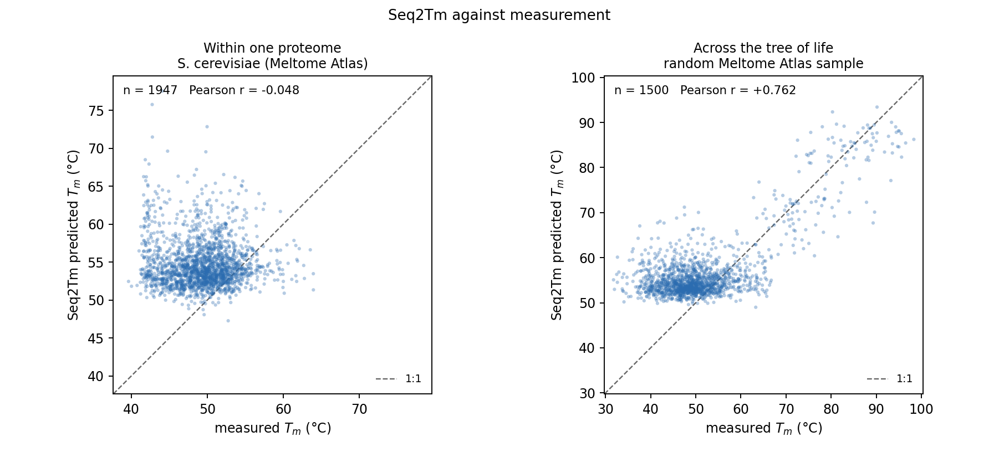

# A1 — can the sequence predictors resolve the difference Figure 4 rests on?

Every species-specific input the Candida etcGEM has comes from three sequence predictors,
and the whole Figure 4 conclusion is a ratio whose denominator is one number one of them
produced. This asks whether that predictor can resolve a difference of that size at all —
against **measurement**, on a eukaryote.

**Headline.** Seq2Tm resolves thermostability *between organisms* across the tree of life
(Pearson r = +0.76) and **not at all within a proteome** (r = −0.05 on 1947 measured
*S. cerevisiae* proteins). Where it can be checked against a measured congeneric difference
it under-states it **17-fold**. Correcting Figure 4's arithmetic for that, the fold gap falls
from the published ~79× to **5.4× [2.5, 10.3]** — still a failure, but a materially different
sentence.

Nothing here adjudicates the biological mechanism. It reports numbers.

Every table and figure below names the script that produced it. Provenance for every input
file is in `DATA_PROVENANCE.md`.

```bash
python3 reports/predictor_calibration/a1_fetch.py         # PART 0
bash    reports/predictor_calibration/a1_predict.sh       # 18 predictor runs, ~1 h
python3 reports/predictor_calibration/a1_orthologs.py     # 10 RBH ortholog sets
python3 reports/predictor_calibration/a1_control.py --prepare   # the positive control
#   ... 15_run_seq2tm.py --seqs-from control_input.csv ... ; then --score
python3 reports/predictor_calibration/a1_analyse.py       # PARTs A-F
```

## PART 0 — what was obtained, and what was not

| | |
|---|---|
| measured yeast meltome | **1949** *S. cerevisiae* proteins with a melting point, 1947 resolving to the reference proteome. Meltome Atlas (Jarzab 2020, *Nat Methods* 17:495; PRIDE PXD011929), run `Saccharomyces cerevisiae lysate` |
| *S. cerevisiae* proteome | UniProt UP000002311 (S288c), 6067 proteins |
| *S. uvarum* proteome | UniProt UP001162085 (reference), 5489 proteins |
| *C. auris* clades I–IV | 5424 / 5327 / 5521 / 5506 proteins |
| *C. haemulonii*, *C. duobushaemulonii*, *C. parapsilosis* | 5249 / 5173 / 5830 proteins |
| **per-protein measured *S. cerevisiae* / *S. uvarum* Tm** | **NOT OBTAINED.** Walunjkar et al. 2025 publish the summary only: mean 1.6 °C over 827 ortholog pairs, 85% of *S. cerevisiae* proteins more stable, against an 8 °C difference in growth limit. PART C is therefore summary-to-summary and the paired *correlation of differences* — the stronger test — cannot be computed. Nothing was substituted. |

**The predictor is the same predictor, and that is verified rather than assumed.** K1 wired
Seq2Tm and Seq2Topt into `tools/reconstruction/` but never ran them. Re-predicting the first
200 rows of the committed `gem/tables/thermal_tm.csv` and `thermal_topt.csv` **in file order
at batch 4** reproduces them to **1.8 × 10⁻⁵ °C** and **1.1 × 10⁻⁴ °C**, r = 1.000000000 in
both cases. Every run in A1 uses that protocol, so the batch-padding artefact documented in
`gem/FIG4_LOCKED.md` applies equally to both sides of every comparison: what is measured here
is the predictor **as used**.

Getting there exposed one bug worth recording. `15_run_seq2tm.py` truncated sequences at
1022 aa, carried over as "the ESM2 positional limit" — but ESM-2 uses rotary position
embeddings and has no such limit, and the committed predictions were made without
truncation. That was the *whole* of the initial discrepancy: the 156 sequences in batches
with no member over 1022 aa already agreed to 1.8 × 10⁻⁵ °C, while every batch containing a
truncated member was wrong by up to 2.6 °C. Default changed to no truncation.

## PART A — does Seq2Tm work on a yeast at all?

`a1_analyse.py` → `partAB_measured_vs_predicted.csv`, `fig_partA_predicted_vs_measured.png`

| | |
|---|---|
| n measured / matched | 1949 / **1947** |
| **Pearson r** | **−0.048** |
| Spearman ρ | +0.025 |
| RMSE | 7.51 °C |
| bias | **+5.43 °C** (measured mean 49.27, predicted 54.70) |

**Seq2Tm has no measurable relationship with measured melting temperature within one yeast
proteome.** It is also systematically 5.4 °C too high.

### The positive control, because r = 0 is equally consistent with a broken pipeline

`a1_control.py` → `control_results.json`

The same predictor, the same code, on a random 1500-protein sample of the **whole** Meltome
Atlas — every species, measured Tm spanning 32–98 °C:

| | within one proteome | across the tree of life |
|---|---|---|
| n | 1947 | 1500 |
| **Pearson r** | **−0.048** | **+0.762** |
| Spearman ρ | +0.025 | +0.320 |
| RMSE | 7.51 °C | 8.78 °C |
| bias | +5.43 °C | +5.08 °C |



The pipeline is sound and the predictor works. **What it resolves is thermophily between
organisms — the difference between a mesophile and *Thermus* — and not variation within a
proteome.** The Candida comparison is entirely of the second kind.

(The control excludes the 2.0% of Atlas sequences longer than 2000 aa, the same cap the
Candida pipeline's own predictor input uses. A single 35,213-residue protein in a batch of
four exhausted memory and killed the first attempt.)

**This is the precondition, and it is not met.** Everything below has to be read as
characterising a predictor that has no demonstrated per-protein validity in the regime it is
being used in.

## PART B — variance compression

| | measured | predicted | ratio |
|---|---|---|---|
| SD | 3.98 | 3.14 | **1.27** |
| IQR | 5.30 | 3.20 | **1.66** |
| 5–95 range | 13.01 | 9.95 | **1.31** |
| regression of measured on predicted, slope | | | **−0.061 ± 0.029** |

The spread is compressed 1.3–1.7×, but **the slope is the number that matters and it is not
positive.** A slope of zero means the predicted value carries no information about the
measured one, so "compression" is the wrong frame here: the predictor is not shrinking real
variation toward the mean by a factor that could be divided out. Within a proteome its
variation is unrelated to the truth.

For contrast, in the regime where the predictor works — the cross-species control — the slope
is **+1.11** and the SD ratio 1.45. That *is* mild compression.

**Consequence for PART F.** The correction cannot come from PART B. It has to come from the
one place a *predicted paired interspecies difference* can be set beside a *measured* one,
which is PART C.

## PART C — the paired interspecies test

`a1_analyse.py` → `paired_differences.csv`. All differences over unique protein pairs
(reciprocal best hits, DIAMOND, e < 1e-10, reciprocity required; `ortholog_pairs.csv`).

| comparison | n pairs | median identity | predicted ΔTm (°C) | 95% CI | fraction positive |
|---|---|---|---|---|---|
| **S. cerevisiae − S. uvarum** | 5287 | 84.3% | **+0.094** | [0.055, 0.134] | 53.8% |
| *measured* (Walunjkar et al. 2025) | 827 | — | **1.600** | — | 85% |
| *C. auris* − *C. haemulonii* | 4831 | 78.7% | +0.151 | [0.112, 0.190] | 54.9% |
| *C. auris* − *C. duobushaemulonii* | 4786 | 77.6% | +0.082 | [0.042, 0.123] | 53.5% |
| *C. auris* − *C. parapsilosis* | 4525 | 53.7% | +0.300 | [0.242, 0.357] | 58.9% |

**measured / predicted = 1.6 / 0.094 = 17×.** The predictor gets the *direction* right —
*S. cerevisiae* the more stable, as measured — and the magnitude 17-fold too small. It also
gets the consistency wrong: 53.8% of its pairs favour *S. cerevisiae*, against a measured
85%. That combination is what a near-zero signal with a small systematic offset looks like.

Two things worth noting about the Candida rows. First, they are **proteome-wide**: 0.151 °C
for *C. auris* − *C. haemulonii*, against the standalone's 0.411 °C over its 432
deduplicated model-enzyme pairs. The model-enzyme subset is not a random sample of the
proteome, and the two numbers are not interchangeable. Second, the three Candida relatives
are **more divergent** than the yeast benchmark pair (77.6–78.7% identity against 84.3%,
and 53.7% for *C. parapsilosis*) — so the transfer assumption in PART F is, if anything,
conservative for them.

**A discrepancy in the project's own numbers, reported not resolved.** The A1 prompt and
`docs/CANDIDA_DISCUSSION_2026-09-07.md` §1 use **0.52 °C**. That is the *reaction-level*
value (0.518 °C, n = 1041). The deduplicated unique-protein-pair value, which
`gem/FIG4_LOCKED.md` and the Fig 4 caption both treat as the correct one, is **0.411 °C**
(n = 432) — and deduplication is the first of the caption's "three decisions that are easy to
undo by accident". This report uses 0.411 as the standalone's number and gives 0.52 only
where the prompt asked for it.

## PART D — the noise floor, and the control nobody had run

The four *C. auris* clades are 99.3–100% identical at the proteome level, so their true
pairwise ΔTm is ~0. Whatever the predictor returns for them is its floor on this kind of
comparison.

| clade pair | n pairs | median identity | predicted ΔTm (°C) | 95% CI | identical-sequence pairs | their mean ΔTm |
|---|---|---|---|---|---|---|
| I − II | 5183 | 99.8% | −0.036 | [−0.056, −0.017] | 1683 | −0.006 |
| I − III | 5358 | 100.0% | −0.009 | [−0.028, +0.011] | 2635 | −0.005 |
| I − IV | 5153 | 99.3% | −0.078 | [−0.107, −0.050] | 905 | −0.003 |
| II − III | 5174 | 99.7% | +0.023 | [+0.002, +0.045] | 1636 | −0.018 |
| II − IV | 5088 | 99.3% | −0.042 | [−0.071, −0.012] | 796 | −0.019 |
| III − IV | 5145 | 99.3% | −0.070 | [−0.099, −0.041] | 881 | −0.018 |

**Mean |mean| = 0.043 °C, worst 0.078 °C, and five of the six are significantly different
from zero** for proteomes whose true difference is zero.

The identical-sequence column separates two sources. For pairs whose two sequences are
*character-for-character identical*, the only reason the predictor can differ is batch
padding, and there the mean is ≤ 0.019 °C. So the floor is **not** padding noise: it is the
predictor converting 0.2–0.7% of sequence divergence into apparent thermostability.

**Expressed as multiples of that floor:**

| | ΔTm | × the floor (0.043 °C) |
|---|---|---|
| the standalone's *C. auris* − *C. haemulonii* (model enzymes, deduplicated) | 0.411 °C | **9.5×** |
| A1's proteome-wide equivalent | 0.151 °C | **3.5×** |

The Figure 4 estimate is above the floor, but by a single-digit multiple of a quantity that
ought to be zero. That is a statement about what the estimate means, not about the biology.

## PART E — Seq2Topt

**PARTs A and B cannot be done for Seq2Topt.** They need measured per-enzyme catalytic
optima proteome-wide, and no such dataset exists — in yeast or anywhere. This is the point
at which the constraint "where no measurement exists, say so and stop" binds. Reported
instead: the same paired tests as Tm, plus the spread each predictor produces.

| comparison | n pairs | predicted ΔTopt (°C) | 95% CI |
|---|---|---|---|
| S. cerevisiae − S. uvarum | 5287 | +0.153 | [0.066, 0.241] |
| *C. auris* clade pairs (true ≈ 0) | 5088–5358 | −0.031 … +0.029 | **every CI includes zero** |
| *C. auris* − *C. haemulonii* | 4831 | +0.040 | **[−0.067, +0.147]** |
| *C. auris* − *C. duobushaemulonii* | 4786 | +0.008 | **[−0.102, +0.118]** |
| *C. auris* − *C. parapsilosis* | 4525 | +0.446 | [0.304, 0.588] |

**For the two species whose thermal collapse Figure 4 is about, the predicted Topt separation
is not distinguishable from zero, and not distinguishable from the same-species floor.**
Per-pair scatter is 2.0–4.9 °C for Topt against 0.7–2.0 °C for Tm, so Seq2Topt is the noisier
of the two channels by roughly a factor of three — consistent with its own reported test
R² (0.57, RMSE 12.3 °C, against Seq2Tm's 0.76 and 7.6 °C).

Predicted spread per proteome (`predicted_spreads.csv`) is nearly identical across all nine
proteomes — Tm SD 2.45–2.86, Topt SD 6.79–7.34 — with no separation between the
*C. auris* clades, the relatives and the two *Saccharomyces*. For scale, the **measured**
*S. cerevisiae* Tm spread is SD 3.98.

## PART F — what the correction does to Figure 4

`a1_analyse.py` → `figure4_arithmetic.csv`

The correction factor is empirical and comes from PART C, the one place a predicted paired
interspecies difference sits beside a measured one:

$$c = \frac{1.6\ ^\circ\mathrm{C}\ \text{(measured)}}{0.094\ ^\circ\mathrm{C}\ \text{(predicted)}} = 17\times\ [11.9,\ 29.2]$$

**The assumption that makes this valid, stated so it can be disagreed with:** that the
compression measured in one congeneric yeast pair transfers to another congeneric pair at
comparable divergence. The Candida relatives are somewhat *more* divergent than
*S. cerevisiae*/*S. uvarum* (77.6–78.7% against 84.3% identity), so if anything the factor is
an under-correction for them.

| | required ΔTm | available ΔTm | **fold gap** |
|---|---|---|---|
| **as published** (standalone's phenomenological form, deduplicated pairs) | 32.54 °C | 0.411 °C | **79×** |
| **K2-corrected requirement**, same available difference | 13.77 °C | 0.411 °C | **34×** |
| **K2 + A1**: corrected requirement, compression-corrected difference | 13.77 °C | **2.56 °C** [1.33, 5.56] | **5.4× [2.5, 10.3]** |
| *for reference*: against the largest MEASURED proteome-wide difference on record | 13.77 °C | 1.60 °C | 8.6× |
| *for reference*: A1's proteome-wide predicted difference, uncorrected | 13.77 °C | 0.151 °C | 91× |

The published ~79× and the corrected ~5× are the same claim with two different pieces of
arithmetic under it. Two independent corrections, each roughly a factor of 2.4 and 17,
account for the difference: K2 found the model requires 13.8 °C rather than 32.5 °C once it
runs on this repository's thermal form, and A1 finds the predictor understates a measured
congeneric difference 17-fold.

**Three things this table is not.** It is not a claim that 2.56 °C is the real
*C. auris*/*C. haemulonii* difference — it is a predicted quantity rescaled by a factor
measured on a different pair. It is not free of PART A: the per-protein predictions being
rescaled have no demonstrated validity within a proteome, and a mean over 5000 such values
detects a systematic offset, nothing more. And 5.4× is still a gap: even taking the largest
measured proteome-wide thermostability difference between congeners anywhere in the
literature (1.6 °C, for an 8 °C difference in growth limit), the model needs 8.6× more than
that.

## PART G — DLTKcat: scoped, not run

**It cannot be benchmarked the way Seq2Tm was here.** DLTKcat predicts kcat(T) for
enzyme–*substrate* pairs, so scoring it needs (i) measured cross-species kcat(T) for
orthologous enzymes, which does not exist as a set, and (ii) substrate assignment, which
needs a metabolic model — and *S. uvarum* has none. There is no measured benchmark and
therefore no equivalent of PART A, PART B or PART C for it.

**What running it on the four Candida proteomes would cost.** External weights and the
DLKcat/DLTKcat environment (already fetched for K1's tools, unused); substrate SMILES for
every reaction's principal substrates (the Candida pipeline already has `kegg_smiles.tsv`);
and an enzyme × substrate × temperature grid. The standalone's DLKcat run alone was
4042/3974/3871/4667 (enzyme, substrate) triples per species — roughly 16,500 — and a
temperature grid of 11 points takes that to of order 180,000 predictions across four
proteomes, plus the MMRT fitting per reaction. Hours to a day, and a new dependency.

**What it would and would not test.** It would give each reaction a per-enzyme kinetic
optimum and curvature derived from predicted turnover, instead of Topt from Seq2Topt and
dCp from a single shared literature prior. That improves **the cold limb and E_a**. It does
not touch the upper limit: *E. coli*'s variance decomposition puts the rising limb and E_a
under kinetics while Topt and CT_max are owned by stability (φ ≈ 0.99), and the Candida
divergence is entirely at the upper limit.

**And note what is actually missing meanwhile.** *E. coli* runs `dcp_from: prior` with
`dltkcat_fits` as an **overlay where fits exist** — the shared literature prior is the base
case in both organisms. Candida is missing a refinement, not a mechanism.

**Recommendation: do not run it, on the current evidence.** Three reasons, in order of
weight. (1) It improves the half of the curve that is not in question. (2) A1's PART E has
just shown that the Topt channel it would replace produces, for the two species that matter,
a separation indistinguishable from zero and from the same-species noise floor — so the
refinement would be applied to a channel with no demonstrated resolving power in this
regime, and the same doubt would attach to DLTKcat's own outputs until someone benchmarks
them. (3) It changes input data rather than model structure, so it cannot be added to K2's
ladder without breaking the attribution the ladder exists for. The case for running it would
change if a measured cross-species kcat(T) set appeared, or if the question moved to the
cold limb.

## What this does and does not license us to say

**It licenses:**

* Seq2Tm resolves thermostability **between organisms** (r = +0.76 across the Meltome Atlas)
  and **not within a proteome** (r = −0.05 on 1947 measured yeast proteins). Both measured
  here, through the same code.
* Where a predicted congeneric ΔTm can be checked against a measured one, the predictor
  under-states it **17-fold** [11.9, 29.2] and gets the fraction of pairs in the right
  direction badly wrong (53.8% against 85%).
* The predictor returns **statistically significant ΔTm of up to 0.078 °C between proteomes
  that are 99.3–100% identical**, where the truth is zero — and that floor is sequence-driven,
  not batch-padding noise. Figure 4's 0.411 °C is 9.5× that floor; the proteome-wide
  equivalent is 3.5×.
* For Seq2Topt, the *C. auris* versus *C. haemulonii* and *C. duobushaemulonii* separations
  are **not distinguishable from zero, nor from the same-species floor**.
* Correcting Figure 4's arithmetic for both K2's finding and A1's measured compression takes
  the fold gap from ~79× to **5.4× [2.5, 10.3]**.

**It does not license:**

* Any claim about **the mechanism**. Nothing here says whether thermal divergence in these
  species is or is not enzyme thermostability. A predictor that cannot see a difference is
  not evidence that the difference is absent, and it is not evidence that it is present.
* Treating 2.56 °C as a measurement of the *C. auris*/*C. haemulonii* difference. It is a
  rescaling, resting on a transfer assumption between yeast pairs and on per-protein values
  with no within-proteome validity.
* Reading the correction factor as precise. It is a ratio to a predicted difference that is
  itself only twice the noise floor; its interval is [11.9, 29.2] and that is before the
  transfer assumption.
* Concluding that "the predictor is broken". On its own terms it works — it is being asked a
  question outside the regime where it has demonstrated resolving power.
* Any statement about **Seq2Topt's accuracy**. No measured benchmark exists; only its spread
  and its noise floor were measurable.

## Files

| what | where | produced by |
|---|---|---|
| provenance for every input | `DATA_PROVENANCE.md` | `a1_fetch.py` |
| PART A/B, per-protein | `partAB_measured_vs_predicted.csv` | `a1_analyse.py` |
| PART A figure + control | `fig_partA_predicted_vs_measured.png` | `a1_analyse.py` |
| the positive control | `control_results.json`, `control_measured_vs_predicted.csv` | `a1_control.py` |
| PARTs C/D/E paired differences | `paired_differences.csv` | `a1_analyse.py` |
| ortholog set sizes and identities | `ortholog_pairs.csv` | `a1_orthologs.py` |
| PART E spreads | `predicted_spreads.csv` | `a1_analyse.py` |
| PART F arithmetic | `figure4_arithmetic.csv` | `a1_analyse.py` |
| everything, machine-readable | `a1_results.json` | `a1_analyse.py` |
